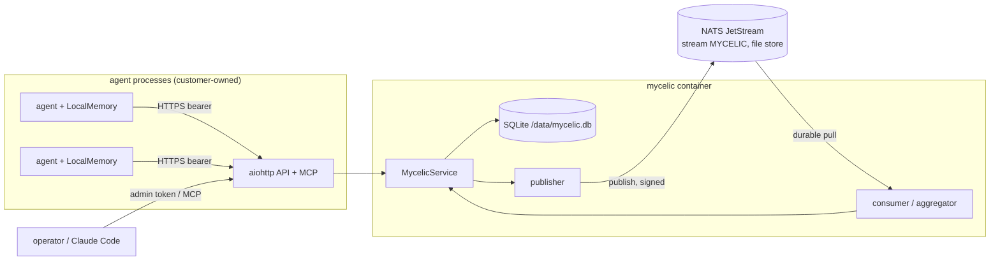

# Mycelic architecture — what actually runs

This document describes the deployed system as it exists in this repository, module by module, and
names the test that verifies each claim. Nothing here describes a planned component.

## 1. Runtime topology

Two long-running processes and two persistent volumes. Agents are separate processes owned by the
customer; they never talk to the broker.

```
                     agent processes (10–100)                      operators / Claude Code
              ┌──────────────┐  ┌──────────────┐                 ┌────────────────────────┐
              │ LocalMemory  │  │ LocalMemory  │  ...            │ admin token / MCP client│
              │ (sqlite)     │  │ (sqlite)     │                 └───────────┬────────────┘
              │ MycelicClient│  │ MycelicClient│                             │
              └──────┬───────┘  └──────┬───────┘                             │
                     │ HTTPS, Bearer mk_<agent>.<secret>                     │ HTTPS, Bearer
                     ▼                 ▼                                     ▼
┌─────────────────────────────────────────────────────────────────────────────────────────────┐
│  mycelic  (container / process; python -m mycelic serve)                                    │
│                                                                                             │
│   aiohttp API ── auth ── rate/size limits ── audit ──► MycelicService                         │
│   /memory /events /query /memory/{id} /lineage/{id}      │                                   │
│   /health /ready /metrics /admin/* /mcp                  │                                   │
│                                                          ▼                                   │
│   SQLite (WAL, synchronous=FULL)  /data/mycelic.db  ◄── store: agents, memories,             │
│                                                          lineage_edges, events(outbox),       │
│                     ▲                 │                  rules, audit_log                     │
│   consumer loop ────┘                 └────► publisher loop                                  │
│   (durable pull, ack after commit,           (outbox rows → js.publish, Nats-Msg-Id,          │
│    apply = record + aggregate + derive)        HMAC signature header)                          │
└──────────────┬────────────────────────────────────────────┬─────────────────────────────────┘
               │ fetch                                       │ publish
               ▼                                             ▼
┌─────────────────────────────────────────────────────────────────────────────────────────────┐
│  nats-server -js   (container / process)   stream MYCELIC, subjects mycelic.<org>.<kind>     │
│  file store on /data (volume nats-data), user/password auth, port 4222 not published         │
└─────────────────────────────────────────────────────────────────────────────────────────────┘
```

| Deployment | Definition | Verified how |
|---|---|---|
| Docker Compose | `deploy/mycelic/docker-compose.yml` (services `nats`, `mycelic`, optional `prometheus`) | `tests/smoke/mycelic_smoke.py --driver compose` built the image and passed all nine steps in this repository's CI sandbox |
| Local processes | `mycelic/harness.py` `ProcessDriver` (nats-server binary + `python -m mycelic serve`) | `tests/smoke/mycelic_smoke.py --driver process` (also run under pytest by `tests/mycelic/test_smoke_process.py`); the service itself against a real broker: `tests/mycelic/test_jetstream.py` |
| Kubernetes | `deploy/mycelic/k8s/` (kustomize: two StatefulSets, Service, Ingress, ConfigMaps, Secret template) | `kubectl kustomize` renders; **not applied to a cluster in this repository** |

## 2. Modules

| Module | Responsibility |
|---|---|
| `mycelic/hierarchy.py` | Layers `agent → team → department → subsidiary → region → enterprise`; unit paths; ancestor/subtree relations |
| `mycelic/config.py` | `MYCELIC_*` environment variables, validated at start (secrets never in source; placeholder values refused) |
| `mycelic/store.py` | SQLite schema and transactions (`BEGIN IMMEDIATE`, one writer, `synchronous=FULL`) |
| `mycelic/transport.py` | `JetStreamTransport` (nats-py) and `InProcessTransport` (unit tests) |
| `mycelic/aggregation.py` | Topic consolidation and slot-composition rules; deterministic derived ids; supersession |
| `mycelic/lineage.py` | Lineage graph reconstruction with per-principal redaction |
| `mycelic/retrieval.py` | BM25 (positive IDF) over visible memories, layer boost |
| `mycelic/auth.py` | API keys, principals, the visibility rule, token-bucket rate limiter |
| `mycelic/service.py` | Ingest, apply, query, lineage, admin operations, publisher/consumer loops, recovery |
| `mycelic/api.py` | aiohttp routes and middleware |
| `mycelic/mcp.py` | MCP tools over the `chat_memory` protocol core; per-request identity; stdio proxy |
| `mycelic/metrics.py` | Prometheus metrics |
| `mycelic/sdk/` | `MycelicClient` (urllib, no dependencies), `LocalMemory`, reference agent process |
| `mycelic/harness.py` | Process and Compose drivers for the smoke test and the demo |

Reused from the existing repository: `NeuralGraph.research.coordination` (`ClaimEnvelope`,
`RuleBasedSynthesizer`, `LineageAnalyzer`), `NeuralGraph.chat_memory.mcp_server` (JSON-RPC/MCP core and
Streamable HTTP transport, generalised to take another tool set), `NeuralGraph.chat_memory.textutil`
(tokenizer), and the store/transaction pattern of `NeuralGraph.chat_memory.store`.

## 3. The data path

```
agent ──► LocalMemory.note()                       private sqlite on the agent's disk
      ──► LocalMemory.share() → POST /memory       idempotency_key = local note id
service   txn: INSERT memory(layer=agent, scope=agent path) + INSERT event(memory.observed, pending)   ──► 202
publisher pending events → js.publish("mycelic.<org>.memory-observed", wire, Nats-Msg-Id=event_id, Mycelic-Signature)
consumer  fetch(1) → verify signature → apply(event):
            txn: record event; producer must be a registered agent for that scope;
                 insert memory if absent; run aggregation:
                   topic consolidation for every ancestor unit of the memory's scope
                   slot-composition rules whose slots the memory fills
                 derived memories + lineage edges + memory.derived events (pending)
            ack after commit
query     POST /query → BM25 over what the caller may read, in the requested unit's subtree
          → answer (highest-ranked, higher layers boosted) + lineage summary + full lineage
lineage   GET /lineage/{id} → walk lineage_edges upward to the raw observations; redact what the caller
          may not read; check every root and its source events still exist
```

Every hop is a real service call; the unit tests replace only the broker (with an in-process log that
still goes through the same outbox/apply code), and `tests/mycelic/test_jetstream.py` plus the smoke test
use the real broker.

## 4. Event log

| Subject | Kind | Produced by | Applied as |
|---|---|---|---|
| `mycelic.<org>.memory-observed` | `memory.observed` | `POST /memory`, `POST /events` (embedded memory), MCP `mycelic_remember` | insert memory if absent, aggregate |
| `mycelic.<org>.memory-derived` | `memory.derived` | the consumer, for every derived memory | insert if absent (normally a no-op: it was written when derived) |
| `mycelic.<org>.memory-retracted` | `memory.retracted` | `POST /memory/{id}/retract` | retract, retire dependents, re-derive |
| `mycelic.<org>.agent-event` | `agent.event` | `POST /events` | recorded (evidence) |
| `mycelic.<org>.agent-registered` / `agent-revoked` / `agent-key-rotated` | admin operations | `/admin/agents` | upsert the registry (key **hashes**, never keys) |
| `mycelic.<org>.rule-upserted` / `rule-deleted` | admin operations | `/admin/rules` | upsert rules |

Stream `MYCELIC`: file storage, `retention=limits`, `discard=new`, no age/size/count limit by default
(a bounded stream is logged as an error at connect), duplicate window 2 h, one replica. Consumer
`mycelic-main`: durable, pull, explicit ack, `max_ack_pending = MYCELIC_CONSUME_BATCH` (default 1, so
events are applied strictly in stream order and a failed event is redelivered in place), `max_deliver` 8
then `term`.

## 5. Aggregation semantics

* **Topic consolidation.** Unit U gets a memory on topic T when at least `MYCELIC_MIN_SUPPORT` (default 2)
  of its direct children contribute on T. A child's contribution is its own consolidation on T if it has
  one, otherwise the best material in its subtree, down to raw observations. Confidence is the noisy-OR of
  the strongest contribution per child; `support` counts distinct agents and `independent_teams` distinct
  teams in the lineage. A unit with fewer registered child units than the threshold *promotes* its child's
  consolidation unchanged (never a raw note), so the top layers of a small organization are not empty.
* **Slot composition.** A rule (`deploy/mycelic/rules.json` or `POST /admin/rules`) names required slots,
  a target layer, a topic prefix and minimum distinct agents/teams. The conclusion exists only when every
  slot is covered for the same entity inside the target unit; slot selection is `RuleBasedSynthesizer`
  (highest confidence per slot), confidence is the minimum over selected slots, and `LineageAnalyzer`
  fragility metrics (unique roots, independent failure domains = teams, minimal cut) are stored with it.
* **Determinism.** A derived memory's id is `sha256(operator, unit, key, sorted parent ids)`. Recomputing
  the parent set from currently active evidence either leaves the active memory as is, supersedes it with
  a new version (old one readable as `previous_versions`), reactivates an earlier version whose exact
  coalition returned, or retracts it when support falls below the threshold. At most one active derived
  memory per (unit, operator, key) is enforced by a unique index.

Verified by `tests/mycelic/test_datapath.py` (consolidation, rule firing, supersession, reactivation,
retraction) and by the smoke test on a live deployment.

## 6. Lineage semantics

`GET /lineage/{id}` answers, for any memory the caller may read:

| Question | Field |
|---|---|
| Where did this come from? | `roots` (raw observations), `nodes`, `edges` |
| Which memories contributed? | `nodes`/`edges` (the full DAG), `previous_versions` |
| Which agents / teams contributed? | `contributing_agents` (visible ones), `contributing_teams`, `redacted_contributions` |
| Which layers transformed it? | `layers`, `transformations` (operator, rule, from/to layer, time) |
| When was it produced? | `timeline.first_observed_at`, `last_observed_at`, `produced_at` |
| What confidence/support exists? | `support.confidence/agents/teams/roots`, `support.fragility` |
| Can the evidence still be reconstructed? | `evidence.reconstructable` (all roots present and not retracted, all cited source events in the log), `events_missing`, `missing_parents`, `retracted_roots` |

Contributions the caller may not read are **redacted, not dropped**: text, agent id, event ids and
entity are withheld, the unit (team) path, layer, timestamps and confidence remain.

## 7. Persistence and recovery

| Failure | Mechanism | Test |
|---|---|---|
| service crash / restart | durable consumer resumes at its ack floor; SQLite is the read model | `test_publish_consume_and_survive_service_restart`, smoke step 5 |
| broker outage | writes go to the outbox (`events.status='pending'`), `/health` reports `degraded`, `/ready` stays 200 by default; publisher flushes on reconnect | `test_broker_outage_is_absorbed_by_the_outbox`, smoke step 6 |
| broker restart | JetStream file store keeps the stream and the consumer | same tests (the broker is SIGKILLed) |
| lost service database | fresh database + non-empty stream ⇒ consumer reset to sequence 1, full replay rebuilds memories, lineage, derived state, agent registry (key hashes) and rules; replay never re-publishes derived events; the replay target is persisted so a crash mid-rebuild resumes it | `test_lost_database_is_rebuilt_from_the_stream`, `test_unfinished_replay_resumes_after_a_crash`, smoke step 7 |
| database restored from backup | `last_applied_seq` behind the consumer's ack floor ⇒ consumer recreated at `last_applied_seq + 1` | `test_restored_backup_receives_the_events_it_missed` |
| durable consumer lost | a brand-new consumer facing a database that applied events ⇒ recreated at `last_applied_seq + 1` | `test_lost_consumer_is_recreated_after_the_last_applied_event` |
| forced replay, poison events | `POST /admin/replay` re-delivers everything idempotently; an event that fails `max_deliver` times, or fails the signature check, is terminated, recorded and counted as consumed so the replay still completes | `test_forced_replay_is_idempotent`, `test_poison_event_is_terminated_and_replay_completes` |
| agent restart | local notes persist; re-sending uses the local id as idempotency key | smoke step 8 |
| forged / unsigned events on the stream | HMAC-SHA256 signature checked before apply; producer must match the registry | `test_unsigned_events_are_rejected` |
| lost NATS volume with intact database | **not covered**: the database keeps serving, but the log cannot be replayed until new events accumulate (see DEPLOYMENT.md, backups) | — |

## 8. Observability

`GET /metrics` (Prometheus): `mycelic_memories_ingested_total`, `mycelic_events_received_total`,
`mycelic_events_published_total{kind}`, `mycelic_events_applied_total{kind,result}`,
`mycelic_events_failed_total{stage}`, `mycelic_replay_events_total`, `mycelic_recovery_total{kind}`,
`mycelic_memories_derived_total{layer,operator}`, `mycelic_retrieval_latency_seconds`,
`mycelic_aggregation_latency_seconds`, `mycelic_lineage_latency_seconds`,
`mycelic_lineage_reconstruction_total{result}`, `mycelic_http_requests_total{route,status}`,
`mycelic_auth_failures_total{reason}`, `mycelic_active_agents`, `mycelic_registered_agents`,
`mycelic_memories{layer}`, `mycelic_outbox_pending`, `mycelic_transport_connected`,
`mycelic_consumer_pending` (read from the broker at scrape time), `mycelic_build_info{version}`.

`GET /health` (public: status, version, transport connected, consumer running), `GET /ready`,
`GET /admin/status` (full checks, stream/consumer positions, masked settings), `GET /admin/audit`,
`GET /admin/events`.

## 9. Mermaid version of the topology


