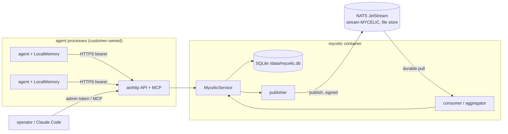

# Mycelic architecture — what actually runs

This document describes the deployed system as it exists in this repository, module by module, and
names the test that verifies each claim. Nothing here describes a planned component.

## 1. Runtime topology

Two long-running processes and two persistent volumes. Agents are separate processes owned by the
customer; they never talk to the broker.

```
                     agent processes (10–100)                      operators / Claude Code
              ┌──────────────┐  ┌──────────────┐                 ┌────────────────────────┐
              │ LocalMemory  │  │ LocalMemory  │  ...            │ admin token / MCP client│
              │ (sqlite)     │  │ (sqlite)     │                 └───────────┬────────────┘
              │ MycelicClient│  │ MycelicClient│                             │
              └──────┬───────┘  └──────┬───────┘                             │
                     │ HTTPS, Bearer mk_<agent>.<secret>                     │ HTTPS, Bearer
                     ▼                 ▼                                     ▼
┌─────────────────────────────────────────────────────────────────────────────────────────────┐
│  mycelic  (container / process; python -m mycelic serve)                                    │
│                                                                                             │
│   aiohttp API ── auth ── rate/size limits ── audit ──► MycelicService                         │
│   /memory /events /query /memory/{id} /lineage/{id}      │                                   │
│   /health /ready /metrics /admin/* /mcp                  │                                   │
│                                                          ▼                                   │
│   SQLite (WAL, synchronous=FULL)  /data/mycelic.db  ◄── store: agents, memories,             │
│                                                          lineage_edges, events(outbox),       │
│                     ▲                 │                  rules, audit_log                     │
│   consumer loop ────┘                 └────► publisher loop                                  │
│   (durable pull, ack after commit,           (outbox rows → js.publish, Nats-Msg-Id,          │
│    apply = record + aggregate + derive)        HMAC signature header)                          │
└──────────────┬────────────────────────────────────────────┬─────────────────────────────────┘
               │ fetch                                       │ publish
               ▼                                             ▼
┌─────────────────────────────────────────────────────────────────────────────────────────────┐
│  nats-server -js   (container / process)   stream MYCELIC, subjects mycelic.<org>.<kind>     │
│  file store on /data (volume nats-data), user/password auth, port 4222 not published         │
└─────────────────────────────────────────────────────────────────────────────────────────────┘
```

| Deployment | Definition | Verified how |
|---|---|---|
| Docker Compose | `deploy/mycelic/docker-compose.yml` (services `nats`, `mycelic`, optional `prometheus`) | `tests/smoke/mycelic_smoke.py --driver compose` built the image and passed all nine steps in this repository's CI sandbox |
| Local processes | `mycelic/harness.py` `ProcessDriver` (nats-server binary + `python -m mycelic serve`) | `tests/smoke/mycelic_smoke.py --driver process` (also run under pytest by `tests/mycelic/test_smoke_process.py`); the service itself against a real broker: `tests/mycelic/test_jetstream.py` |
| Kubernetes | `deploy/mycelic/k8s/` (kustomize: two StatefulSets, Service, Ingress, ConfigMaps, Secret template) | `kubectl kustomize` renders; **not applied to a cluster in this repository** |

## 2. Modules

| Module | Responsibility |
|---|---|
| `mycelic/hierarchy.py` | Layers `agent → team → department → subsidiary → region → enterprise`; unit paths; ancestor/subtree relations |
| `mycelic/config.py` | `MYCELIC_*` environment variables, validated at start (secrets never in source; placeholder values refused) |
| `mycelic/store.py` | SQLite schema (version 3; forward-only migrations in one transaction, including label normalisation of stored observations and rules) and transactions (`BEGIN IMMEDIATE`, one writer, `synchronous=FULL`) |
| `mycelic/transport.py` | `JetStreamTransport` (nats-py) and `InProcessTransport` (unit tests) |
| `mycelic/aggregation.py` | Topic consolidation and slot-composition rules: read-only planners (`plan_consolidation`, `plan_rule`) over pure builders (`build_consolidation`, `build_conclusion`: no store, no clock); deterministic derived ids; supersession |
| `mycelic/lineage.py` | Lineage graph reconstruction with per-principal redaction |
| `mycelic/retrieval.py` | BM25 (positive IDF) over visible memories, layer boost |
| `mycelic/auth.py` | API keys, principals, the visibility rule, token-bucket rate limiter |
| `mycelic/service.py` | Ingest, apply, query, lineage, admin operations, publisher/consumer loops, recovery |
| `mycelic/api.py` | aiohttp routes and middleware |
| `mycelic/mcp.py` | MCP tools over the `chat_memory` protocol core; per-request identity; stdio proxy |
| `mycelic/metrics.py` | Prometheus metrics |
| `mycelic/sdk/` | `MycelicClient` (urllib, no dependencies), `LocalMemory`, reference agent process |
| `mycelic/harness.py` | Process and Compose drivers for the smoke test and the demo |

Reused from the existing repository: `NeuralGraph.research.coordination` (`ClaimEnvelope`,
`RuleBasedSynthesizer`, `LineageAnalyzer`), `NeuralGraph.chat_memory.mcp_server` (JSON-RPC/MCP core and
Streamable HTTP transport, generalised to take another tool set), `NeuralGraph.chat_memory.textutil`
(tokenizer), and the store/transaction pattern of `NeuralGraph.chat_memory.store`.

## 3. The data path

```
agent ──► LocalMemory.note()                       private sqlite on the agent's disk
      ──► LocalMemory.share() → POST /memory       idempotency_key = local note id
service   txn: INSERT memory(layer=agent, scope=agent path) + INSERT event(memory.observed, pending)   ──► 202
publisher pending events → js.publish("mycelic.<org>.memory-observed", wire, Nats-Msg-Id=event_id, Mycelic-Signature)
consumer  fetch(1) → verify signature → apply(event):
            txn: record event; producer must be a registered agent for that scope;
                 insert memory if absent; run aggregation over the rules and the agent registry
                 as the log has applied them (applied_rules, agents.log_status):
                   topic consolidation for every ancestor unit of the memory's scope
                   slot-composition rules whose slots the memory fills
                 derived memories + lineage edges + memory.derived events (pending)
            ack after commit
query     POST /query → BM25 over what the caller may read, in the requested unit's subtree
          → answer (highest-ranked, higher layers boosted) + lineage summary + full lineage
lineage   GET /lineage/{id} → walk lineage_edges upward to the raw observations; redact what the caller
          may not read; check every root and its source events still exist
```

Every hop is a real service call; the unit tests replace only the broker (with an in-process log that
still goes through the same outbox/apply code), and `tests/mycelic/test_jetstream.py` plus the smoke test
use the real broker.

## 4. Event log

| Subject | Kind | Produced by | Applied as |
|---|---|---|---|
| `mycelic.<org>.memory-observed` | `memory.observed` | `POST /memory`, `POST /events` (embedded memory), MCP `mycelic_remember` | insert memory if absent, aggregate |
| `mycelic.<org>.memory-derived` | `memory.derived` | the consumer, for every derived memory | informational: `duplicate` if this node derived it, else ignored and counted (`mycelic_events_ignored_total{reason="derived_not_reproduced"}`), never inserted |
| `mycelic.<org>.memory-retracted` | `memory.retracted` | `POST /memory/{id}/retract` | retract, retire dependents, re-derive |
| `mycelic.<org>.agent-event` | `agent.event` | `POST /events` | recorded (evidence) |
| `mycelic.<org>.agent-registered` / `agent-revoked` / `agent-key-rotated` | admin operations | `/admin/agents` | upsert the registry (key **hashes**, never keys); `agents.log_status` records the registry as applied, which is what aggregation counts (the API writes `status` at once, for authentication and the admin views); a registration or revocation that changes how many child units a unit above the agent has re-plans that unit's promotions and everything above them |
| `mycelic.<org>.rule-upserted` / `rule-deleted` | admin operations | `/admin/rules` | update `applied_rules`, which aggregation evaluates, then apply the rule to everything applied before it: an upsert reconciles the rule's active conclusions (withdrawn, kept or superseded) and composes the rule wherever evidence could satisfy it; a delete withdraws its conclusions; either way dependents are retired and re-evaluated. The admin table `rules` is written by the API at once, and by an event only when the event came from the stream alone and no newer local change of that rule is still unapplied |

Stream `MYCELIC`: file storage, `retention=limits`, `discard=new`, no age/size/count limit by default
(a bounded stream is logged as an error at connect), duplicate window 2 h, one replica. Consumer
`mycelic-main`: durable, pull, explicit ack, `max_ack_pending = MYCELIC_CONSUME_BATCH` (default 1, so
events are applied strictly in stream order and a failed event is redelivered in place), `max_deliver` 8
then `term`.

## 5. Aggregation semantics

* **Topic consolidation.** Unit U gets a memory on topic T when at least `MYCELIC_MIN_SUPPORT` (default 2)
  of its direct children contribute on T. A child's contribution is its own consolidation on T if it has
  one, otherwise the best material in its subtree, down to raw observations. Confidence is the noisy-OR of
  the strongest contribution per child; `support` counts distinct agents and `independent_teams` distinct
  teams in the lineage. A unit with fewer registered child units than the threshold *promotes* its child's
  consolidation unchanged (never a raw note), so the top layers of a small organization are not empty.
* **Slot composition.** A rule (`deploy/mycelic/rules.json` or `POST /admin/rules`) names required slots,
  a target layer, a topic prefix and minimum distinct agents/teams. The conclusion exists only when every
  slot is covered for the same entity inside the target unit; slot selection is `RuleBasedSynthesizer`
  (highest confidence per slot), confidence is the minimum over selected slots, and `LineageAnalyzer`
  fragility metrics (unique roots, independent failure domains = teams, minimal cut) are stored with it.
* **Composition (strategic synthesis).** A rule's ``sources`` may include other rules' conclusions and
  consolidations; a conclusion carries ``emits_slot``/``emits_topic`` so a higher rule can consume it;
  ``min_units`` demands per-slot corroboration across units (``{"supply_risk": {"region": 2}}``), counted
  over the memories that become parents (only the strongest per slot unless ``corroborate`` is set), and
  ``corroborate`` keeps every memory filling a slot as evidence. Derivations cascade upward (bounded depth,
  truncation logged), a rule never consumes its own output even transitively (`rule_chain` metadata; cyclic
  rule sets are refused at the admin entry points), and finer-grained evidence is preferred over a
  consolidation that restates it. Fragility metrics score at most six claims per slot. After a retraction,
  a withdrawal for lost support, or a supersession that leaves a dependent behind, dependents are retired and
  re-evaluated on the remaining evidence (`Aggregator.reevaluate`). Verified by `tests/mycelic/test_strategic.py` and
  `demo/mycelic_strategic_demo.py` (run under pytest by `tests/mycelic/test_strategic_demo_process.py`).
* **Label normalisation.** Topics, slots and entities are stored and compared in one spelling: NFKC, case-folded,
  NFKC again, whitespace runs collapsed to one space and trimmed (`models.canonical_label`; a label that is only
  whitespace is no label). `SD-9`, ` sd-9 ` and the full-width `ＳＤ－９` are one entity; Cyrillic is lower-cased and
  CJK is kept as it is, never stripped. A slot must still match `[A-Za-z0-9_.:-]{1,100}` after normalisation, and
  lengths are checked on the normalised form. The same rule applies at every entry point (`POST /memory`,
  `POST /events`, MCP, `/query` filters), to a rule's slots, topic prefix, emitted slot and topic, `min_units`
  slots (two that become one keep the larger count) and `{slot:...}` placeholders, and to `memory.observed`
  payloads at apply (so an older log replays into the same state). Verified by `tests/mycelic/test_labels.py`.
* **Log-applied rules and agents.** Aggregation reads `applied_rules` and the registry as of the event being
  applied (`agents.log_status`), never what the API has already written but the consumer has not applied, so a
  live node behind its log and a rebuild of that log derive the same history
  (`test_rules_and_registry_are_read_in_log_order_and_rebuild_identically`). A conclusion appears when the event
  that makes it hold applies and disappears when the event that ends it applies, whatever kind of event that is.
* **Rule lifecycle at apply.** A `rule.upserted` event first records the rule in `applied_rules`, then evaluates it
  against everything applied so far (`Aggregator.evaluate_rule`): every active conclusion of the rule is reconciled,
  and the rule is composed at every (unit, entity) where applied evidence could fill one of its slots, so a rule
  added after its evidence concludes at its own apply, with no new observation. Reconciling withdraws a conclusion
  whose rule is now disabled (`status_reason` `rule disabled`), no longer covers its organization or no longer
  targets its layer (`rule no longer applies here`; new conclusions appear at the new layer or only in the remaining
  organization), or whose support the new thresholds no longer reach (`support below threshold`); it supersedes a
  conclusion that the rule now derives differently (a new template, threshold, slot, topic or source: a new id, the
  old one `superseded` with `version_of` kept); and it leaves alone one that the rule derives exactly as before.
  A `rule.deleted` event withdraws every active conclusion of the rule (`rule deleted`, `Aggregator.withdraw_rule`).
  Whatever rested on a withdrawn or superseded conclusion (a strategy on regional conclusions, a consolidation of
  their topic) is retired and re-evaluated, so nothing active rests on a conclusion that is not; a new emitted topic
  or slot therefore moves the consolidations of the conclusions to the new topic and takes them away from the rules
  that consumed the old slot. Disabling then
  re-enabling a rule, or deleting and re-creating it identically, reactivates the same ids. Re-evaluating a retired
  conclusion uses the rule only where it still applies (`Aggregator.rule_for`), so a conclusion is never rebuilt at a
  unit whose layer its rule no longer targets. Two upserts of one rule that both reach the log before the first
  applies are applied in order: the first is evaluated and then superseded by the second, so a key gets at most one
  intermediate version, and a rebuild reproduces it (`tests/mycelic/test_rule_lifecycle.py`).
* **Registry changes.** Only promotion depends on how many registered child units a unit has. When an
  `agent.registered` or `agent.revoked` event changes that number for a unit above the agent (department and above;
  a team's children are agents and a team never promotes), the topics the unit promotes or could promote (those of
  its direct children's consolidations) are re-planned from the agent's team up to the enterprise
  (`Aggregator.registry_changed`). A second team in a department withdraws the department's promotion and the
  promotions above it; an agent in a brand-new region withdraws the enterprise's promotion; revoking the last agent
  of the new unit reactivates the same ids. A revoked agent's notes stay evidence, so contributions do not change.
  A registration into an existing unit, a duplicate registration and a revocation that is replayed or names an
  unknown agent change no count and do no aggregation work.
* **Candidates.** Each consolidation and rule reads the newest `max_candidates` (5,000) matching memories in apply
  order (`memories.apply_seq`, which numbers rows in the order the consumer applied them on every node); a child
  unit with its own consolidation contributes only that, so its notes are not read. A full candidate set means
  older evidence was left out: `mycelic_aggregation_truncated_total{what="candidates"}` counts it and a warning
  is logged once per unit and key (`test_candidate_cap_does_not_freeze_team_or_upper_layers`).
* **`*` conclusions.** A rule evaluated without an entity concludes only when evidence that names no entity is
  among the selected memories; such a `rule:*` conclusion is re-evaluated when entity-specific evidence arrives
  (`test_wildcard_conclusion_is_refreshed_by_entity_evidence`) and when evidence goes away, a retracted note or a
  withdrawn consolidation or conclusion, since the next strongest memory may name no entity.
* **Blocking candidates.** A rule selects the strongest memory per slot, so a strong memory that adds no agent can
  keep a conclusion below its threshold without the conclusion resting on it. When such a memory stops filling the
  slot, because it is retracted or withdrawn or because it is superseded by a version with another slot, entity or
  topic (a rule changed what it emits, a note with another slot joined a consolidation), the rules its slot fed are
  composed again under its old slot, entity and topic (`Aggregator._withdraw`, `Aggregator._superseded`). The
  conclusion it blocked then appears at once and is offered to everything above it
  (`test_superseded_candidate_unblocks_conclusions`, `test_withdrawn_candidate_unblocks_conclusions`,
  `test_consolidation_losing_its_slot_or_entity_unblocks_conclusions`). A version superseded by one that is the
  same candidate (same slot, entity, topic and rule chain: a note joining a consolidation, a conclusion gaining
  evidence, by far the most common case) is not composed again, because offering its successor upward has just
  composed exactly those rule keys (`test_same_candidate_successor_is_not_composed_twice`).
* **Cascades.** Retiring dependents walks active memories only (nearest first, in id order, at most 100,000);
  a cut walk and a cascade cut at depth 8 are logged as errors and counted
  (`mycelic_aggregation_truncated_total{what="dependents"|"cascade"}`). A derived id already taken by an unrelated
  row, or an earlier version that comes back with different text, is reported
  (`mycelic_aggregation_inconsistency_total{kind}`, audit `aggregation.inconsistency` with text hashes) instead of
  failing the event.
* **Determinism and versioned ids.** A derived memory's id is `sha256(operator, unit, versioned key, sorted parent
  ids)`. The versioned key of a consolidation is `<topic>|v<DERIVATION_VERSION>|ms<MIN_SUPPORT>`; that of a
  conclusion is `<rule_id>:<entity or *>|v<DERIVATION_VERSION>|r<rule digest>`, where the digest is the first 16
  hex characters of a hash of the rule's deriving fields (`models.rule_snapshot`: `rule_id` and every field except
  `enabled`, `metadata` and `org_id`, which do not change what a rule derives, so switching a rule off and on,
  deleting and re-creating it, narrowing it to one organization or editing its metadata keeps its ids). Each derived
  memory records how it was derived in `metadata.derivation`: `{v, min_support}` for a consolidation, `{v,
  rule_digest, rule}` for a conclusion (`rule` is the snapshot; agents see `{v, rule_digest}`, administrators the
  snapshot too; agents cannot set the key). `metadata.agg_key` stays the topic or `rule_id:entity`, so one version is
  active per key and a new derivation supersedes the old one across versions. `DERIVATION_VERSION` (1) is bumped
  whenever a released builder's output changes; the re-aggregation job then converges stored state. Recomputing the
  parent set from currently active evidence either leaves the active memory as is, supersedes it with a new version
  (old one readable as `previous_versions`), reactivates an earlier version whose exact coalition returned, or
  retracts it when support falls below the threshold. At most one active derived memory per (unit, operator, key)
  is enforced by a unique index.
* **Re-aggregation job.** Local maintenance, not an event (`MycelicService._reaggregate_job`,
  `Aggregator.reaggregate_step`). It starts in the background at start-up when the database was derived under
  another `DERIVATION_VERSION` or `MIN_SUPPORT` than this node runs with (`meta.derivation_version`,
  `meta.min_support`), or a migration flagged it (`meta.reaggregate_pending`), and on demand
  (`POST /admin/reaggregate`, `python -m mycelic reaggregate [--org]`). A database with no memories records the meta
  at start without a job, so a fresh volume and a rebuild never run one. Per organization it goes through three
  phases: `derived` (every active consolidation and conclusion, lower layers first, is reconciled: legacy ids are
  superseded by their new version, conclusions of deleted, disabled or moved rules and consolidations under legacy
  label spellings are withdrawn; a legacy row resting on one superseded before it, and not replaced along with it, is
  retracted as `evidence superseded` and derived again without a `version_of` link; no row is deleted), `topics` (every unit above applied evidence is consolidated, which creates what
  should exist, for example after `MIN_SUPPORT` is lowered) and `rules` (every enabled rule is composed wherever it
  has evidence). Each step reconciles at most `reaggregate_batch` (5) items in one transaction and then yields to
  the event loop, so probes, the API and the consumer keep running in between (at 5,000 notes in one organization a
  step's work took at most 0.3 s and its slowest item 0.24 s, and a full run forced by a `MIN_SUPPORT` change
  108–136 s in 1,528 steps; whole steps usually took at most 0.42 s, and the rare slower ones, up to 1.2 s, are the
  commit waiting on the disk's fsync (`synchronous=FULL`; one instrumented commit took 0.57 s); batches of 10 took up
  to 0.5 s a step and batches of 50 up to 1.3 s). Every enumeration
  is recomputed at each step and resumed after the last key processed, so applies between steps are safe; the price
  is that a run's duration grows faster than linearly with the size of the organization. While a replay is in
  progress the job runs no step (`checks.reaggregation.state` = `waiting_for_replay`) and starts again from the first
  organization afterwards. A complete run over all organizations records the meta and clears the pending flag; an
  organization-scoped run never does; an interrupted run (`interrupted`) or a failed one (`failed`, with the error;
  the node keeps serving and stays ready) leaves the meta, so the next start runs again from the beginning. Each
  organization's run writes one audit row `aggregation.reaggregate` (`org_id`, `changed`, `steps`, `reason`) and every
  step counts `mycelic_reaggregation_steps_total`. The derived events a run emits are not reproduced by a rebuild: a
  rebuild derives the converged state directly and counts those events as duplicates or ignored
  (`tests/mycelic/test_reaggregate.py`).
* **Fixed point.** `tests/mycelic/test_aggregation_invariants.py` applies seeded random sequences of registrations
  (full, sparse and in a second organization), revocations, notes with random labels, retractions and rule upserts,
  disables, deletes, re-creations, layer and organization moves, and checks after each operation (or once at the end)
  that one memory is active per key, every active derived memory rests on active parents, consolidations stand for
  enough children of their unit, support is that of the roots, re-planning reproduces every active derived memory
  and every key that holds has its memory, notes reach every unit above them under `MIN_SUPPORT` 1, a rebuild of the
  log reproduces the history, and a full re-aggregation pass changes nothing (`MYCELIC_INVARIANT_SEEDS` sets the
  number of seeds).

Verified by `tests/mycelic/test_datapath.py` (consolidation, rule firing, supersession, reactivation,
retraction) and by the smoke test on a live deployment.

## 6. Lineage semantics

`GET /lineage/{id}` answers, for any memory the caller may read:

| Question | Field |
|---|---|
| Where did this come from? | `roots` (raw observations), `nodes`, `edges` |
| Which memories contributed? | `nodes`/`edges` (the full DAG), `previous_versions` |
| Which agents / teams contributed? | `contributing_agents` (visible ones), `contributing_teams`, `redacted_contributions` |
| Which layers transformed it? | `layers`, `transformations` (operator, rule, from/to layer, time) |
| When was it produced? | `timeline.first_observed_at`, `last_observed_at`, `produced_at` |
| What confidence/support exists? | `support.confidence/agents/teams/roots`, `support.fragility` |
| Can the evidence still be reconstructed? | `evidence.reconstructable` (all roots present and not retracted, all cited source events in the log), `events_missing`, `missing_parents`, `retracted_roots` |

Contributions the caller may not read are **redacted, not dropped**: text, agent id, event ids and
entity are withheld, the unit (team) path, layer, timestamps and confidence remain.

## 7. Persistence and recovery

| Failure | Mechanism | Test |
|---|---|---|
| service crash / restart | durable consumer resumes at its ack floor; SQLite is the read model | `test_publish_consume_and_survive_service_restart`, smoke step 5 |
| broker outage | writes go to the outbox (`events.status='pending'`), `/health` reports `degraded`, `/ready` stays 200 by default; publisher flushes on reconnect | `test_broker_outage_is_absorbed_by_the_outbox`, smoke step 6 |
| broker restart | JetStream file store keeps the stream and the consumer | same tests (the broker is SIGKILLed) |
| lost service database | fresh database + non-empty stream ⇒ consumer reset to sequence 1, full replay rebuilds memories, lineage, derived state, agent registry (key hashes) and rules; replay never re-publishes derived events; the replay target is persisted so a crash mid-rebuild resumes it | `test_lost_database_is_rebuilt_from_the_stream`, `test_unfinished_replay_resumes_after_a_crash`, smoke step 7 |
| database restored from backup | `last_applied_seq` behind the consumer's ack floor ⇒ consumer recreated at `last_applied_seq + 1` | `test_restored_backup_receives_the_events_it_missed` |
| durable consumer lost | a brand-new consumer facing a database that applied events ⇒ recreated at `last_applied_seq + 1` | `test_lost_consumer_is_recreated_after_the_last_applied_event` |
| forced replay, poison events | `POST /admin/replay` re-delivers everything idempotently; an event that fails `max_deliver` times, or fails the signature check, is terminated, recorded and counted as consumed so the replay still completes | `test_forced_replay_is_idempotent`, `test_poison_event_is_terminated_and_replay_completes` |
| agent restart | local notes persist; re-sending uses the local id as idempotency key | smoke step 8 |
| forged / unsigned events on the stream | HMAC-SHA256 signature checked before apply; producer must match the registry | `test_unsigned_events_are_rejected` |
| lost NATS volume with intact database | **not covered**: the database keeps serving, but the log cannot be replayed until new events accumulate (see DEPLOYMENT.md, backups) | — |

## 8. Observability

`GET /metrics` (Prometheus): `mycelic_memories_ingested_total`, `mycelic_events_received_total`,
`mycelic_events_published_total{kind}`, `mycelic_events_applied_total{kind,result}`,
`mycelic_events_failed_total{stage}`, `mycelic_replay_events_total`, `mycelic_recovery_total{kind}`,
`mycelic_memories_derived_total{layer,operator}`, `mycelic_events_ignored_total{reason}` (`derived_not_reproduced`,
`retraction_target`, `unknown_kind`), `mycelic_aggregation_inconsistency_total{kind}` (`id_collision`,
`reactivation_mismatch`), `mycelic_aggregation_truncated_total{what}` (`candidates`, `dependents`, `cascade`),
`mycelic_retrieval_latency_seconds`,
`mycelic_aggregation_latency_seconds`, `mycelic_reaggregation_steps_total` (re-aggregation job steps, one
transaction each), `mycelic_lineage_latency_seconds`,
`mycelic_lineage_reconstruction_total{result}`, `mycelic_http_requests_total{route,status}`,
`mycelic_auth_failures_total{reason}`, `mycelic_active_agents`, `mycelic_registered_agents`,
`mycelic_memories{layer}`, `mycelic_outbox_pending`, `mycelic_transport_connected`,
`mycelic_consumer_pending` (read from the broker at scrape time), `mycelic_build_info{version}`.

`GET /health` (public: status, version, transport connected, consumer running), `GET /ready`,
`GET /admin/status` (full checks, stream/consumer positions, masked settings, and `checks.reaggregation`: the
re-aggregation job's `state` (`idle`, `running`, `waiting_for_replay`, `done`, `interrupted`, `failed`), `reason`,
`scope`, current `org_id` and `phase`, `steps`, `changed`, `started_at`, `finished_at`, `error`), `GET /admin/audit`,
`GET /admin/events`. The job never affects `/ready`: the node serves while it converges.

## 9. Mermaid version of the topology


```mermaid
flowchart LR
  subgraph Agents["agent processes (customer-owned)"]
    A1[agent + LocalMemory] -- HTTPS bearer --> API
    A2[agent + LocalMemory] -- HTTPS bearer --> API
  end
  subgraph Mycelic["mycelic container"]
    API[aiohttp API + MCP] --> SVC[MycelicService]
    SVC --> DB[(SQLite /data/mycelic.db)]
    SVC --> PUB[publisher]
    CONS[consumer / aggregator] --> SVC
  end
  PUB -- publish, signed --> JS[(NATS JetStream\nstream MYCELIC, file store)]
  JS -- durable pull --> CONS
  OPS[operator / Claude Code] -- admin token / MCP --> API
```
