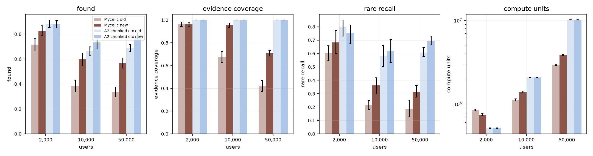
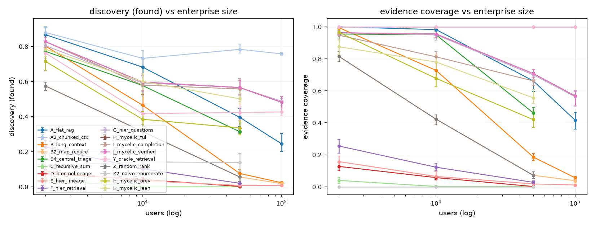
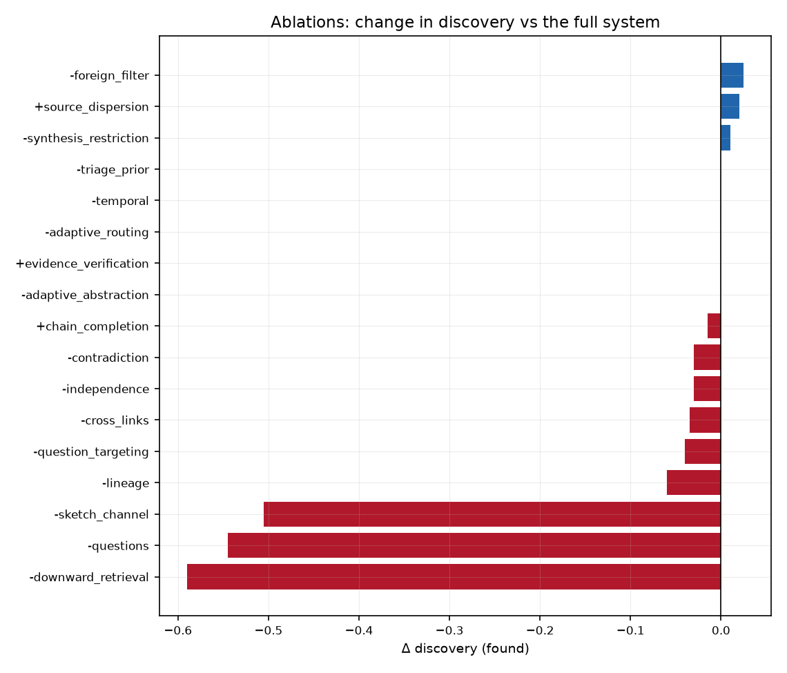
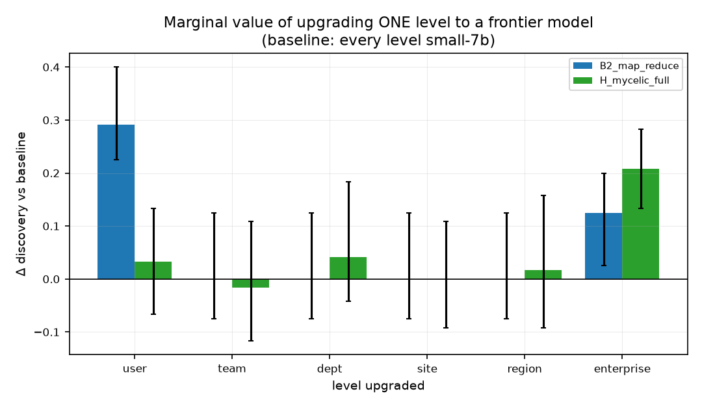
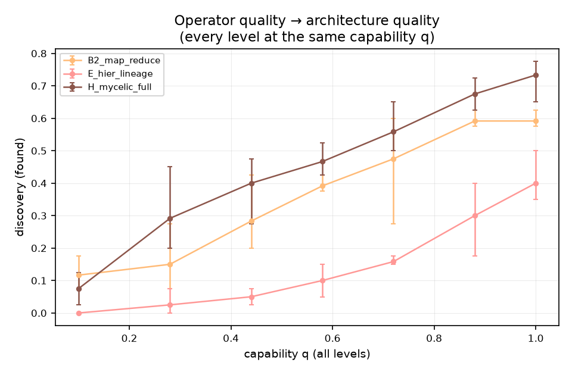
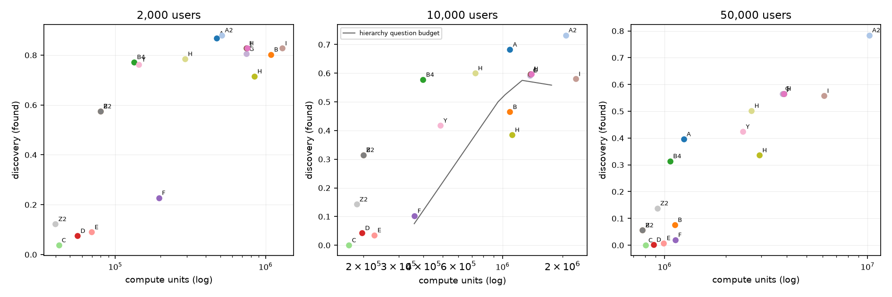
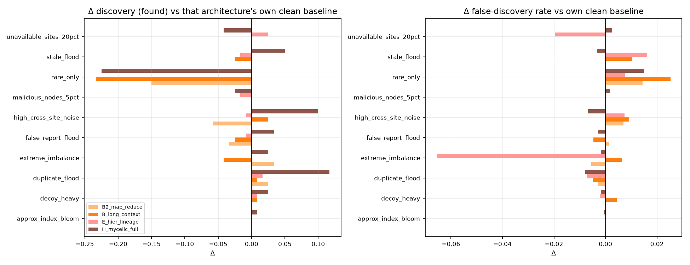
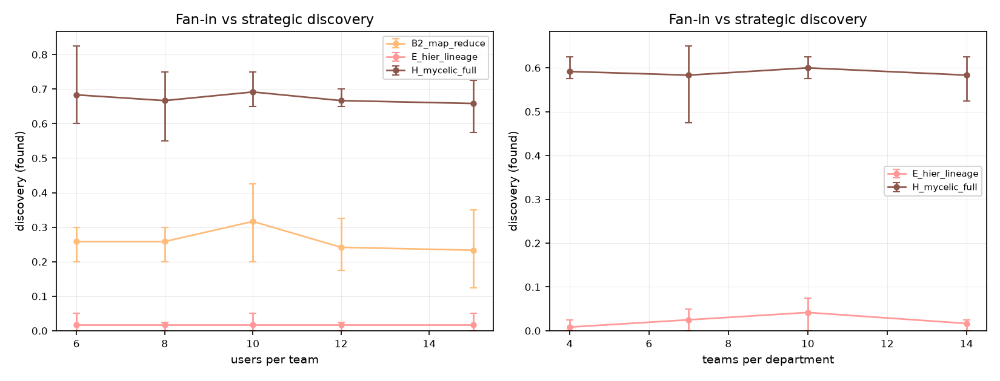
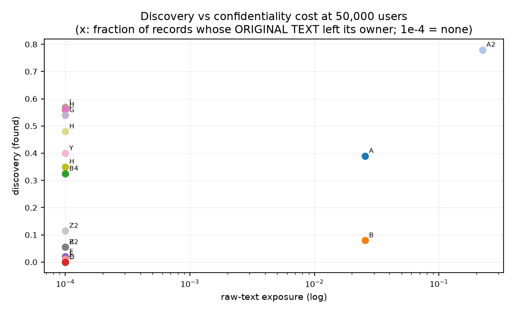
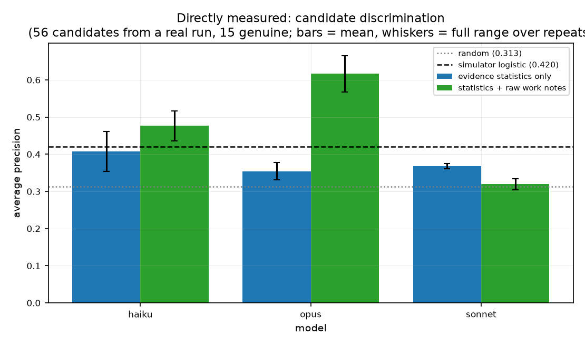

# Mycelic: hierarchical enterprise intelligence
## Benchmark report and architecture recommendation

**The question.** How should thousands of private, user-level AI agents
abstract, route, combine, question, verify and propagate what they know
upward, so that an enterprise-level system discovers strategic information
that no individual employee, team, department, site or region could discover
alone?

**What this document is.** A mechanism study on a synthetic enterprise with
known hidden ground truth. Eighteen architectures are compared under one
shared implementation of every cognitive operation, on a matched kernel model
tier (kernel prompt sizes are not matched; §2). The v1 settings and the learned
ranker's weights were fitted on calibration-seed rows; several vNext decisions
(the question budget, and the rejection of local re-extraction, decoy-weighted
ranker selection and modal link timing) were made on evaluation seeds 0–4 at
10,000 users and 0–2 at 50,000, and §2 names the evidence behind every frozen
value. It is not a deployment report, and it does not measure any
specific model end to end. Part II states exactly what was measured on real
models and what was simulated.

**How to read it.** Part I is the decision. Part II is how to read the
numbers. Parts III to V are the benchmark, the results and the case against
them. Every table and figure is generated from raw per-run records; nothing is
transcribed by hand.

**If you have ten minutes**, read §1 (the decision), the head-to-head table in
it, and §28 (the findings that generalise beyond this project). **If you are
going to be asked to defend this**, read §24 (the reviewer critique), §25
(assumptions) and §26 (what we tried that failed) as well — they are where the
weaknesses are, stated by us rather than found by someone else.

<details>
<summary><b>Contents</b></summary>


**PART I — THE DECISION**

* [1. Decision summary](#1-decision-summary)
* [2. Executive summary](#2-executive-summary)
* [3. Recommended architecture](#3-recommended-architecture)

**PART II — HOW TO READ THIS**

* [4. Glossary](#4-glossary)
* [5. What was measured, what was simulated](#5-what-was-measured-what-was-simulated)

**PART III — THE BENCHMARK**

* [6. Methodology](#6-methodology)
* [7. The synthetic enterprise at each scale](#7-the-synthetic-enterprise-at-each-scale)
* [8. Calibration](#8-calibration)

**PART IV — RESULTS**

* [9. Architectures compared](#9-architectures-compared)
* [10. Baseline comparison](#10-baseline-comparison)
* [11. Scale](#11-scale)
* [12. Ablations](#12-ablations)
* [13. Where compute should go](#13-where-compute-should-go)
* [14. Cost and quality](#14-cost-and-quality)
* [15. Latency](#15-latency)
* [16. Information loss](#16-information-loss)
* [17. Continual questioning](#17-continual-questioning)
* [18. Downward retrieval, and adversarial conditions](#18-downward-retrieval-and-adversarial-conditions)
* [19. Organisational shape](#19-organisational-shape)
* [20. Confidentiality and propagation volume](#20-confidentiality-and-propagation-volume)
* [21. Provenance integrity](#21-provenance-integrity)
* [22. Capability-shape sensitivity](#22-capability-shape-sensitivity)
* [23. Direct model measurement](#23-direct-model-measurement)

**PART V — THE CASE AGAINST THESE RESULTS**

* [24. Reviewer critique](#24-reviewer-critique)
* [25. Assumptions](#25-assumptions)
* [26. Failed approaches, and what they taught us](#26-failed-approaches-and-what-they-taught-us)
* [27. Recommended next experiments](#27-recommended-next-experiments)
* [28. Headline findings that are not about Mycelic](#28-headline-findings-that-are-not-about-mycelic)
* [29. Reproducing this](#29-reproducing-this)

</details>

---

# PART I — THE DECISION

## 1. Decision summary

### The one-paragraph version

We built a synthetic enterprise with known hidden problems planted in it, at 2,000, 10,000, 50,000 and 100,000 people, and tested 18 ways of finding those problems, from reading a filtered subset of the company's notes with one very large model, to a six-level hierarchy of agents mirroring the org chart. **The hierarchy is not the most accurate option.** The strongest single approach measured at 50,000 people is `A2_chunked_ctx`, which finds 78% of the hidden problems against the hierarchy's 57%. Whether the hierarchy is nonetheless worth building depends entirely on which of the secondary properties below we actually need; the table states which ones it delivers and which it does not.

### Head to head at 50,000 users (5 seeds)

*(Runs exist at 100,000 users too, and §11 reports them. The head-to-head is stated at 50,000 because that is the largest scale where **every** architecture in the comparison was run — `B4_central_triage`, `C_recursive_sum`, `D_hier_nolineage`, `F_hier_retrieval` were not run at 100,000. Choosing the largest complete scale is a rule applied by the generator, not a choice made per result.)*

*Seeds 0–2 at 50,000 users were also the development panel on which several vNext decisions were read (§6); the held-out panel is seeds 5–9 at 10,000 users.*

| | best centralised option | the hierarchy | hierarchy better? |
|---|---:|---:|---|
| approach | `A2_chunked_ctx` | `H_mycelic_full` | |
| hidden problems found | 78% | 57% | no |
| the hardest problems (1-2 witnesses company-wide) | 69% | 31% | no |
| found within the top 100 of the register | 15% | 22% | **yes** |
| precision in the top 40 of the register | 21% | 32% | **yes** |
| precision in the top 100 of the register | 15% | 22% | **yes** |
| ranking quality (AP) | 0.098 | 0.108 | **yes** |
| decoy traps accepted | 47% | 38% | **yes** |
| evidence coverage (held it at all) | 100% | 71% | no |
| independent-support accuracy | 62% | 77% | **yes** |
| lineage accuracy | 65% | 51% | no |
| contradictions detected (F1) | 22% | 30% | **yes** |
| compute | 1.02e+07 | 3.86e+06 | **yes** |
| model calls | 10 | 1.14e+05 | no |
| employees' original notes read centrally | 22% | 0% | **yes** |

*Reading the false-discovery rate.* The register is a ranked watchlist of roughly one entry per tracked entity, not a shortlist, so a high FDR over the whole register is structural and is true of every architecture including the perfect-retrieval reference. The operationally meaningful numbers are precision in the top 40 or top 100 — what an executive would actually read — and the ranking quality (AP) that determines them.

### Which of the usual arguments for a hierarchy actually hold

**Hold, on this evidence:**

* confidentiality (no original notes leave the owning agent) — 0% vs 22% for the centralised option.
* independent-support accuracy — 77% vs 62% for the centralised option.
* resistance to planted traps — 38% vs 47% for the centralised option.

**Do NOT hold, and should not be used to justify the build:**

* weak-signal sensitivity — 31% vs 69%; the centralised option is better.
* lineage / provenance — 51% vs 65%; the centralised option is better.

### The control that reframes the decision

`B4_central_triage` runs **exactly the hierarchy's own discovery algorithm**, centrally: one claim pool, no propagation budget, no routing error, no descent. It separates the value of the *algorithm* from the value of the *topology*.

It finds 31% of the hidden problems against the hierarchy's 57%, at 1.07e+06 compute against 3.86e+06 — about 3.6x less.  Across all 25 paired (scale, seed) runs the difference is +0.080 (95% CI [+0.036, +0.127], 18/22 seeds, sign p=0.004), so the difference is real, and its sign is the one above.

So the algorithm alone does not explain the result: **run centrally, the same triage finds fewer of the hidden problems than the hierarchy does.** The topology — propagation budgets, routing and the descent — adds discovery on these worlds, at roughly 3.6x the compute and tens of thousands of extra model calls. Per scale, the paired difference is +0.055 at 2,000, +0.020 at 10,000 and +0.252 at 50,000 users. The centralised version pools 88% of all extracted claims in one place; the hierarchy pools 14% and moves no original text at all.

### Three decisions this supports

**1. Do not build progressive summarisation up the org chart.** This is the intuitive design — each layer summarises the layer below — and it is the clearest negative result in the study. At 50,000 users it finds 0% (plain summarisation), 0% (structured, no lineage) and 1% (structured with lineage) of the hidden problems. The reason is measurable rather than a matter of tuning, and is given in the executive summary.

**2. If we build a hierarchy, the value is in the downward path, not the upward one.** Adding targeted downward retrieval takes discovery from 1% to 2%; adding sketch-driven questioning on top takes it to 57%. Budget accordingly: the upward channel should be cheap and statistical, and the downward channel is where the work — and the cost — actually is.

**3. Spend top-tier model budget on re-opening original evidence, not on bigger reasoning over summaries.** Measured directly on 3 real models, each run 2 times per condition: given the same summarised evidence, a large model and a small model land in the same band (AP 0.354–0.407) and no better than a six-feature statistical rule (0.420). Given the *original notes* behind that evidence, 2 of 3 improve, and for opus the richer condition's worst run still beats the summarised condition's best. It is **not** universal: sonnet did not improve, so this is a property of a model's ability to use raw evidence, not a law. Acting on it — having the kernel re-read a handful of source notes per candidate — was still the best return on compute found in the study, but size it against §23 rather than against the headline number.


---

## 2. Executive summary

**What actually wins, and where.**

| users | best architecture | discovery (`found`) | compute (cu) | raw records leaving their owner |
|---|---|---:|---:|---:|
| 2,000 | `A2_chunked_ctx` | 0.880 | 5.12e+05 | 25.2% |
| 10,000 | `A2_chunked_ctx` | 0.733 | 2.07e+06 | 22.6% |
| 50,000 | `A2_chunked_ctx` | 0.784 | 1.02e+07 | 22.3% |
| 100,000 | `A2_chunked_ctx` | 0.758 | 2.03e+07 | 22.3% |

**1. Upward propagation alone does not work, at any scale, in any form.** At 50,000 users (the largest scale where all five were run) recursive summarisation finds 0.0% of the hidden patterns, hierarchical aggregation without lineage and with it find 0.2% and 0.8%. Adding targeted downward retrieval takes it to 2.0%; adding sketch-driven questioning takes it to 56.6%. The hierarchy's value is almost entirely in the *downward* path — Δ +0.546 (95% CI [+0.494, +0.606], 5/5 seeds, sign p=0.062).

**2. The reason is measurable and is not a tuning artefact.** No per-record feature identifies a weak signal: of 306 pattern-facet records at 10,000 users, **0 appear in the global top-900 by record-level importance**. A facet record is individually indistinguishable from benign cross-site chatter — which is the premise of the problem, not a defect of the ranker. Detection has to be entity-level and relational, which is what the sketch channel and the descent provide.

**3. At enterprise scale the binding constraint is discrimination, not retrieval.** A perfect-retrieval oracle — every extracted claim, no budget at all — holds the evidence for 100% of the hidden patterns and still reports only 42.7% of them. The hierarchy holds 57% and reports 48.2%. More undifferentiated evidence makes the kernel's ranking worse, so a propagation budget is a feature and not only a cost.

**4. Directly measured: at fixed evidence, model capability buys almost nothing here, changing what the evidence *contains* helps the strongest model a lot and is not reliable across models.** 3 real models ranked the same 56 candidates from a real run (2 independent runs per cell). Given the aggregate evidence statistics they scored AP 0.354–0.407, against 0.420 for a six-feature logistic and 0.313 for random — i.e. a large capability range lands within noise of a logistic. Given the **raw work notes** behind the same statistics the same models scored 0.319–0.617. Richer evidence helped 2 of 3 models (Δ -0.048 to +0.262); the largest run-to-run range within a single cell is 0.107, and 1 of the 3 moves by more than that (opus). The abstraction, not the reasoner, is the plausible ceiling — but see §23 before treating the size of the effect as established.

**5. Acting on that: the useful way to spend frontier compute at the kernel is to re-open original evidence, not to reason harder over the same abstraction.** Having the kernel re-read a handful of each top candidate's original notes with its own extractor changes AP by +7% for +0.8% compute (Δ +0.013 (95% CI [+0.010, +0.017], 5/5 seeds, sign p=0.062)).

**6. The hierarchy's defensible advantage is confidentiality, and it is categorical rather than marginal.** No raw record text ever leaves the agent that owns it (0.0%); the retrieval baseline centralises 2.5% of all records as original text and the chunked-context baseline 22.3%. What leaves a node in the hierarchy is structured claims and an entity/predicate sketch.

**7. The honest bottom line.** If centralising raw text is acceptable, the strongest thing measured here is `A2_chunked_ctx`, which reads 22% of all records centrally and finds 78% of the hidden problems at 50,000 users against the hierarchy's 57% — ahead of it at every scale measured, at 2.6x the hierarchy's compute. The hierarchy earns its cost where sovereign local memory is a requirement; that is a real constraint, but a constraint — not an accuracy win. On this evidence it also delivers confidentiality, independent-support accuracy and resistance to planted traps. It does not deliver weak-signal sensitivity or lineage / provenance, and those should not be used to justify it.

_Statistical note: an exact sign test on *n* paired seeds cannot report below 2^-(n-1); with 5 seeds the floor is p = 0.0625 and with 10 it is p = 0.002._

### What the vNext work changed, on identical worlds

OLD is the benchmark as archived before the vNext work (`artifacts/v1/`: hand-set ranker, question budget 0.25 of the triage queue, unbatched metering, earliest-mention link timing); NEW is this rerun (learned ranker fitted on the calibration seeds and adopted per architecture, budget 0.65, batched metering, hybrid link timing). Every other setting, the worlds, the seeds, the gold labels, the metrics and the register cap are identical. `H_mycelic_prev` runs the OLD configuration inside the NEW suite as the reproduction check. The full account is `docs/mycelic_vnext/NEXT_RESEARCH_REPORT.md`.



**10,000 users**

| system | metric | OLD | NEW | Δ | 95% CI | better on | verdict |
|---|---|---:|---:|---:|---|---:|---|
| Mycelic hierarchy | found | 0.385 | 0.597 | +0.212 | [+0.173, +0.250] | 10/10 | **better** |
| Mycelic hierarchy | evidence cov. | 0.677 | 0.955 | +0.277 | [+0.230, +0.323] | 10/10 | **better** |
| Mycelic hierarchy | rare recall | 0.218 | 0.361 | +0.144 | [+0.099, +0.190] | 10/10 | **better** |
| Mycelic hierarchy | AP | 0.029 | 0.180 | +0.151 | [+0.116, +0.184] | 10/10 | **better** |
| Mycelic hierarchy | FDR | 0.974 | 0.960 | -0.014 | [-0.017, -0.011] | 10/10 | **better** |
| Mycelic hierarchy | decoy acc. (all) | 0.205 | 0.395 | +0.190 | [+0.147, +0.240] | 0/10 | **worse** |
| Mycelic hierarchy | decoy D5 stale | 0.280 | 0.800 | +0.520 | [+0.450, +0.590] | 0/10 | **worse** |
| Mycelic hierarchy | decoy D2 scramble | 0.260 | 0.350 | +0.090 | [-0.050, +0.220] | 2/9 | inside noise |
| Mycelic hierarchy | compute | 1.11e+06 | 1.38e+06 | +24% | [+257117.923, +284417.300] | 0/10 | **worse** |
| Mycelic hierarchy | calls (metering) | 9.40e+04 | 2.69e+04 | -71% | [-71035.700, -62784.573] | 10/10 | **better** |
| Mycelic hierarchy | kernel prompt tokens (max) | 8.14e+05 | 1.41e+06 | +74% | [+580015.605, +624143.325] | 0/10 | **worse** |
| A2 chunked long context | found | 0.663 | 0.733 | +0.070 | [+0.035, +0.105] | 8/8 | **better** |
| A2 chunked long context | evidence cov. | 1.000 | 1.000 | +0.000 | [+0.000, +0.000] | 0/0 | same |
| A2 chunked long context | rare recall | 0.581 | 0.622 | +0.041 | [-0.028, +0.105] | 6/9 | inside noise |
| A2 chunked long context | AP | 0.069 | 0.214 | +0.145 | [+0.104, +0.189] | 10/10 | **better** |
| A2 chunked long context | FDR | 0.955 | 0.951 | -0.004 | [-0.007, -0.002] | 8/10 | **better** |
| A2 chunked long context | decoy acc. (all) | 0.362 | 0.475 | +0.113 | [+0.085, +0.142] | 0/10 | **worse** |
| A2 chunked long context | decoy D5 stale | 0.530 | 0.700 | +0.170 | [+0.080, +0.260] | 0/7 | **worse** |
| A2 chunked long context | decoy D2 scramble | 0.430 | 0.580 | +0.150 | [+0.080, +0.230] | 0/8 | **worse** |
| A2 chunked long context | compute | 2.07e+06 | 2.07e+06 | +0% | [+0.000, +0.000] | 0/0 | same |
| A2 chunked long context | calls (metering) | 3.00e+00 | 3.00e+00 | +0% | [+0.000, +0.000] | 0/0 | same |
| A2 chunked long context | kernel prompt tokens (max) | 1.00e+06 | 1.00e+06 | +0% | [+0.000, +0.000] | 0/0 | same |
| B4 central triage | found | 0.388 | 0.577 | +0.190 | [+0.145, +0.237] | 10/10 | **better** |
| B4 central triage | evidence cov. | 0.950 | 0.950 | +0.000 | [+0.000, +0.000] | 0/0 | same |
| B4 central triage | rare recall | 0.257 | 0.326 | +0.069 | [+0.005, +0.130] | 6/8 | **better** |
| B4 central triage | AP | 0.024 | 0.129 | +0.105 | [+0.070, +0.145] | 10/10 | **better** |
| B4 central triage | FDR | 0.974 | 0.962 | -0.012 | [-0.016, -0.009] | 10/10 | **better** |
| B4 central triage | decoy acc. (all) | 0.200 | 0.390 | +0.190 | [+0.147, +0.237] | 0/10 | **worse** |
| B4 central triage | decoy D5 stale | 0.260 | 0.740 | +0.480 | [+0.360, +0.590] | 0/10 | **worse** |
| B4 central triage | decoy D2 scramble | 0.230 | 0.420 | +0.190 | [+0.120, +0.260] | 0/9 | **worse** |
| B4 central triage | compute | 3.98e+05 | 3.98e+05 | +0% | [+0.000, +0.000] | 0/0 | same |
| B4 central triage | calls (metering) | 1.00e+04 | 1.00e+04 | +0% | [+0.000, +0.000] | 0/0 | same |
| B4 central triage | kernel prompt tokens (max) | 5.20e+05 | 5.20e+05 | +0% | [+0.000, +0.000] | 0/0 | same |
| Y oracle retrieval | found | 0.232 | 0.417 | +0.185 | [+0.150, +0.232] | 10/10 | **better** |
| Y oracle retrieval | evidence cov. | 1.000 | 1.000 | +0.000 | [+0.000, +0.000] | 0/0 | same |
| Y oracle retrieval | rare recall | 0.148 | 0.171 | +0.022 | [-0.041, +0.084] | 4/6 | inside noise |
| Y oracle retrieval | AP | 0.009 | 0.023 | +0.015 | [+0.007, +0.021] | 9/10 | **better** |
| Y oracle retrieval | FDR | 0.984 | 0.972 | -0.012 | [-0.015, -0.010] | 10/10 | **better** |
| Y oracle retrieval | decoy acc. (all) | 0.133 | 0.295 | +0.163 | [+0.115, +0.207] | 0/9 | **worse** |
| Y oracle retrieval | decoy D5 stale | 0.130 | 0.520 | +0.390 | [+0.290, +0.490] | 0/10 | **worse** |
| Y oracle retrieval | decoy D2 scramble | 0.170 | 0.270 | +0.100 | [+0.010, +0.180] | 2/10 | **worse** |
| Y oracle retrieval | compute | 4.87e+05 | 4.87e+05 | +0% | [+0.000, +0.000] | 0/0 | same |
| Y oracle retrieval | calls (metering) | 1.00e+04 | 1.00e+04 | +0% | [+0.000, +0.000] | 0/0 | same |
| Y oracle retrieval | kernel prompt tokens (max) | 7.61e+05 | 7.61e+05 | +0% | [+0.000, +0.000] | 0/0 | same |

paired seeds at 10,000: 10 (old rows 10, new rows 10); register entries kept: OLD [600], NEW [600] (the cap is min(6000, max(600, n_entities)) in both).

**50,000 users**

| system | metric | OLD | NEW | Δ | 95% CI | better on | verdict |
|---|---|---:|---:|---:|---|---:|---|
| Mycelic hierarchy | found | 0.336 | 0.566 | +0.230 | [+0.202, +0.266] | 5/5 | **better** |
| Mycelic hierarchy | evidence cov. | 0.420 | 0.708 | +0.288 | [+0.264, +0.312] | 5/5 | **better** |
| Mycelic hierarchy | rare recall | 0.189 | 0.315 | +0.126 | [+0.104, +0.148] | 5/5 | **better** |
| Mycelic hierarchy | AP | 0.009 | 0.108 | +0.099 | [+0.072, +0.130] | 5/5 | **better** |
| Mycelic hierarchy | FDR | 0.988 | 0.981 | -0.007 | [-0.008, -0.006] | 5/5 | **better** |
| Mycelic hierarchy | decoy acc. (all) | 0.204 | 0.378 | +0.174 | [+0.150, +0.196] | 0/5 | **worse** |
| Mycelic hierarchy | decoy D5 stale | 0.360 | 0.744 | +0.384 | [+0.304, +0.464] | 0/5 | **worse** |
| Mycelic hierarchy | decoy D2 scramble | 0.224 | 0.384 | +0.160 | [+0.088, +0.248] | 0/5 | **worse** |
| Mycelic hierarchy | compute | 2.93e+06 | 3.86e+06 | +32% | [+907151.612, +948522.898] | 0/5 | **worse** |
| Mycelic hierarchy | calls (metering) | 2.84e+05 | 1.14e+05 | -60% | [-175966.200, -163911.000] | 5/5 | **better** |
| Mycelic hierarchy | kernel prompt tokens (max) | 1.54e+06 | 3.23e+06 | +109% | [+1623429.600, +1730196.000] | 0/5 | **worse** |
| A2 chunked long context | found | 0.686 | 0.784 | +0.098 | [+0.092, +0.104] | 5/5 | **better** |
| A2 chunked long context | evidence cov. | 1.000 | 1.000 | +0.000 | [+0.000, +0.000] | 0/0 | same |
| A2 chunked long context | rare recall | 0.608 | 0.692 | +0.085 | [+0.056, +0.113] | 5/5 | **better** |
| A2 chunked long context | AP | 0.051 | 0.098 | +0.047 | [+0.037, +0.061] | 5/5 | **better** |
| A2 chunked long context | FDR | 0.977 | 0.974 | -0.003 | [-0.003, -0.003] | 5/5 | **better** |
| A2 chunked long context | decoy acc. (all) | 0.368 | 0.466 | +0.098 | [+0.078, +0.118] | 0/5 | **worse** |
| A2 chunked long context | decoy D5 stale | 0.560 | 0.688 | +0.128 | [+0.088, +0.168] | 0/5 | **worse** |
| A2 chunked long context | decoy D2 scramble | 0.440 | 0.576 | +0.136 | [+0.064, +0.208] | 0/5 | **worse** |
| A2 chunked long context | compute | 1.02e+07 | 1.02e+07 | +0% | [+0.000, +0.000] | 0/0 | same |
| A2 chunked long context | calls (metering) | 1.00e+01 | 1.00e+01 | +0% | [+0.000, +0.000] | 0/0 | same |
| A2 chunked long context | kernel prompt tokens (max) | 1.98e+06 | 1.98e+06 | +0% | [+0.000, +0.000] | 0/0 | same |
| B4 central triage | found | 0.314 | 0.314 | +0.000 | [+0.000, +0.000] | 0/0 | same |
| B4 central triage | evidence cov. | 0.462 | 0.462 | +0.000 | [+0.000, +0.000] | 0/0 | same |
| B4 central triage | rare recall | 0.112 | 0.116 | +0.004 | [+0.000, +0.012] | 1/1 | inside noise |
| B4 central triage | AP | 0.008 | 0.034 | +0.025 | [+0.018, +0.033] | 5/5 | **better** |
| B4 central triage | FDR | 0.981 | 0.981 | -0.000 | [-0.000, +0.000] | 1/5 | inside noise |
| B4 central triage | decoy acc. (all) | 0.282 | 0.306 | +0.024 | [+0.008, +0.042] | 0/4 | **worse** |
| B4 central triage | decoy D5 stale | 0.576 | 0.672 | +0.096 | [+0.032, +0.168] | 0/4 | **worse** |
| B4 central triage | decoy D2 scramble | 0.360 | 0.360 | +0.000 | [+0.000, +0.000] | 0/0 | same |
| B4 central triage | compute | 1.07e+06 | 1.07e+06 | +0% | [+0.000, +0.000] | 0/0 | same |
| B4 central triage | calls (metering) | 5.00e+04 | 5.00e+04 | +0% | [+0.000, +0.000] | 0/0 | same |
| B4 central triage | kernel prompt tokens (max) | 5.20e+05 | 5.20e+05 | +0% | [+0.000, +0.000] | 0/0 | same |
| Y oracle retrieval | found | 0.284 | 0.424 | +0.140 | [+0.084, +0.196] | 5/5 | **better** |
| Y oracle retrieval | evidence cov. | 1.000 | 1.000 | +0.000 | [+0.000, +0.000] | 0/0 | same |
| Y oracle retrieval | rare recall | 0.220 | 0.210 | -0.010 | [-0.060, +0.054] | 1/4 | inside noise |
| Y oracle retrieval | AP | 0.005 | 0.012 | +0.007 | [+0.004, +0.010] | 5/5 | **better** |
| Y oracle retrieval | FDR | 0.991 | 0.986 | -0.005 | [-0.007, -0.003] | 5/5 | **better** |
| Y oracle retrieval | decoy acc. (all) | 0.148 | 0.284 | +0.136 | [+0.124, +0.148] | 0/5 | **worse** |
| Y oracle retrieval | decoy D5 stale | 0.176 | 0.576 | +0.400 | [+0.352, +0.448] | 0/5 | **worse** |
| Y oracle retrieval | decoy D2 scramble | 0.192 | 0.280 | +0.088 | [+0.032, +0.136] | 0/4 | **worse** |
| Y oracle retrieval | compute | 2.43e+06 | 2.43e+06 | +0% | [+0.000, +0.000] | 0/0 | same |
| Y oracle retrieval | calls (metering) | 5.00e+04 | 5.00e+04 | +0% | [+0.000, +0.000] | 0/0 | same |
| Y oracle retrieval | kernel prompt tokens (max) | 3.79e+06 | 3.79e+06 | +0% | [+0.000, +0.000] | 0/0 | same |

paired seeds at 50,000: 5 (old rows 5, new rows 5); register entries kept: OLD [2776, 2999], NEW [2999] (the cap is min(6000, max(600, n_entities)) in both).

**Reproduction of the v1 configuration inside the new suite (10,000 users)**

| metric | OLD H_mycelic_full | NEW H_mycelic_prev | max abs. Δ over seeds |
|---|---:|---:|---:|
| found | 0.385 | 0.385 | 0.000 |
| evidence cov. | 0.677 | 0.677 | 0.000 |
| rare recall | 0.218 | 0.218 | 0.000 |
| AP | 0.029 | 0.029 | 0.000 |
| FDR | 0.974 | 0.974 | 0.000 |
| decoy acc. (all) | 0.205 | 0.205 | 0.000 |
| decoy D5 stale | 0.280 | 0.280 | 0.000 |
| decoy D2 scramble | 0.260 | 0.260 | 0.000 |
| compute | 1.11e+06 | 1.11e+06 | 0.00e+00 |
| calls (metering) | 9.40e+04 | 9.40e+04 | 0.00e+00 |
| kernel prompt tokens (max) | 8.14e+05 | 8.14e+05 | 0.00e+00 |

**Frozen configuration and the paired file that justified each value**

| knob | frozen value | seeds the cited evidence was read on | evidence |
|---|---|---|---|
| `question_frac` | `0.65` | quick_qf_v3.jsonl: seeds 0–4 at 10,000 — evaluation (development panel) | `quick_qf_v3.jsonl` |
| `batched_descent` | `True` | quick_v3_H.jsonl: seeds 0–4 at 10,000 — evaluation (development panel) | `quick_v3_H.jsonl` |
| `link_time` | `hybrid` | quick_refit_hyb.jsonl: seeds 0–4 at 10,000 — evaluation (development panel) | `quick_refit_hyb.jsonl` |
| `local_reextract` | `False` | quick_rx_reextract.jsonl: seeds 0–4 at 10,000 — evaluation (development panel) | `quick_rx_reextract.jsonl` |
| `strict_targeting` | `False` | quick_cal_screen.jsonl: seeds 500–502 at 10,000 — calibration | `quick_cal_screen.jsonl` |
| `triage_target_chains` | `none` | quick_cal_screen.jsonl: seeds 500–502 at 10,000 — calibration | `quick_cal_screen.jsonl` |
| ranker | logistic, l2 0.3, interactions True, 23614 candidates | seeds [500, 501, 502] | `research/mycelic/artifacts/calibration.hyb.json` |
| ranker adopted by | A2_chunked_ctx, A_flat_rag, B2_map_reduce, B4_central_triage, D_hier_nolineage, E_hier_lineage, F_hier_retrieval, G_hier_questions, H_mycelic_full, H_mycelic_lean, I_mycelic_completion, J_mycelic_verified, Y_oracle_retrieval | calibration seeds | ranker_arch_table |


---

## 3. Recommended architecture


```
                          ENTERPRISE KERNEL  (1 node)
                          router · evidence judge · contradiction resolver
                          temporal analyst · question generator
                                    ^   |
   channel A: sketches (complete)   |   |  targeted descent (no broadcast)
   channel B: knowledge objects     |   v
                          REGION            (~7 nodes, 5-27 sites each)
                                    ^   |
                          SITE / SUBSIDIARY (~93 nodes, 1-58 depts each)
                                    ^   |
                          DEPARTMENT        (~736 nodes, 1-18 teams each)
                                    ^   |
                          TEAM              (~5,335 nodes, 4-22 users each)
                                    ^   |
                          USER              (50,000 sovereign local agents)
                                    |
                          raw memory NEVER leaves the user node


  UPWARD, two distinct channels
  -----------------------------
  A  sketch channel   complete, cheap, LLM-free.  Per entity, per site:
                      mention count, bitmask of operational predicates seen
                      >= min_support times, time span.  One integer per
                      entity above the site boundary.  This is what makes
                      discovery possible at all.
  B  object channel   selective, expensive, evidence-bearing.  Knowledge
                      objects carrying content, abstraction, entities,
                      timestamps, source layer, source nodes, lineage path,
                      evidence pointers, independent-support sketch,
                      confidence, contradictions, novelty, revision count.
                      Budgeted per node, so most of it is dropped.

  DOWNWARD
  --------
  Triage over channel A finds entities whose operational evidence spans
  several regions where the entity does not belong.  A best-first descent
  over the same sketches reaches a few dozen of ~57,000 nodes, and the
  reached user agents re-read their OWN raw memory for that entity only.
  Recovered evidence returns with lineage intact and accumulates in the
  kernel's working pool.
```


### 3. Recommended hierarchy

Keep the six human levels — USER → TEAM → DEPARTMENT → SITE → REGION → ENTERPRISE — but do not make them all carry content. The recommended design splits the upward flow in two:

* **a complete, LLM-free sketch channel** (per entity, per site: mention count, a bitmask of operational predicates seen at least `min_support` times, and a time span), which is what makes discovery possible at all; and
* **a budgeted, evidence-bearing object channel** carrying lineage, evidence pointers, independent-support sketches, contradictions and confidence — most of which is deliberately dropped.

Discovery then happens by triaging the sketch channel for entities whose operational evidence repeats at sites where the entity does not belong, and descending on those entities specifically. The intermediate levels exist to aggregate the sketch and to bound the descent, not to summarise text upward.

### 4. Recommended models at each level

Measured directly, by upgrading exactly one level from `small-7b` to `frontier` and holding everything else fixed: the largest gain comes from the **enterprise** level (Δ found +0.208) and the smallest from the **team** level (Δ found -0.017). Full table and paired tests in §13.

Best absolute allocation measured: **flat-frontier** (found 0.675, 8.46e+06 cu). Best discovery per unit compute: **lexical-to-kernel** (found 0.608, 6.93e+05 cu). Cheapest: **flat-small** (found 0.292).

**The practical recommendation is `lexical-to-kernel`, not a graduated ladder.** It keeps 90% of the best measured discovery for 8% of the compute. The reason is the same one that runs through the whole study: the edge is only extracting claims, which is cheap and mostly saturated, while the kernel is doing the discrimination, which is where the difficulty actually is. Spending on the middle levels buys the least of anything measured here. If the budget stretches further, put it in the kernel — re-reading original evidence per candidate — before putting it into a bigger model at any intermediate level.

### 5-6. Recommended fan-in, and why

Team size was swept over 6, 8, 10, 12 and 15 users. Best measured: **10 users per team** (found 0.692); the total spread across the whole range is 0.033. Team fan-in is therefore **not** a material design lever for strategic discovery in this regime — the signal is recovered by descent, which is indexed by entity rather than routed through team boundaries. Choose team size for human reasons.


---

# PART II — HOW TO READ THIS

## 4. Glossary


The report uses a small number of terms repeatedly. All of them are
measurements, not scores on a scale someone invented.

| term | what it means |
|---|---|
| **hidden pattern** | A genuine emerging problem planted in the synthetic company: a chain of causally linked events about one supplier, system or component, whose parts are deliberately scattered across different teams, sites and regions so that nobody sees more than one part. |
| **discovery (`found`)** | The fraction of hidden patterns the system puts on the executive risk register *anywhere*. The plainest measure of "did we find it at all". |
| **AP** (average precision) | How well the system *ranks* what it found. A register nobody can read top to bottom is worth less than one where the real items are at the top. Random ranking of the same candidates scores about 0.30 on the discrimination task. |
| **evidence coverage** | The fraction of hidden patterns for which the system ever *held* the evidence, whether or not it reported them. The gap between coverage and discovery is what is lost to judgement rather than to retrieval. |
| **rare-signal recall** | Discovery restricted to the hardest patterns: those supported by one or two people in the entire 50,000-person company. |
| **FDR** (false discovery rate) | The fraction of what the system reports that is not a real pattern. |
| **decoy acceptance** | The fraction of the deliberately planted traps the system falls for. |
| **compute (cu)** | Normalised compute units: model size times tokens. Provider-independent; a dollar estimate is given separately. |
| **raw-text exposure** | The fraction of employees' original notes read by anything other than the agent that owns them. The confidentiality cost. |


## 5. What was measured, what was simulated

This distinction matters more than any single number in the report, so it is
stated before the results rather than after them.

| element | status |
|---|---|
| org chart, corpus, hidden patterns, decoys | **generated** — deterministic, seeded, reproducible from the committed code |
| every architecture's control flow: routing, propagation, descent, questioning, verification | **executed** — real code on the real corpus, at every scale reported |
| token counts, inference-call counts, context sizes, compute units | **measured** from those executed runs |
| wall-clock latency | **modelled** from the metered token counts (see assumption A4); not observed on real hardware |
| model-tier behaviour: extraction quality, abstraction loss, verification accuracy, hallucination | **simulated** from a capability vector |
| primitive operator accuracy of Haiku 4.5, Sonnet 5 and Opus 5 | **directly measured**, blind, 198 items |
| candidate-discrimination accuracy of those three models | **directly measured**, blind, on candidates taken from a real run, two independent runs per model per condition |
| where named open-weight model classes sit on the capability axis | **assumed** — never measured here |
| 50,000-user results | **executed**, not extrapolated: every cell is a real run of the full pipeline |

Nothing in this report is extrapolated from a smaller scale. Where a number is
modelled rather than observed, the row above says so.

---

# PART III — THE BENCHMARK

## 6. Methodology


### The synthetic enterprise

Six levels — USER → TEAM → DEPARTMENT → SITE/SUBSIDIARY → REGION → ENTERPRISE.
Fan-in is drawn from clipped heavy-tailed distributions, so the tree is
genuinely heterogeneous: small teams beside large ones, satellite offices of
~40 people beside hubs of ~4,000, and regions sized on a skewed weighting so
the largest holds roughly a third of the company and the smallest a few
percent.

### What is in a record

A record is a structured tuple — predicate, anchor entity, auxiliary entity,
day, event id, polarity — realised as a short noisy work note. Surface forms
are drawn from a synonym set per predicate, plus random filler. The synonym
and filler choices are keyed on the **event id**, not the record id, so an
echo of an event repeats the original wording almost verbatim while two
independent observations of the same thing differ. Duplicate detection is
therefore a text-similarity problem every architecture faces equally, and no
system is ever handed the event id.

The entity namespace is **partitioned**: a small global pool of shared
platforms and corporate vendors visible everywhere, and site-private blocks
for the components, tools and suppliers used at one location. Benign
cross-site traffic — shared suppliers, transferred staff, joint projects —
puts a steady trickle of foreign entity mentions everywhere, so "this entity
appears in more than one region" is a weak signal rather than a giveaway.

### What counts as a strategic pattern

A pattern is a contiguous path in a causal predicate schema (seven chains such
as `supplier_substitution → component_defect → yield_drop → shipment_delay →
customer_escalation → revenue_miss`), bound to ONE anchor entity, with
non-decreasing timestamps, whose facets are deliberately scattered across
distant org branches. No user, team, department or region sees more than one
facet. A **rare-signal** pattern is supported by one or two users per facet out
of the whole enterprise.

Crucially, a pattern is equally visible to a centralised system that manages to
get the facet records into one context. The hierarchy gets no structural free
lunch; its only possible advantage is *finding* them under a budget.

### The five decoy classes

| class | what it is | which check rejects it |
|---|---|---|
| D1 entity coincidence | one anchor, predicates from unrelated chains | causal-schema membership |
| D2 temporal scramble | right chain and anchor, wrong time order | temporal ordering |
| D3 near-miss entity | right chain and order, lexically similar but *different* anchors per facet | entity linking |
| D4 duplicate inflation | one real event echoed by many users in many branches | source independence |
| D5 stale chain | a real chain, every link later retracted | temporal state |

D4 is a genuine causal chain that is merely over-supported, so reporting it is
not a false discovery. It is scored separately, by how badly the system
inflates its independent-support count, and is excluded from the precision
denominator. The other four count against precision.

### The fairness contract

Every architecture calls the *same* implementation of every operator:
extraction, novelty and importance scoring, abstraction, entity linking,
causal/temporal/independence verification, contradiction detection,
question generation. Architectures differ only in

* which records or objects reach which operator call, and
* which model tier runs that call.

Operators may read ground-truth fields in order to *simulate* a noisy model,
but their output never exposes `kind`, `group`, `facet`, `veracity` or
`event`. Systems consume only operator output, the org chart and surface text.

Centralised baselines are deliberately given the advantages that are really
theirs: a frontier-tier extractor reading raw text (far better than the small
model at the edge), a global importance ranking that no hierarchical node can
compute from its own subtree, and a calibrated retrieval budget.

### Matched conditions

* **The kernel model tier is matched; kernel prompt size is not.** Every
  architecture's kernel runs on the same tier, but its largest single prompt
  at 50,000 users ranges from under 0.01M tokens (recursive summarisation) to
  4.1M (`I_mycelic_completion`); the hierarchy's is 3.2M, the retrieval
  oracle's 3.8M and A2's 2.0M (`max_context_tokens` in
  `artifacts/e1_baselines.jsonl`; the old-vs-new tables in §2 show four).
* **The risk register scales with the entity namespace** (~one entry per
  tracked entity, capped). A constant register was binding at 50k users and
  silently truncated most of the gold out of every system's output.
* **Every v1 knob is fitted on calibration seeds 500–502 and frozen** before the
  evaluation seeds are touched — for the hierarchy, for map-reduce, for the
  centralised triage control and for flat RAG alike. The vNext ranker and its
  per-architecture adoption were fitted on calibration-seed rows only. Several
  vNext decisions were made on evaluation seeds instead, the development panel
  (seeds 0–4 at 10,000 users and 0–2 at 50,000): the question budget, and the
  rejection of local re-extraction, of decoy-weighted ranker selection and of
  modal link timing (the frozen hybrid timing first won on the calibration
  seeds; batched descent changes only how calls are metered). The 50,000-user
  head-to-head (seeds 0–4) therefore includes three development seeds. Seeds
  5–9 at 10,000 users, which no development decision read, give one read of
  the frozen configuration as a whole against v1 (see the old-vs-new block in
  the executive summary and `docs/mycelic_vnext/NEXT_RESEARCH_REPORT.md` §6).

### Metrics

Raw measurements, never a single composite:

* **AP** — average precision of the kernel's ranked risk register against the
  hidden patterns. Budget-free, standard for ranked retrieval of a known
  relevant set.
* **found** — fraction of hidden patterns for which the register contains a
  matching entry anywhere. Measures discovery independently of ranking.
* **evidence coverage** — fraction of hidden patterns for which the kernel
  ever *held* two or more of the pattern's links under the right entity.
  Separates "could not get the evidence" from "had it and ranked it badly".
* Recall@K, rare-signal recall, FDR, per-class decoy acceptance,
  independent-evidence accuracy, lineage accuracy, provenance preservation,
  evidence precision/recall, contradiction F1, information loss, compression,
  kernel context size, tokens, inference calls, wall-clock, compute units,
  cost per correct discovery, and privacy exposure.

**Two match criteria are computed and both are reported.** `primary`: the
report names the right entity and substantially identifies the chain — at
least two of the gold links and at least half of them. `strict`: at least
`min(3, |gold links|)`. A 3-link pattern reported as a 3-link chain sharing 2
of its links is a real, actionable discovery (right entity, right chain, most
of the story), which the strict criterion scores as zero; the strict column is
never dropped.

### Statistics

Every architecture comparison is **paired on (scale, seed)** — the seed
controls both the org chart and the corpus, so unpaired tests would be swamped
by between-world variance. Aggregates carry bootstrap 95% CIs. With five seeds
an **exact sign test** is reported rather than a t-test, because n=5 does not
support a normality assumption. A sign test on five paired seeds cannot
produce p below 0.0625 even when the effect is unanimous; that is a hard floor
of this design and is stated wherever it matters.


## 7. The synthetic enterprise at each scale

| users | records | teams | depts | sites | regions | users/team (p10–p90) | teams/dept | depts/site | patterns | rare | decoys | entities |
|---|---|---|---|---|---|---|---|---|---|---|---|---|
| 1,999 | 68,463 | 213 | 31 | 9 | 7 | 6–14 (med 9) | 3–10 | 1–8 | 40 | 9 | 50 | 150 |
| 9,999 | 329,730 | 1,074 | 149 | 15 | 7 | 6–13 (med 9) | 4–11 | 1–39 | 40 | 17 | 50 | 599 |
| 49,999 | 1,639,365 | 5,335 | 736 | 93 | 7 | 6–14 (med 9) | 4–12 | 1–58 | 100 | 45 | 125 | 2,999 |

## 8. Calibration

Every v1 setting was fitted on calibration seeds disjoint from the
evaluation seeds, by the same procedure for every architecture, and then
frozen; so were the learned ranker's weights and each architecture's
decision to adopt it. Several vNext decisions were not: the question budget,
and the rejection of local re-extraction, decoy-weighted ranker selection and
modal link timing, were made from paired runs on evaluation seeds 0–4 at 10,000
users and 0–2 at 50,000 (the frozen-configuration table in §2 cites the
evidence for the frozen values, and the paired-run ledger in
`docs/mycelic_vnext/NEXT_RESEARCH_REPORT.md` §4 cites the file behind each
rejection; §6 there counts the reads).
The v1 protocol is not a formality: it rejected two changes that looked like
large improvements on a single evaluation seed and did not generalise.

Fitted on calibration seeds [500, 501, 502] at 10,000 users, objective `average_precision`, then frozen:

| knob | chosen |
|---|---:|
| `triage_prior_weight` | 0.0 |
| `question_frac` | 0.65 |
| `mr_budget` | 2500 |
| `ct_kernel_ko_cap` | 20000 |
| `flat_budget` | 1000000 |

**hierarchy grid**

| triage_prior_weight | question_frac | AP | found | compute |
|---|---|---|---|---|
| 0.0 | 0.25 | 0.02825 | 0.375 | 1.132e+06 |
| 0.0 | 0.55 | 0.02232 | 0.317 | 1.504e+06 |
| 0.0 | 1.0 | 0.01888 | 0.358 | 2.227e+06 |
| 1.2 | 0.25 | 0.02750 | 0.375 | 1.132e+06 |
| 1.2 | 0.55 | 0.02441 | 0.317 | 1.504e+06 |
| 1.2 | 1.0 | 0.02692 | 0.358 | 2.227e+06 |
| 2.0 | 0.25 | 0.02707 | 0.375 | 1.132e+06 |
| 2.0 | 0.55 | 0.02448 | 0.317 | 1.504e+06 |
| 2.0 | 1.0 | 0.02612 | 0.358 | 2.227e+06 |
| 3.0 | 0.25 | 0.02605 | 0.375 | 1.132e+06 |
| 3.0 | 0.55 | 0.02377 | 0.317 | 1.504e+06 |
| 3.0 | 1.0 | 0.02586 | 0.358 | 2.227e+06 |
| 4.0 | 0.25 | 0.02533 | 0.375 | 1.132e+06 |
| 4.0 | 0.55 | 0.02300 | 0.317 | 1.504e+06 |
| 4.0 | 1.0 | 0.02552 | 0.358 | 2.227e+06 |

**map-reduce grid**

| kernel_ko_budget | AP | found | compute |
|---|---|---|---|
| 300 | 0.01806 | 0.033 | 1.498e+05 |
| 900 | 0.02316 | 0.108 | 1.632e+05 |
| 2500 | 0.04387 | 0.292 | 1.990e+05 |
| 8000 | 0.01290 | 0.350 | 2.656e+05 |

**central triage grid**

| kernel_ko_cap | AP | found | compute |
|---|---|---|---|
| 0 | 0.03240 | 0.425 | 4.329e+05 |
| 2000 | 0.01772 | 0.067 | 1.787e+05 |
| 6000 | 0.03454 | 0.350 | 2.386e+05 |
| 20000 | 0.03462 | 0.408 | 3.972e+05 |
| 60000 | 0.03240 | 0.425 | 4.329e+05 |

**flat RAG grid**

| token_budget | AP | found | compute |
|---|---|---|---|
| 60000 | 0.00520 | 0.125 | 8.369e+04 |
| 120000 | 0.01918 | 0.258 | 1.646e+05 |
| 400000 | 0.04813 | 0.642 | 4.584e+05 |
| 1000000 | 0.11894 | 0.717 | 1.089e+06 |

---

# PART IV — RESULTS

## 9. Architectures compared

| id | architecture |
|---|---|
| `A_flat_rag` | cheap lexical, schema-aware retrieval over raw text, into one kernel call |
| `A2_chunked_ctx` | frontier context tiled over every record that mentions a causal-schema predicate (22–25% of the corpus; the 64-chunk cap never binds) — the "just use more context" answer |
| `B_long_context` | an unfiltered raw-record sample filling the kernel's context |
| `B2_map_reduce` | cheap extraction over every record, global importance ranking, one strong kernel call |
| `B4_central_triage` | **control**: the hierarchy's own triage algorithm run centrally, with no propagation budget, no routing error and no descent |
| `C_recursive_sum` | recursive summarisation up the org tree: no structure, no lineage |
| `D_hier_nolineage` | hierarchical semantic aggregation **without** lineage or independence tracking |
| `E_hier_lineage` | lineage-aware hierarchical aggregation — pure upward flow |
| `F_hier_retrieval` | E + targeted downward retrieval |
| `G_hier_questions` | F + continual questioning |
| `H_mycelic_full` | G + semantic cross-links |
| `I_mycelic_completion` | H + hypothesis-driven chain completion |
| `J_mycelic_verified` | H + kernel-side evidence verification |
| `Y_oracle_retrieval` | **reference**: every extracted claim, no budget at all. Not deployable. |
| `Z_random_rank` | **control**: map-reduce's candidates, ranked at random |
| `Z2_naive_enumerate` | **control**: enumerate every entity's best chain, no verification at all |

## 10. Baseline comparison


#### 2,000 users (68,463 records, 40.0 hidden patterns, 10 seeds)

| architecture | AP | found | R@100 | rare recall | evidence cov. | FDR | decoy acc. | indep. acc. | lineage | info loss | compute (cu) | privacy exp. |
|---|---:|---:|---:|---:|---:|---:|---:|---:|---:|---:|---:|---:|
| A2_chunked_ctx | 0.432 <sub>[0.383, 0.482]</sub> | 0.880 <sub>[0.850, 0.908]</sub> | 0.622 | 0.753 | 1.000 | 0.895 | 0.490 | 0.679 | 0.665 | 0.003 | 5.12e+05 | 0.252 |
| A_flat_rag | 0.430 <sub>[0.376, 0.483]</sub> | 0.867 <sub>[0.825, 0.912]</sub> | 0.625 | 0.744 | 1.000 | 0.895 | 0.530 | 0.676 | 0.670 | 0.003 | 4.71e+05 | 0.252 |
| H_mycelic_lean | 0.355 <sub>[0.312, 0.395]</sub> | 0.785 <sub>[0.743, 0.823]</sub> | 0.560 | 0.564 | 0.875 | 0.924 | 0.505 | 0.752 | 0.540 | 0.172 | 2.91e+05 | 0.143 |
| I_mycelic_completion | 0.293 <sub>[0.255, 0.338]</sub> | 0.828 <sub>[0.782, 0.872]</sub> | 0.505 | 0.677 | 0.948 | 0.945 | 0.565 | 0.733 | 0.513 | 0.080 | 1.29e+06 | 0.143 |
| J_mycelic_verified | 0.290 <sub>[0.241, 0.340]</sub> | 0.828 <sub>[0.790, 0.868]</sub> | 0.510 | 0.672 | 0.963 | 0.943 | 0.545 | 0.729 | 0.528 | 0.089 | 7.53e+05 | 0.143 |
| H_mycelic_full | 0.276 <sub>[0.226, 0.327]</sub> | 0.828 <sub>[0.790, 0.868]</sub> | 0.492 | 0.682 | 0.963 | 0.944 | 0.552 | 0.730 | 0.528 | 0.089 | 7.43e+05 | 0.143 |
| G_hier_questions | 0.270 <sub>[0.232, 0.311]</sub> | 0.805 <sub>[0.760, 0.850]</sub> | 0.485 | 0.659 | 0.963 | 0.945 | 0.537 | 0.727 | 0.528 | 0.085 | 7.45e+05 | 0.133 |
| B4_central_triage | 0.235 <sub>[0.195, 0.278]</sub> | 0.772 <sub>[0.720, 0.820]</sub> | 0.450 | 0.655 | 0.955 | 0.948 | 0.592 | 0.731 | 0.521 | 0.063 | 1.33e+05 | 0.885 |
| B_long_context | 0.178 <sub>[0.145, 0.210]</sub> | 0.802 <sub>[0.775, 0.828]</sub> | 0.450 | 0.524 | 0.995 | 0.891 | 0.430 | 0.753 | 0.686 | 0.045 | 1.09e+06 | 0.612 |
| B2_map_reduce | 0.168 <sub>[0.146, 0.188]</sub> | 0.575 <sub>[0.550, 0.598]</sub> | 0.345 | 0.356 | 0.815 | 0.935 | 0.470 | 0.617 | 0.494 | 0.289 | 79727 | 0.885 |
| Y_oracle_retrieval | 0.141 <sub>[0.119, 0.161]</sub> | 0.762 <sub>[0.730, 0.793]</sub> | 0.325 | 0.661 | 1.000 | 0.949 | 0.590 | 0.620 | 0.496 | 0.006 | 1.44e+05 | 0.885 |
| F_hier_retrieval | 0.077 <sub>[0.051, 0.105]</sub> | 0.227 <sub>[0.190, 0.263]</sub> | 0.175 | 0.244 | 0.255 | 0.958 | 0.123 | 0.689 | 0.567 | 0.723 | 1.95e+05 | 0.133 |
| H_mycelic_prev | 0.074 <sub>[0.060, 0.092]</sub> | 0.715 <sub>[0.665, 0.765]</sub> | 0.235 | 0.605 | 0.965 | 0.952 | 0.497 | 0.735 | 0.546 | 0.080 | 8.43e+05 | 0.143 |
| Z_random_rank | 0.042 <sub>[0.039, 0.045]</sub> | 0.575 <sub>[0.550, 0.598]</sub> | 0.147 | 0.356 | 0.815 | 0.934 | 0.472 | 0.617 | 0.494 | 0.289 | 79727 | 0.885 |
| E_hier_lineage | 0.026 <sub>[0.015, 0.037]</sub> | 0.090 <sub>[0.055, 0.125]</sub> | 0.090 | 0.057 | 0.158 | 0.944 | 0.045 | 0.499 | 0.676 | 0.847 | 69650 | 0.133 |
| Z2_naive_enumerate | 0.017 <sub>[0.003, 0.038]</sub> | 0.123 <sub>[0.053, 0.227]</sub> | 0.080 | 0.102 | 0.000 | 0.967 | 0.113 | 0.000 | 0.000 | 1.000 | 39975 | 0.885 |
| D_hier_nolineage | 0.015 <sub>[0.006, 0.028]</sub> | 0.075 <sub>[0.053, 0.100]</sub> | 0.075 | 0.000 | 0.128 | 1.000 | 0.005 | 0.000 | 0.000 | 0.856 | 56113 | 0.133 |
| C_recursive_sum | 0.008 <sub>[0.003, 0.014]</sub> | 0.038 <sub>[0.022, 0.053]</sub> | 0.038 | 0.000 | 0.040 | 1.000 | 0.000 | 0.000 | 0.000 | 0.954 | 42097 | 0.089 |

#### 10,000 users (329,730 records, 40.0 hidden patterns, 10 seeds)

| architecture | AP | found | R@100 | rare recall | evidence cov. | FDR | decoy acc. | indep. acc. | lineage | info loss | compute (cu) | privacy exp. |
|---|---:|---:|---:|---:|---:|---:|---:|---:|---:|---:|---:|---:|
| I_mycelic_completion | 0.222 <sub>[0.179, 0.263]</sub> | 0.580 <sub>[0.522, 0.635]</sub> | 0.385 | 0.329 | 0.812 | 0.961 | 0.367 | 0.759 | 0.506 | 0.210 | 2.33e+06 | 0.147 |
| A2_chunked_ctx | 0.214 <sub>[0.174, 0.256]</sub> | 0.733 <sub>[0.680, 0.778]</sub> | 0.377 | 0.622 | 1.000 | 0.951 | 0.475 | 0.645 | 0.661 | 0.004 | 2.07e+06 | 0.226 |
| A_flat_rag | 0.211 <sub>[0.174, 0.252]</sub> | 0.682 <sub>[0.633, 0.735]</sub> | 0.367 | 0.490 | 0.982 | 0.954 | 0.390 | 0.720 | 0.683 | 0.049 | 1.09e+06 | 0.127 |
| H_mycelic_lean | 0.207 <sub>[0.162, 0.248]</sub> | 0.600 <sub>[0.552, 0.645]</sub> | 0.355 | 0.306 | 0.780 | 0.960 | 0.417 | 0.778 | 0.526 | 0.238 | 7.27e+05 | 0.147 |
| J_mycelic_verified | 0.189 <sub>[0.151, 0.224]</sub> | 0.597 <sub>[0.545, 0.647]</sub> | 0.360 | 0.361 | 0.955 | 0.960 | 0.395 | 0.749 | 0.518 | 0.094 | 1.39e+06 | 0.147 |
| G_hier_questions | 0.184 <sub>[0.162, 0.210]</sub> | 0.593 <sub>[0.550, 0.633]</sub> | 0.335 | 0.300 | 0.950 | 0.960 | 0.375 | 0.760 | 0.522 | 0.101 | 1.37e+06 | 0.138 |
| H_mycelic_full | 0.180 <sub>[0.142, 0.214]</sub> | 0.597 <sub>[0.545, 0.647]</sub> | 0.340 | 0.361 | 0.955 | 0.960 | 0.395 | 0.749 | 0.518 | 0.094 | 1.38e+06 | 0.147 |
| B2_map_reduce | 0.130 <sub>[0.096, 0.160]</sub> | 0.315 <sub>[0.273, 0.358]</sub> | 0.260 | 0.122 | 0.422 | 0.970 | 0.232 | 0.771 | 0.540 | 0.644 | 1.99e+05 | 0.885 |
| B4_central_triage | 0.129 <sub>[0.091, 0.172]</sub> | 0.577 <sub>[0.525, 0.632]</sub> | 0.292 | 0.326 | 0.950 | 0.962 | 0.390 | 0.734 | 0.503 | 0.114 | 3.98e+05 | 0.885 |
| F_hier_retrieval | 0.034 <sub>[0.022, 0.049]</sub> | 0.103 <sub>[0.078, 0.128]</sub> | 0.090 | 0.076 | 0.123 | 0.984 | 0.048 | 0.776 | 0.537 | 0.860 | 3.61e+05 | 0.138 |
| B_long_context | 0.030 <sub>[0.025, 0.036]</sub> | 0.465 <sub>[0.410, 0.530]</sub> | 0.158 | 0.152 | 0.728 | 0.948 | 0.155 | 0.660 | 0.718 | 0.384 | 1.09e+06 | 0.127 |
| H_mycelic_prev | 0.029 <sub>[0.016, 0.044]</sub> | 0.385 <sub>[0.335, 0.430]</sub> | 0.107 | 0.218 | 0.677 | 0.974 | 0.205 | 0.737 | 0.515 | 0.334 | 1.11e+06 | 0.147 |
| Y_oracle_retrieval | 0.023 <sub>[0.018, 0.029]</sub> | 0.417 <sub>[0.370, 0.463]</sub> | 0.110 | 0.171 | 1.000 | 0.972 | 0.295 | 0.631 | 0.473 | 0.004 | 4.87e+05 | 0.885 |
| E_hier_lineage | 0.014 <sub>[0.004, 0.027]</sub> | 0.035 <sub>[0.022, 0.048]</sub> | 0.035 | 0.000 | 0.065 | 0.979 | 0.010 | 0.543 | 0.750 | 0.924 | 2.27e+05 | 0.138 |
| Z_random_rank | 0.013 <sub>[0.009, 0.016]</sub> | 0.315 <sub>[0.273, 0.358]</sub> | 0.065 | 0.122 | 0.422 | 0.970 | 0.227 | 0.771 | 0.540 | 0.644 | 1.99e+05 | 0.885 |
| D_hier_nolineage | 0.008 <sub>[0.003, 0.016]</sub> | 0.043 <sub>[0.033, 0.053]</sub> | 0.043 | 0.000 | 0.057 | 1.000 | 0.000 | 0.000 | 0.000 | 0.935 | 1.97e+05 | 0.138 |
| Z2_naive_enumerate | 0.004 <sub>[0.001, 0.008]</sub> | 0.143 <sub>[0.075, 0.227]</sub> | 0.042 | 0.156 | 0.000 | 0.990 | 0.140 | 0.000 | 0.000 | 1.000 | 1.84e+05 | 0.885 |
| C_recursive_sum | 0.000 <sub>[0.000, 0.000]</sub> | 0.000 <sub>[0.000, 0.000]</sub> | 0.000 | 0.000 | 0.003 | 1.000 | 0.000 | 0.000 | 0.000 | 0.990 | 1.69e+05 | 0.092 |

#### 50,000 users (1,639,365 records, 100.0 hidden patterns, 5 seeds)

| architecture | AP | found | R@100 | rare recall | evidence cov. | FDR | decoy acc. | indep. acc. | lineage | info loss | compute (cu) | privacy exp. |
|---|---:|---:|---:|---:|---:|---:|---:|---:|---:|---:|---:|---:|
| I_mycelic_completion | 0.169 <sub>[0.146, 0.204]</sub> | 0.558 <sub>[0.502, 0.616]</sub> | 0.240 | 0.296 | 0.662 | 0.981 | 0.362 | 0.785 | 0.494 | 0.347 | 6.11e+06 | 0.146 |
| H_mycelic_lean | 0.155 <sub>[0.124, 0.193]</sub> | 0.502 <sub>[0.472, 0.556]</sub> | 0.212 | 0.245 | 0.556 | 0.983 | 0.356 | 0.784 | 0.498 | 0.449 | 2.68e+06 | 0.146 |
| J_mycelic_verified | 0.120 <sub>[0.091, 0.155]</sub> | 0.566 <sub>[0.526, 0.608]</sub> | 0.232 | 0.315 | 0.708 | 0.981 | 0.378 | 0.774 | 0.507 | 0.305 | 3.87e+06 | 0.146 |
| G_hier_questions | 0.117 <sub>[0.096, 0.138]</sub> | 0.566 <sub>[0.520, 0.618]</sub> | 0.216 | 0.337 | 0.700 | 0.981 | 0.372 | 0.772 | 0.497 | 0.313 | 3.80e+06 | 0.138 |
| H_mycelic_full | 0.108 <sub>[0.081, 0.139]</sub> | 0.566 <sub>[0.526, 0.608]</sub> | 0.222 | 0.315 | 0.708 | 0.981 | 0.378 | 0.774 | 0.507 | 0.305 | 3.86e+06 | 0.146 |
| A2_chunked_ctx | 0.098 <sub>[0.073, 0.128]</sub> | 0.784 <sub>[0.762, 0.810]</sub> | 0.150 | 0.692 | 1.000 | 0.974 | 0.466 | 0.616 | 0.652 | 0.003 | 1.02e+07 | 0.223 |
| A_flat_rag | 0.056 <sub>[0.041, 0.072]</sub> | 0.396 <sub>[0.346, 0.446]</sub> | 0.112 | 0.086 | 0.662 | 0.970 | 0.148 | 0.643 | 0.753 | 0.446 | 1.24e+06 | 0.025 |
| B4_central_triage | 0.034 <sub>[0.026, 0.042]</sub> | 0.314 <sub>[0.302, 0.328]</sub> | 0.140 | 0.116 | 0.462 | 0.981 | 0.306 | 0.679 | 0.484 | 0.602 | 1.07e+06 | 0.885 |
| B2_map_reduce | 0.020 <sub>[0.006, 0.034]</sub> | 0.056 <sub>[0.030, 0.082]</sub> | 0.046 | 0.018 | 0.072 | 0.987 | 0.026 | 0.801 | 0.582 | 0.941 | 7.78e+05 | 0.885 |
| Y_oracle_retrieval | 0.012 <sub>[0.009, 0.015]</sub> | 0.424 <sub>[0.378, 0.486]</sub> | 0.020 | 0.210 | 1.000 | 0.986 | 0.284 | 0.548 | 0.480 | 0.003 | 2.43e+06 | 0.885 |
| H_mycelic_prev | 0.009 <sub>[0.008, 0.010]</sub> | 0.336 <sub>[0.296, 0.376]</sub> | 0.022 | 0.189 | 0.420 | 0.988 | 0.204 | 0.751 | 0.511 | 0.574 | 2.93e+06 | 0.146 |
| F_hier_retrieval | 0.006 <sub>[0.003, 0.010]</sub> | 0.020 <sub>[0.012, 0.028]</sub> | 0.016 | 0.009 | 0.028 | 0.992 | 0.004 | 0.863 | 0.538 | 0.963 | 1.13e+06 | 0.138 |
| E_hier_lineage | 0.003 <sub>[0.001, 0.007]</sub> | 0.008 <sub>[0.004, 0.010]</sub> | 0.008 | 0.000 | 0.018 | 0.982 | 0.000 | 0.349 | 0.600 | 0.976 | 9.90e+05 | 0.138 |
| B_long_context | 0.002 <sub>[0.001, 0.003]</sub> | 0.076 <sub>[0.056, 0.098]</sub> | 0.018 | 0.007 | 0.186 | 0.984 | 0.022 | 0.606 | 0.615 | 0.808 | 1.12e+06 | 0.025 |
| Z2_naive_enumerate | 0.001 <sub>[0.000, 0.002]</sub> | 0.138 <sub>[0.086, 0.190]</sub> | 0.006 | 0.125 | 0.000 | 0.995 | 0.150 | 0.000 | 0.000 | 1.000 | 9.21e+05 | 0.885 |
| Z_random_rank | 0.001 <sub>[0.000, 0.002]</sub> | 0.056 <sub>[0.030, 0.082]</sub> | 0.010 | 0.018 | 0.072 | 0.987 | 0.026 | 0.801 | 0.582 | 0.941 | 7.78e+05 | 0.885 |
| D_hier_nolineage | 0.000 <sub>[0.000, 0.001]</sub> | 0.002 <sub>[0.000, 0.006]</sub> | 0.002 | 0.000 | 0.002 | 1.000 | 0.000 | 0.000 | 0.000 | 0.990 | 8.82e+05 | 0.138 |
| C_recursive_sum | 0.000 <sub>[0.000, 0.000]</sub> | 0.000 <sub>[0.000, 0.000]</sub> | 0.000 | 0.000 | 0.002 | 1.000 | 0.000 | 0.000 | 0.000 | 0.996 | 8.05e+05 | 0.092 |

### Paired comparisons

Every comparison is paired on (scale, seed) — the seed controls both the org
chart and the corpus, so unpaired tests would be swamped by between-world
variance.

| comparison | metric | mean A | mean B | Δ | 95% CI | wins | sign p |
|---|---|---:|---:|---:|---|---:|---:|
| H_mycelic_full vs E_hier_lineage | found | 0.6832 | 0.0516 | +0.6316 | [+0.5854, +0.6810] | 25/25 | 0.000 |
| H_mycelic_full vs B2_map_reduce | found | 0.6832 | 0.3672 | +0.3160 | [+0.2694, +0.3666] | 25/25 | 0.000 |
| H_mycelic_full vs A_flat_rag | found | 0.6832 | 0.6992 | -0.0160 | [-0.0668, +0.0372] | 10/22 | 0.832 |
| H_mycelic_full vs B_long_context | found | 0.6832 | 0.5222 | +0.1610 | [+0.0926, +0.2368] | 18/23 | 0.011 |
| H_mycelic_full vs C_recursive_sum | found | 0.6832 | 0.0150 | +0.6682 | [+0.6194, +0.7162] | 25/25 | 0.000 |
| H_mycelic_full vs D_hier_nolineage | found | 0.6832 | 0.0474 | +0.6358 | [+0.5882, +0.6852] | 25/25 | 0.000 |
| H_mycelic_full vs B4_central_triage | found | 0.6832 | 0.6028 | +0.0804 | [+0.0358, +0.1270] | 18/22 | 0.004 |
| H_mycelic_full vs Y_oracle_retrieval | found | 0.6832 | 0.5568 | +0.1264 | [+0.0926, +0.1610] | 23/25 | 0.000 |
| B2_map_reduce vs Z_random_rank | found | 0.3672 | 0.3672 | +0.0000 | [+0.0000, +0.0000] | 0/0 | 1.000 |
| G_hier_questions vs F_hier_retrieval | found | 0.6722 | 0.1360 | +0.5362 | [+0.5008, +0.5742] | 25/25 | 0.000 |
| F_hier_retrieval vs E_hier_lineage | found | 0.1360 | 0.0516 | +0.0844 | [+0.0612, +0.1094] | 24/24 | 0.000 |
| H_mycelic_full vs E_hier_lineage | AP | 0.2043 | 0.0166 | +0.1877 | [+0.1536, +0.2253] | 25/25 | 0.000 |
| H_mycelic_full vs B2_map_reduce | AP | 0.2043 | 0.1233 | +0.0810 | [+0.0587, +0.1051] | 23/25 | 0.000 |
| H_mycelic_full vs A_flat_rag | AP | 0.2043 | 0.2677 | -0.0634 | [-0.1094, -0.0207] | 7/25 | 0.043 |
| H_mycelic_full vs B_long_context | AP | 0.2043 | 0.0837 | +0.1206 | [+0.0903, +0.1498] | 22/25 | 0.000 |
| H_mycelic_full vs C_recursive_sum | AP | 0.2043 | 0.0033 | +0.2010 | [+0.1664, +0.2378] | 25/25 | 0.000 |
| H_mycelic_full vs D_hier_nolineage | AP | 0.2043 | 0.0093 | +0.1950 | [+0.1603, +0.2321] | 25/25 | 0.000 |
| H_mycelic_full vs B4_central_triage | AP | 0.2043 | 0.1525 | +0.0518 | [+0.0286, +0.0738] | 20/25 | 0.004 |
| H_mycelic_full vs Y_oracle_retrieval | AP | 0.2043 | 0.0678 | +0.1365 | [+0.1107, +0.1633] | 25/25 | 0.000 |
| B2_map_reduce vs Z_random_rank | AP | 0.1233 | 0.0219 | +0.1015 | [+0.0781, +0.1234] | 25/25 | 0.000 |
| G_hier_questions vs F_hier_retrieval | AP | 0.2051 | 0.0459 | +0.1591 | [+0.1326, +0.1898] | 25/25 | 0.000 |
| F_hier_retrieval vs E_hier_lineage | AP | 0.0459 | 0.0166 | +0.0293 | [+0.0176, +0.0425] | 22/25 | 0.000 |

## 11. Scale



| architecture | 2,000 | 10,000 | 50,000 | 100,000 |
|---|---:|---:|---:|---:|
| A_flat_rag | 0.867 | 0.682 | 0.396 | 0.245 |
| A2_chunked_ctx | 0.880 | 0.733 | 0.784 | 0.758 |
| B_long_context | 0.802 | 0.465 | 0.076 | 0.023 |
| B2_map_reduce | 0.575 | 0.315 | 0.056 | 0.018 |
| B4_central_triage | 0.772 | 0.577 | 0.314 | — |
| E_hier_lineage | 0.090 | 0.035 | 0.008 | 0.008 |
| G_hier_questions | 0.805 | 0.593 | 0.566 | 0.488 |
| H_mycelic_full | 0.828 | 0.597 | 0.566 | 0.482 |
| J_mycelic_verified | 0.828 | 0.597 | 0.566 | 0.482 |
| Y_oracle_retrieval | 0.762 | 0.417 | 0.424 | 0.427 |

Compute (cu) at the same points:

| architecture | 2,000 | 10,000 | 50,000 | 100,000 |
|---|---:|---:|---:|---:|
| A_flat_rag | 4.71e+05 | 1.09e+06 | 1.24e+06 | 1.41e+06 |
| A2_chunked_ctx | 5.12e+05 | 2.07e+06 | 1.02e+07 | 2.03e+07 |
| B_long_context | 1.09e+06 | 1.09e+06 | 1.12e+06 | 1.11e+06 |
| B2_map_reduce | 7.97e+04 | 1.99e+05 | 7.78e+05 | 1.49e+06 |
| B4_central_triage | 1.33e+05 | 3.98e+05 | 1.07e+06 | — |
| E_hier_lineage | 6.97e+04 | 2.27e+05 | 9.90e+05 | 1.92e+06 |
| G_hier_questions | 7.45e+05 | 1.37e+06 | 3.80e+06 | 5.99e+06 |
| H_mycelic_full | 7.43e+05 | 1.38e+06 | 3.86e+06 | 6.20e+06 |
| J_mycelic_verified | 7.53e+05 | 1.39e+06 | 3.87e+06 | 6.21e+06 |
| Y_oracle_retrieval | 1.44e+05 | 4.87e+05 | 2.43e+06 | 4.86e+06 |

**Does the picture change with size?** From 2,000 to 100,000 users — 50x the people — the hierarchy's discovery goes 0.828 → 0.482 and `A2_chunked_ctx`'s goes 0.880 → 0.758, so the gap widens rather than closing. Compute tells the opposite story: the hierarchy's rises 8.3x over that 50x growth in people, `A2_chunked_ctx`'s 39.8x, so the hierarchy's cost advantage grows with size: `A2_chunked_ctx` costs 0.7x the hierarchy at 2,000 users — i.e. it is the cheaper of the two there — and 3.3x at 100,000. Neither curve crosses inside the range measured. The trend is favourable to the hierarchy on cost and unfavourable on accuracy, and nothing here justifies extrapolating a crossing point beyond 100,000 — that would be an extrapolation, and this study does not make any.

## 12. Ablations



| variant | AP | found | rare recall | evidence cov. | FDR | indep. acc. | lineage | contra F1 | D4 support infl. | Q utility | compute (cu) |
|---|---:|---:|---:|---:|---:|---:|---:|---:|---:|---:|---:|
| +chain_completion | 0.229 | 0.610 <sub>[0.515, 0.680]</sub> | 0.331 | 0.830 | 0.959 | 0.763 | 0.491 | 0.290 | 1.500 | 0.611 | 2.30e+06 |
| -adaptive_routing | 0.218 | 0.625 <sub>[0.550, 0.700]</sub> | 0.388 | 0.975 | 0.958 | 0.739 | 0.501 | 0.178 | 2.400 | 0.627 | 1.41e+06 |
| +evidence_verification | 0.198 | 0.625 <sub>[0.545, 0.690]</sub> | 0.375 | 0.980 | 0.958 | 0.748 | 0.506 | 0.147 | 1.800 | 0.611 | 1.38e+06 |
| -synthesis_restriction | 0.195 | 0.635 <sub>[0.540, 0.715]</sub> | 0.388 | 0.980 | 0.958 | 0.747 | 0.508 | 0.134 | 1.560 | 0.605 | 1.37e+06 |
| -independence | 0.188 | 0.595 <sub>[0.555, 0.630]</sub> | 0.300 | 0.970 | 0.960 | 0.733 | 0.515 | 0.086 | 2.700 | 0.600 | 1.36e+06 |
| -foreign_filter | 0.185 | 0.650 <sub>[0.585, 0.715]</sub> | 0.420 | 0.985 | 0.957 | 0.720 | 0.490 | 0.187 | 2.800 | 0.606 | 1.75e+06 |
| -triage_prior | 0.185 | 0.625 <sub>[0.545, 0.690]</sub> | 0.375 | 0.980 | 0.958 | 0.748 | 0.506 | 0.147 | 1.800 | 0.611 | 1.37e+06 |
| full | 0.185 | 0.625 <sub>[0.545, 0.690]</sub> | 0.375 | 0.980 | 0.958 | 0.748 | 0.506 | 0.147 | 1.800 | 0.611 | 1.37e+06 |
| -question_targeting | 0.184 | 0.585 <sub>[0.525, 0.650]</sub> | 0.375 | 0.980 | 0.961 | 0.748 | 0.510 | 0.183 | 3.200 | 0.610 | 1.37e+06 |
| +source_dispersion | 0.180 | 0.645 <sub>[0.590, 0.700]</sub> | 0.418 | 0.970 | 0.957 | 0.738 | 0.502 | 0.062 | 2.600 | 0.605 | 1.36e+06 |
| -cross_links | 0.179 | 0.590 <sub>[0.520, 0.660]</sub> | 0.340 | 0.980 | 0.961 | 0.755 | 0.513 | 0.149 | 2.160 | 0.615 | 1.36e+06 |
| -adaptive_abstraction | 0.165 | 0.625 <sub>[0.595, 0.655]</sub> | 0.362 | 0.970 | 0.958 | 0.752 | 0.514 | 0.225 | 1.600 | 0.618 | 1.36e+06 |
| -contradiction | 0.164 | 0.595 <sub>[0.545, 0.650]</sub> | 0.348 | 0.965 | 0.960 | 0.754 | 0.501 | 0.173 | 2.160 | 0.623 | 1.35e+06 |
| -temporal | 0.161 | 0.625 <sub>[0.555, 0.700]</sub> | 0.361 | 0.955 | 0.958 | 0.756 | 0.489 | 0.213 | 2.800 | 0.592 | 1.32e+06 |
| -lineage | 0.144 | 0.565 <sub>[0.485, 0.640]</sub> | 0.303 | 0.970 | 0.952 | 0.758 | 0.000 | 0.158 | 3.469 | 0.617 | 1.34e+06 |
| -questions | 0.031 | 0.080 <sub>[0.065, 0.095]</sub> | 0.060 | 0.090 | 0.987 | 0.757 | 0.470 | 0.133 | 2.900 | 0.000 | 3.62e+05 |
| -sketch_channel | 0.017 | 0.120 <sub>[0.085, 0.155]</sub> | 0.102 | 0.130 | 0.988 | 0.590 | 0.532 | 0.000 | 1.600 | 0.999 | 1.11e+06 |
| -downward_retrieval | 0.016 | 0.035 <sub>[0.015, 0.055]</sub> | 0.013 | 0.060 | 0.986 | 0.512 | 0.627 | 0.000 | 1.375 | 0.000 | 2.30e+05 |

**Paired against the full system** (same seeds):

| removed | Δ found | 95% CI | wins | sign p | Δ AP | Δ compute |
|---|---:|---|---:|---:|---:|---:|
| +chain_completion | -0.0150 | [-0.0350, +0.0100] | 3/4 | 0.625 | +0.0443 | +9.361e+05 |
| +evidence_verification | -0.0000 | [-0.0000, -0.0000] | 0/0 | 1.000 | +0.0132 | +1.035e+04 |
| +source_dispersion | +0.0200 | [-0.0200, +0.0600] | 2/4 | 1.000 | -0.0046 | -6.007e+03 |
| -adaptive_abstraction | -0.0000 | [-0.0350, +0.0550] | 3/4 | 0.625 | -0.0196 | -1.149e+04 |
| -adaptive_routing | +0.0000 | [-0.0400, +0.0250] | 1/4 | 0.625 | +0.0335 | +3.961e+04 |
| -contradiction | -0.0300 | [-0.0600, +0.0000] | 3/4 | 0.625 | -0.0206 | -1.701e+04 |
| -cross_links | -0.0350 | [-0.0950, +0.0250] | 3/5 | 1.000 | -0.0056 | -1.291e+04 |
| -downward_retrieval | -0.5900 | [-0.6350, -0.5150] | 5/5 | 0.062 | -0.1687 | -1.138e+06 |
| -foreign_filter | +0.0250 | [-0.0100, +0.0600] | 2/5 | 1.000 | +0.0000 | +3.812e+05 |
| -independence | -0.0300 | [-0.0600, +0.0150] | 4/5 | 0.375 | +0.0032 | -1.030e+04 |
| -lineage | -0.0600 | [-0.0950, -0.0250] | 4/4 | 0.125 | -0.0407 | -3.182e+04 |
| -question_targeting | -0.0400 | [-0.1000, +0.0150] | 4/5 | 0.375 | -0.0007 | +1.479e+03 |
| -questions | -0.5450 | [-0.6100, -0.4750] | 5/5 | 0.062 | -0.1543 | -1.006e+06 |
| -sketch_channel | -0.5050 | [-0.6000, -0.4250] | 5/5 | 0.062 | -0.1679 | -2.588e+05 |
| -synthesis_restriction | +0.0100 | [-0.0150, +0.0350] | 2/5 | 1.000 | +0.0101 | +1.984e+02 |
| -temporal | -0.0000 | [-0.0650, +0.0650] | 3/5 | 1.000 | -0.0240 | -4.687e+04 |
| -triage_prior | -0.0000 | [-0.0000, -0.0000] | 0/0 | 1.000 | -0.0000 | -0.000e+00 |

**Reading the ablations.** Δ is the variant minus the full system. For a `-` row, a negative Δ means removing the mechanism made things worse, so the mechanism is doing work. For a `+` row the mechanism is *added* to the full system, so a positive Δ is the case for adopting it. A CI spanning zero means the seed count cannot separate the two; with 5 seeds an exact sign test cannot go below 0.0625, so the interval is carrying more of the argument than the p-value.

* **Load-bearing** — removing it costs discovery, interval entirely below zero: `-downward_retrieval` (-0.590), `-questions` (-0.545), `-sketch_channel` (-0.505), `-lineage` (-0.060).
* **Not distinguishable from noise at this seed count**: `-adaptive_abstraction`, `-adaptive_routing`, `-contradiction`, `-cross_links`, `-foreign_filter`, `-independence`, `-question_targeting`, `-synthesis_restriction`, `-temporal`, `-triage_prior`. These are not shown to be useless; they are shown to be unmeasured, which is a different statement and the honest one.
* **Variants tested on top of the full system.** These are not "the feature off vs on" — the full system already carries whatever calibration selected — so each is shown with the setting it actually changes:

    * `+source_dispersion = w_dispersion=1.5` → Δ +0.020 [-0.020, +0.060] — inconclusive at this seed count
    * `+evidence_verification = verify_evidence=True` → Δ -0.000 [-0.000, -0.000] — inconclusive at this seed count
    * `+chain_completion = chain_completion=True` → Δ -0.015 [-0.035, +0.010] — inconclusive at this seed count


## 13. Where compute should go



### Marginal value of capability at each level

Baseline: every level running the same small model. Then exactly one level is
upgraded to a frontier model, holding everything else fixed. This is the
experiment that decides where model budget should go.


#### B2_map_reduce — baseline is every level at small-7b

| level upgraded to frontier | AP | found | Δ found | compute | Δ compute | Δfound / Mcu |
|---|---:|---:|---:|---:|---:|---:|
| user | 0.1208 | 0.442 | 0.292 | 4.35e+06 | 4.20e+06 | 0.0694 |
| enterprise | 0.1235 | 0.275 | 0.125 | 1.72e+05 | 26494 | 0.1250 |
| dept | 0.0126 | 0.150 | 0.000 | 1.46e+05 | 0 | 0.0000 |
| none | 0.0126 | 0.150 | 0.000 | 1.46e+05 | 0 | 0.0000 |
| region | 0.0126 | 0.150 | 0.000 | 1.46e+05 | 0 | 0.0000 |
| site | 0.0126 | 0.150 | 0.000 | 1.46e+05 | 0 | 0.0000 |
| team | 0.0126 | 0.150 | 0.000 | 1.46e+05 | 0 | 0.0000 |

| level | Δ found | 95% CI | wins | sign p |
|---|---:|---|---:|---:|
| dept | +0.0000 | [+0.0000, +0.0000] | 0/0 | 1.000 |
| enterprise | +0.1250 | [+0.0750, +0.2000] | 3/3 | 0.250 |
| region | +0.0000 | [+0.0000, +0.0000] | 0/0 | 1.000 |
| site | +0.0000 | [+0.0000, +0.0000] | 0/0 | 1.000 |
| team | +0.0000 | [+0.0000, +0.0000] | 0/0 | 1.000 |
| user | +0.2917 | [+0.2750, +0.3000] | 3/3 | 0.250 |

**Where the model budget goes for `B2_map_reduce`.** Upgrading the **user** level buys the most discovery (+0.292) and upgrading **enterprise** buys the most per unit of extra compute (0.125 discovery per Mcu). The **team** level buys the least (+0.000). Ranked: user +0.292 > enterprise +0.125 > team +0.000 > dept +0.000 > site +0.000 > region +0.000. The pattern is **only the top level matters at all** — every intermediate level is flat at zero — and note that the user level is doing extraction from raw text, a different job from the aggregation the middle levels do, so its gain does not belong to the same trend as theirs. Every interval here is from 3 runs per cell, so the ordering is directional and the individual gaps are not separable.

#### H_mycelic_full — baseline is every level at small-7b

| level upgraded to frontier | AP | found | Δ found | compute | Δ compute | Δfound / Mcu |
|---|---:|---:|---:|---:|---:|---:|
| enterprise | 0.1125 | 0.500 | 0.208 | 6.93e+05 | 3.72e+05 | 0.2083 |
| dept | 0.0168 | 0.333 | 0.042 | 1.18e+06 | 8.57e+05 | 0.0417 |
| user | 0.1326 | 0.325 | 0.033 | 5.34e+06 | 5.02e+06 | 0.0066 |
| region | 0.0115 | 0.308 | 0.017 | 4.17e+05 | 96090 | 0.0167 |
| none | 0.0139 | 0.292 | 0.000 | 3.21e+05 | 0 | 0.0000 |
| site | 0.0132 | 0.292 | 0.000 | 5.75e+05 | 2.54e+05 | 0.0000 |
| team | 0.0120 | 0.275 | -0.017 | 2.33e+06 | 2.01e+06 | -0.0083 |

| level | Δ found | 95% CI | wins | sign p |
|---|---:|---|---:|---:|
| dept | +0.0417 | [+0.0250, +0.0500] | 3/3 | 0.250 |
| enterprise | +0.2083 | [+0.1250, +0.2750] | 3/3 | 0.250 |
| region | +0.0167 | [+0.0000, +0.0500] | 1/1 | 1.000 |
| site | +0.0000 | [-0.0500, +0.0500] | 1/2 | 1.000 |
| team | -0.0167 | [-0.0500, +0.0500] | 1/3 | 1.000 |
| user | +0.0333 | [-0.0250, +0.1000] | 2/3 | 1.000 |

**Where the model budget goes for `H_mycelic_full`.** Upgrading the **enterprise** level buys the most discovery (+0.208) and upgrading **enterprise** buys the most per unit of extra compute (0.208 discovery per Mcu). The **team** level buys the least (-0.017). Ranked: enterprise +0.208 > dept +0.042 > user +0.033 > region +0.017 > site +0.000 > team -0.017. The pattern is **not a clean trend** — and note that the user level is doing extraction from raw text, a different job from the aggregation the middle levels do, so its gain does not belong to the same trend as theirs. Every interval here is from 3 runs per cell, so the ordering is directional and the individual gaps are not separable.

### Allocation across levels


#### B2_map_reduce

Best discovery: **`flat-frontier`** (0.592 at 4.37e+06 cu). Best value: **`lexical-bottom`** (0.300 at 5.39e+04 cu — 5.02e+03 cu per correct discovery, against 1.88e+05 for the best-discovery option). `lexical-bottom` keeps 51% of the discovery for 1% of the compute. Whether that trade is worth making is a budget question, not a research one — but it is the answer to "should capability increase up the ladder?": a *graduated* ladder is not what wins here. What wins is a cheap edge and a strong kernel, because the kernel is where the discrimination happens and the edge is only extracting. For reference the cheapest allocation of all, `lexical-bottom`, reaches 0.300 at 5.39e+04 cu, so the spread between doing nothing clever and doing the most expensive thing is +0.292 discovery for 81x the compute.

| allocation | user→…→kernel | AP | found | rare | compute | cu/disc | wall s |
|---|---:|---:|---:|---:|---:|---:|---:|
| flat-frontier | frontier->frontier->frontier->frontier->frontier->frontier | 0.3053 | 0.592 | 0.226 | 4.37e+06 | 1.88e+05 | 238.7 |
| flat-mid | mid-32b->mid-32b->mid-32b->mid-32b->mid-32b->mid-32b | 0.1324 | 0.392 | 0.237 | 6.83e+05 | 44851 | 94.6 |
| front-loaded | mid-14b->mid-32b->mid-32b->mid-14b->mid-14b->large-70b | 0.0952 | 0.342 | 0.226 | 3.03e+05 | 22911 | 115.7 |
| lexical-bottom | lexical->small-7b->mid-14b->mid-32b->frontier->frontier-plus | 0.1661 | 0.300 | 0.184 | 53852 | 5016 | 223.8 |
| lexical-to-kernel | lexical->lexical->lexical->lexical->lexical->frontier-plus | 0.1661 | 0.300 | 0.184 | 53852 | 5016 | 223.8 |
| back-loaded | small-7b->small-7b->mid-14b->mid-32b->frontier->frontier-plus | 0.1227 | 0.292 | 0.081 | 1.99e+05 | 18498 | 239.4 |
| naive-ladder | small-7b->mid-14b->mid-32b->large-70b->frontier->frontier-plus | 0.1227 | 0.292 | 0.081 | 1.99e+05 | 18498 | 239.4 |
| two-step | small-7b->small-7b->mid-32b->mid-32b->mid-32b->frontier-plus | 0.1227 | 0.292 | 0.081 | 1.99e+05 | 18498 | 239.4 |
| edge-bottom | edge-3b->mid-14b->mid-32b->large-70b->frontier->frontier-plus | 0.0629 | 0.275 | 0.203 | 1.21e+05 | 11760 | 272.5 |
| kernel-only | edge-3b->edge-3b->edge-3b->edge-3b->edge-3b->frontier-plus | 0.0629 | 0.275 | 0.203 | 1.21e+05 | 11760 | 272.5 |
| flat-small | small-7b->small-7b->small-7b->small-7b->small-7b->small-7b | 0.0126 | 0.150 | 0.061 | 1.46e+05 | 33755 | 60.7 |

#### E_hier_lineage

Best discovery: **`flat-frontier`** (0.300 at 5.38e+06 cu). Best value: **`lexical-to-kernel`** (0.067 at 1.50e+04 cu — 6.7e+03 cu per correct discovery, against 5.31e+05 for the best-discovery option). `lexical-to-kernel` keeps 22% of the discovery for 0% of the compute. Whether that trade is worth making is a budget question, not a research one — but it is the answer to "should capability increase up the ladder?": a *graduated* ladder is not what wins here. What wins is a cheap edge and a strong kernel, because the kernel is where the discrimination happens and the edge is only extracting. For reference the cheapest allocation of all, `lexical-to-kernel`, reaches 0.067 at 1.50e+04 cu, so the spread between doing nothing clever and doing the most expensive thing is +0.233 discovery for 359x the compute.

| allocation | user→…→kernel | AP | found | rare | compute | cu/disc | wall s |
|---|---:|---:|---:|---:|---:|---:|---:|
| flat-frontier | frontier->frontier->frontier->frontier->frontier->frontier | 0.2483 | 0.300 | 0.123 | 5.38e+06 | 5.31e+05 | 260.2 |
| flat-mid | mid-32b->mid-32b->mid-32b->mid-32b->mid-32b->mid-32b | 0.0474 | 0.100 | 0.022 | 8.30e+05 | 3.46e+05 | 91.5 |
| lexical-to-kernel | lexical->lexical->lexical->lexical->lexical->frontier-plus | 0.0441 | 0.067 | 0.000 | 14996 | 6701 | 48.6 |
| front-loaded | mid-14b->mid-32b->mid-32b->mid-14b->mid-14b->large-70b | 0.0293 | 0.058 | 0.020 | 4.36e+05 | 2.67e+05 | 81.2 |
| lexical-bottom | lexical->small-7b->mid-14b->mid-32b->frontier->frontier-plus | 0.0421 | 0.058 | 0.000 | 82687 | 41343 | 124.4 |
| two-step | small-7b->small-7b->mid-32b->mid-32b->mid-32b->frontier-plus | 0.0225 | 0.042 | 0.000 | 2.22e+05 | 1.47e+05 | 105.2 |
| edge-bottom | edge-3b->mid-14b->mid-32b->large-70b->frontier->frontier-plus | 0.0038 | 0.033 | 0.022 | 1.95e+05 | 1.62e+05 | 152.1 |
| naive-ladder | small-7b->mid-14b->mid-32b->large-70b->frontier->frontier-plus | 0.0191 | 0.033 | 0.000 | 2.79e+05 | 2.32e+05 | 146.3 |
| back-loaded | small-7b->small-7b->mid-14b->mid-32b->frontier->frontier-plus | 0.0179 | 0.025 | 0.000 | 2.25e+05 | 1.87e+05 | 131.6 |
| flat-small | small-7b->small-7b->small-7b->small-7b->small-7b->small-7b | 0.0021 | 0.025 | 0.022 | 1.73e+05 | 1.35e+05 | 53.5 |
| kernel-only | edge-3b->edge-3b->edge-3b->edge-3b->edge-3b->frontier-plus | 0.0000 | 0.000 | 0.000 | 80431 | 80431 | 53.6 |

#### H_mycelic_full

Best discovery: **`flat-frontier`** (0.675 at 8.46e+06 cu). Best value: **`lexical-to-kernel`** (0.608 at 6.93e+05 cu — 2.88e+04 cu per correct discovery, against 3.18e+05 for the best-discovery option). `lexical-to-kernel` keeps 90% of the discovery for 8% of the compute. Whether that trade is worth making is a budget question, not a research one — but it is the answer to "should capability increase up the ladder?": a *graduated* ladder is not what wins here. What wins is a cheap edge and a strong kernel, because the kernel is where the discrimination happens and the edge is only extracting. For reference the cheapest allocation of all, `flat-small`, reaches 0.292 at 3.21e+05 cu, so the spread between doing nothing clever and doing the most expensive thing is +0.383 discovery for 26x the compute.

| allocation | user→…→kernel | AP | found | rare | compute | cu/disc | wall s |
|---|---:|---:|---:|---:|---:|---:|---:|
| flat-frontier | frontier->frontier->frontier->frontier->frontier->frontier | 0.3299 | 0.675 | 0.401 | 8.46e+06 | 3.18e+05 | 1048.2 |
| lexical-bottom | lexical->small-7b->mid-14b->mid-32b->frontier->frontier-plus | 0.2497 | 0.633 | 0.429 | 1.14e+06 | 45311 | 1889.9 |
| lexical-to-kernel | lexical->lexical->lexical->lexical->lexical->frontier-plus | 0.2519 | 0.608 | 0.388 | 6.93e+05 | 28786 | 1357.8 |
| naive-ladder | small-7b->mid-14b->mid-32b->large-70b->frontier->frontier-plus | 0.1400 | 0.592 | 0.323 | 1.61e+06 | 68355 | 1991.1 |
| back-loaded | small-7b->small-7b->mid-14b->mid-32b->frontier->frontier-plus | 0.1469 | 0.583 | 0.348 | 1.36e+06 | 59282 | 1904.9 |
| two-step | small-7b->small-7b->mid-32b->mid-32b->mid-32b->frontier-plus | 0.1274 | 0.542 | 0.340 | 1.34e+06 | 61753 | 1831.0 |
| flat-mid | mid-32b->mid-32b->mid-32b->mid-32b->mid-32b->mid-32b | 0.1719 | 0.467 | 0.290 | 1.34e+06 | 72380 | 487.2 |
| front-loaded | mid-14b->mid-32b->mid-32b->mid-14b->mid-14b->large-70b | 0.1560 | 0.450 | 0.240 | 9.75e+05 | 54249 | 649.7 |
| kernel-only | edge-3b->edge-3b->edge-3b->edge-3b->edge-3b->frontier-plus | 0.0684 | 0.442 | 0.265 | 9.21e+05 | 53121 | 1617.8 |
| edge-bottom | edge-3b->mid-14b->mid-32b->large-70b->frontier->frontier-plus | 0.0809 | 0.442 | 0.259 | 1.65e+06 | 98097 | 2151.0 |
| flat-small | small-7b->small-7b->small-7b->small-7b->small-7b->small-7b | 0.0139 | 0.292 | 0.262 | 3.21e+05 | 31107 | 355.9 |

### Uniform capability sweep



The function from operator quality to architecture quality — which is the
claim this study can actually make, since named model classes are assumed
positions on this axis rather than measured ones.

| architecture | q | AP | found | rare | FDR | compute |
|---|---:|---:|---:|---:|---:|---:|
| B2_map_reduce | 0.10 | 0.0027 | 0.117 | 0.108 | 0.987 | 89103 |
| B2_map_reduce | 0.28 | 0.0126 | 0.150 | 0.061 | 0.984 | 1.75e+05 |
| B2_map_reduce | 0.44 | 0.0524 | 0.283 | 0.139 | 0.967 | 3.21e+05 |
| B2_map_reduce | 0.58 | 0.1324 | 0.392 | 0.237 | 0.955 | 5.44e+05 |
| B2_map_reduce | 0.72 | 0.1918 | 0.475 | 0.257 | 0.944 | 9.22e+05 |
| B2_map_reduce | 0.88 | 0.3053 | 0.592 | 0.226 | 0.935 | 1.68e+06 |
| B2_map_reduce | 1.00 | 0.2914 | 0.592 | 0.345 | 0.939 | 2.64e+06 |
| E_hier_lineage | 0.10 | 0.0000 | 0.000 | 0.000 | 1.000 | 1.04e+05 |
| E_hier_lineage | 0.28 | 0.0021 | 0.025 | 0.022 | 0.984 | 2.09e+05 |
| E_hier_lineage | 0.44 | 0.0306 | 0.050 | 0.020 | 0.959 | 3.87e+05 |
| E_hier_lineage | 0.58 | 0.0474 | 0.100 | 0.022 | 0.946 | 6.61e+05 |
| E_hier_lineage | 0.72 | 0.0966 | 0.158 | 0.017 | 0.894 | 1.13e+06 |
| E_hier_lineage | 0.88 | 0.2483 | 0.300 | 0.123 | 0.731 | 2.07e+06 |
| E_hier_lineage | 1.00 | 0.3496 | 0.400 | 0.231 | 0.514 | 3.25e+06 |
| H_mycelic_full | 0.10 | 0.0007 | 0.075 | 0.017 | 0.995 | 2.03e+05 |
| H_mycelic_full | 0.28 | 0.0139 | 0.292 | 0.262 | 0.981 | 3.86e+05 |
| H_mycelic_full | 0.44 | 0.0768 | 0.400 | 0.348 | 0.973 | 6.60e+05 |
| H_mycelic_full | 0.58 | 0.1719 | 0.467 | 0.290 | 0.969 | 1.07e+06 |
| H_mycelic_full | 0.72 | 0.2277 | 0.558 | 0.415 | 0.963 | 1.76e+06 |
| H_mycelic_full | 0.88 | 0.3299 | 0.675 | 0.401 | 0.949 | 3.26e+06 |
| H_mycelic_full | 1.00 | 0.3249 | 0.733 | 0.591 | 0.944 | 5.08e+06 |

**What the sweep says.** Each architecture is run with *every* level set to the same capability `q`, so the curve isolates the operator from the topology.

| architecture | found at q=0.10 | found at q=1.00 | gain | compute multiple | gain per doubling of compute |
|---|---:|---:|---:|---:|---:|
| B2_map_reduce | 0.117 | 0.592 | +0.475 | 29.6x | +0.097 |
| E_hier_lineage | 0.000 | 0.400 | +0.400 | 31.2x | +0.081 |
| H_mycelic_full | 0.075 | 0.733 | +0.658 | 25.1x | +0.142 |

Capability is not worth the same everywhere. Per doubling of compute spent on better operators, `H_mycelic_full` converts it into +0.142 discovery and `E_hier_lineage` into +0.081. Read together with §13, which upgrades one level at a time: this table says how much a *uniform* capability increase is worth, §13 says where to put it if you are only buying one.

The row worth dwelling on is `E_hier_lineage`, pure upward aggregation with no descent. It finds 0.0% at q=0.10 and 40.0% at q=1.00. Its failure at realistic operator quality is therefore not a structural impossibility — a *perfect* summariser would make it work — but every real operator sits far enough below perfect that the structure cannot be rescued by a better model. That is a stronger negative result than 'it does not work', and a more useful one: it says the design is sensitive to exactly the thing we cannot guarantee.

## 14. Cost and quality



#### Hierarchy: question / descent budget

| question budget frac | AP | found | rare | compute | cu/disc |
|---|---:|---:|---:|---:|---:|
| 0.00 | 0.0226 | 0.075 | 0.056 | 3.59e+05 | 1.29e+05 |
| 0.05 | 0.1481 | 0.500 | 0.256 | 9.48e+05 | 48367 |
| 0.15 | 0.1481 | 0.500 | 0.256 | 9.48e+05 | 48367 |
| 0.35 | 0.1417 | 0.525 | 0.309 | 1.03e+06 | 50009 |
| 0.55 | 0.1458 | 0.575 | 0.325 | 1.25e+06 | 55403 |
| 1.00 | 0.1181 | 0.558 | 0.367 | 1.76e+06 | 79725 |

**The curve turns over.** Discovery peaks at **0.55 question-budget fraction** (0.575) and falls to 0.558 at 1.0 — a loss of 0.017 from spending *more*. Cost per correct discovery is lowest at 0.05 (4.84e+04 cu). This is the study's central structural claim in one table: past a point, additional undifferentiated evidence crowds the genuine candidates down the ranking faster than it adds new ones. A budget is a filter, and removing the filter is not free.

#### Map-reduce: kernel object budget

| kernel objects | AP | found | compute | cu/disc |
|---|---:|---:|---:|---:|
| 300 | 0.0169 | 0.033 | 1.51e+05 | 1.18e+05 |
| 900 | 0.0477 | 0.108 | 1.64e+05 | 41083 |
| 2500 | 0.1227 | 0.292 | 1.99e+05 | 18498 |
| 8000 | 0.0427 | 0.400 | 2.66e+05 | 17056 |
| 20000 | 0.0397 | 0.367 | 3.91e+05 | 26700 |

**The curve turns over.** Discovery peaks at **8000 kernel objects** (0.400) and falls to 0.367 at 20000 — a loss of 0.033 from spending *more*. Cost per correct discovery is lowest at 8000 (1.71e+04 cu). This is the study's central structural claim in one table: past a point, additional undifferentiated evidence crowds the genuine candidates down the ranking faster than it adds new ones. A budget is a filter, and removing the filter is not free.

## 15. Latency

Latency is a critical-path estimate over the token counts actually metered:
stages run in sequence, calls within a stage run in parallel up to a per-tier
fleet concurrency. Per-architecture wall-clock and per-call p50/p95 appear in
the §10 tables. The operationally important difference is not the estimate but
the **call count**: the centralised designs make one to a few dozen model
calls; the hierarchy makes tens of thousands. That is a real deployment
difference in scheduling, retry and failure-domain terms, independent of how
accurate the latency model is.

## 16. Information loss

`information loss` is the fraction of the hidden patterns' claim types that do
not survive to the kernel's working pool. `evidence coverage` is the fraction
of patterns for which the kernel ever held two or more of the pattern's links.
The gap between evidence coverage and discovery is loss to **judgement**; the
gap between 1.0 and evidence coverage is loss to **retrieval**. Both are in
§10, and the distinction is the single most useful diagnostic in this study.

## 17. Continual questioning

The full system asks 516 questions per run. 61% of them change a conclusion — a question counts as useful only if the kernel's hypothesis set or its confidence actually moved, never merely because text was produced. Each returns 89 new knowledge objects on average, and 100% are well-targeted.

**That last figure is not a measurement and should not be read as one.** `question_targeting` is the fraction of questions the kernel aimed at the entity it was actually reasoning about, and in the simulator that is drawn directly from the kernel tier's `question_quality` parameter — so with a frontier kernel it is ~100% *by construction*, and it would report ~100% even if targeting were worthless. The informative test is the ablation below that destroys targeting outright, and that one does not reach significance. It is listed here because leaving a parameter echoed back as a headline number would be the kind of thing this report is supposed to catch.

* **removing questioning entirely**: discovery Δ -0.545 (95% CI [-0.610, -0.475], worse on 5/5 seeds, sign p=0.062), rare-signal recall Δ -0.315 (95% CI [-0.373, -0.245], worse on 5/5 seeds, sign p=0.062), compute -1.01e+06 cu.
* **keeping questions but destroying their targeting**: discovery Δ -0.040 (95% CI [-0.100, +0.015], worse on 4/5 seeds, sign p=0.375), rare-signal recall Δ +0.000 (95% CI [-0.073, +0.074], worse on 2/4 seeds, sign p=1.000), compute +1.48e+03 cu.

Every Δ above is *the ablated system minus the full one*, so a negative number means removing the mechanism made things worse. The seed count is the number of paired seeds on which the ablation was the worse of the two.

## 18. Downward retrieval, and adversarial conditions

### Downward retrieval

The downward path is the largest single contributor to the hierarchy's
performance, and it works in two separable stages:

* **targeted descent** (`E` to `F`) — the kernel forms a hypothesis and routes
  a query down the index to the branches holding the missing evidence.
  Expansion is best-first with a per-parent quota, the entity's home branch is
  deliberately down-weighted (the retrieval budget should be spent where the
  entity does *not* belong), and the reached user agents re-read their own raw
  memory for that entity only. A descent touches a few dozen of roughly 57,000
  nodes and its leaf count is capped, so it does not degenerate into a
  broadcast as the enterprise grows — asserted by a test, not by construction.
* **sketch-driven questioning** (`F` to `G`) — the kernel sweeps the complete
  entity sketch for entities whose operational evidence repeats at sites where
  they do not belong, and descends on those. Finding these costs no model
  tokens at all, and this is where most of the discovery comes from.

### Adversarial conditions

Each condition is compared against **that same architecture's own clean run on
the same seeds**, so what is read here is degradation, not a level difference
between architectures. The question this answers is not "which architecture is
best" but "which architecture *breaks*, and in which direction": a condition
that costs discovery is survivable, a condition that costs discovery *and*
raises the false-discovery rate is the dangerous kind, because the system
becomes quieter about real things and louder about invented ones at the same
time.



| condition | architecture | AP | found | FDR | decoy acc | D1 | D2 | D3 | D5 | D4 infl |
|---|---:|---:|---:|---:|---:|---:|---:|---:|---:|---:|
| approx_index_bloom | B2_map_reduce | 0.1227 | 0.292 | 0.972 | 0.275 | 0.067 | 0.267 | 0.167 | 0.600 | 2.47 |
| approx_index_bloom | B_long_context | 0.0289 | 0.442 | 0.950 | 0.133 | 0.000 | 0.167 | 0.133 | 0.233 | 1.74 |
| approx_index_bloom | E_hier_lineage | 0.0179 | 0.025 | 0.984 | 0.025 | 0.000 | 0.000 | 0.067 | 0.033 | 0.89 |
| approx_index_bloom | H_mycelic_full | 0.1332 | 0.592 | 0.960 | 0.333 | 0.133 | 0.233 | 0.300 | 0.667 | 2.87 |
| clean | B2_map_reduce | 0.1227 | 0.292 | 0.972 | 0.275 | 0.067 | 0.267 | 0.167 | 0.600 | 2.47 |
| clean | B_long_context | 0.0289 | 0.442 | 0.950 | 0.133 | 0.000 | 0.167 | 0.133 | 0.233 | 1.74 |
| clean | E_hier_lineage | 0.0179 | 0.025 | 0.984 | 0.025 | 0.000 | 0.000 | 0.067 | 0.033 | 0.89 |
| clean | H_mycelic_full | 0.1469 | 0.583 | 0.961 | 0.375 | 0.033 | 0.333 | 0.367 | 0.767 | 1.00 |
| decoy_heavy | B2_map_reduce | 0.0807 | 0.292 | 0.973 | 0.208 | 0.083 | 0.250 | 0.069 | 0.431 | 2.99 |
| decoy_heavy | B_long_context | 0.0309 | 0.450 | 0.955 | 0.125 | 0.042 | 0.139 | 0.139 | 0.181 | 1.71 |
| decoy_heavy | E_hier_lineage | 0.0127 | 0.033 | 0.982 | 0.010 | 0.000 | 0.014 | 0.000 | 0.028 | 1.07 |
| decoy_heavy | H_mycelic_full | 0.1248 | 0.608 | 0.959 | 0.333 | 0.083 | 0.306 | 0.319 | 0.625 | 2.50 |
| duplicate_flood | B2_map_reduce | 0.1715 | 0.317 | 0.969 | 0.233 | 0.167 | 0.233 | 0.100 | 0.433 | 2.61 |
| duplicate_flood | B_long_context | 0.0602 | 0.450 | 0.945 | 0.158 | 0.033 | 0.233 | 0.033 | 0.333 | 1.52 |
| duplicate_flood | E_hier_lineage | 0.0143 | 0.042 | 0.977 | 0.008 | 0.000 | 0.033 | 0.000 | 0.000 | 1.17 |
| duplicate_flood | H_mycelic_full | 0.2063 | 0.700 | 0.953 | 0.367 | 0.133 | 0.367 | 0.200 | 0.767 | 2.88 |
| extreme_imbalance | B2_map_reduce | 0.1248 | 0.325 | 0.967 | 0.258 | 0.133 | 0.333 | 0.067 | 0.500 | 1.00 |
| extreme_imbalance | B_long_context | 0.0299 | 0.400 | 0.957 | 0.158 | 0.033 | 0.233 | 0.100 | 0.267 | 1.88 |
| extreme_imbalance | E_hier_lineage | 0.0250 | 0.025 | 0.918 | 0.000 | 0.000 | 0.000 | 0.000 | 0.000 | 1.00 |
| extreme_imbalance | H_mycelic_full | 0.2241 | 0.608 | 0.959 | 0.292 | 0.067 | 0.267 | 0.233 | 0.600 | 1.70 |
| false_report_flood | B2_map_reduce | 0.1105 | 0.258 | 0.974 | 0.192 | 0.133 | 0.267 | 0.067 | 0.300 | 2.00 |
| false_report_flood | B_long_context | 0.0269 | 0.417 | 0.946 | 0.192 | 0.067 | 0.333 | 0.100 | 0.267 | 1.57 |
| false_report_flood | E_hier_lineage | 0.0104 | 0.017 | 0.984 | 0.008 | 0.000 | 0.000 | 0.033 | 0.000 | 1.04 |
| false_report_flood | H_mycelic_full | 0.1775 | 0.617 | 0.958 | 0.367 | 0.200 | 0.233 | 0.400 | 0.633 | 1.00 |
| high_cross_site_noise | B2_map_reduce | 0.0858 | 0.233 | 0.980 | 0.225 | 0.067 | 0.367 | 0.100 | 0.367 | 2.33 |
| high_cross_site_noise | B_long_context | 0.0382 | 0.467 | 0.959 | 0.200 | 0.067 | 0.167 | 0.333 | 0.233 | 1.56 |
| high_cross_site_noise | E_hier_lineage | 0.0026 | 0.017 | 0.991 | 0.000 | 0.000 | 0.000 | 0.000 | 0.000 | 1.00 |
| high_cross_site_noise | H_mycelic_full | 0.2019 | 0.683 | 0.954 | 0.408 | 0.167 | 0.467 | 0.367 | 0.633 | 3.07 |
| malicious_nodes_5pct | B2_map_reduce | 0.1227 | 0.292 | 0.972 | 0.275 | 0.067 | 0.267 | 0.167 | 0.600 | 2.47 |
| malicious_nodes_5pct | B_long_context | 0.0289 | 0.442 | 0.950 | 0.133 | 0.000 | 0.167 | 0.133 | 0.233 | 1.74 |
| malicious_nodes_5pct | E_hier_lineage | 0.0028 | 0.008 | 0.984 | 0.008 | 0.000 | 0.000 | 0.000 | 0.033 | 2.00 |
| malicious_nodes_5pct | H_mycelic_full | 0.1040 | 0.558 | 0.963 | 0.350 | 0.167 | 0.300 | 0.333 | 0.600 | 3.00 |
| rare_only | B2_map_reduce | 0.0037 | 0.142 | 0.987 | 0.175 | 0.067 | 0.267 | 0.000 | 0.367 | 1.00 |
| rare_only | B_long_context | 0.0110 | 0.208 | 0.976 | 0.150 | 0.033 | 0.100 | 0.100 | 0.367 | 1.78 |
| rare_only | E_hier_lineage | 0.0008 | 0.025 | 0.991 | 0.008 | 0.000 | 0.033 | 0.000 | 0.000 | 1.00 |
| rare_only | H_mycelic_full | 0.0143 | 0.358 | 0.976 | 0.317 | 0.067 | 0.200 | 0.167 | 0.833 | 2.00 |
| stale_flood | B2_map_reduce | 0.1128 | 0.292 | 0.973 | 0.192 | 0.000 | 0.333 | 0.067 | 0.367 | 1.00 |
| stale_flood | B_long_context | 0.0283 | 0.417 | 0.961 | 0.133 | 0.033 | 0.100 | 0.100 | 0.300 | 1.40 |
| stale_flood | E_hier_lineage | 0.0001 | 0.008 | 1.000 | 0.033 | 0.000 | 0.033 | 0.100 | 0.000 | 1.02 |
| stale_flood | H_mycelic_full | 0.1597 | 0.633 | 0.958 | 0.283 | 0.167 | 0.267 | 0.133 | 0.567 | 2.00 |
| unavailable_sites_20pct | B2_map_reduce | 0.1227 | 0.292 | 0.972 | 0.275 | 0.067 | 0.267 | 0.167 | 0.600 | 2.47 |
| unavailable_sites_20pct | B_long_context | 0.0289 | 0.442 | 0.950 | 0.133 | 0.000 | 0.167 | 0.133 | 0.233 | 1.74 |
| unavailable_sites_20pct | E_hier_lineage | 0.0176 | 0.050 | 0.964 | 0.017 | 0.000 | 0.000 | 0.000 | 0.067 | 1.12 |
| unavailable_sites_20pct | H_mycelic_full | 0.1550 | 0.542 | 0.964 | 0.350 | 0.100 | 0.333 | 0.333 | 0.633 | 2.58 |

**Does the hierarchy invent strategic narratives out of noise?** Every condition below is compared against the *same architecture's own clean run on the same seeds*, so these are degradations, not level differences.

| architecture | worst condition for discovery | Δ found | worst condition for false discoveries | Δ FDR | max Δ FDR across all conditions |
|---|---|---:|---|---:|---:|
| B2_map_reduce | rare_only | -0.150 | rare_only | +0.014 | +0.014 |
| B_long_context | rare_only | -0.233 | rare_only | +0.025 | +0.025 |
| E_hier_lineage | malicious_nodes_5pct | -0.017 | stale_flood | +0.016 | +0.016 |
| H_mycelic_full | rare_only | -0.225 | rare_only | +0.015 | +0.015 |

**The largest increase in false-discovery rate under any adversarial condition, for any architecture, is +0.025.** Flooding the corpus with correlated false reports, duplicated chatter posing as independent corroboration, stale retracted chains, or corrupted nodes does not make these systems markedly more likely to assert things that are not there. What the adversarial conditions cost is *recall* — the systems go quieter, not wronger. For an executive register that is the preferable failure mode, but it is also the more dangerous one to operate blind: a degraded system looks exactly like a calm quarter.

## 19. Organisational shape

### Fan-in



#### Users per team

| architecture | team size | AP | found | rare | info loss | compute | wall s |
|---|---:|---:|---:|---:|---:|---:|---:|
| B2_map_reduce | 6 | 0.0810 | 0.258 | 0.107 | 0.744 | 1.99e+05 | 236.9 |
| B2_map_reduce | 8 | 0.1039 | 0.258 | 0.102 | 0.707 | 2.00e+05 | 244.3 |
| B2_map_reduce | 10 | 0.0875 | 0.317 | 0.193 | 0.659 | 1.98e+05 | 232.6 |
| B2_map_reduce | 12 | 0.1254 | 0.242 | 0.139 | 0.705 | 1.99e+05 | 236.1 |
| B2_map_reduce | 15 | 0.1278 | 0.233 | 0.075 | 0.706 | 1.99e+05 | 240.2 |
| E_hier_lineage | 6 | 0.0104 | 0.017 | 0.000 | 0.940 | 2.43e+05 | 141.1 |
| E_hier_lineage | 8 | 0.0014 | 0.017 | 0.000 | 0.952 | 2.36e+05 | 145.1 |
| E_hier_lineage | 10 | 0.0015 | 0.017 | 0.000 | 0.949 | 2.28e+05 | 142.5 |
| E_hier_lineage | 12 | 0.0044 | 0.017 | 0.000 | 0.946 | 2.27e+05 | 152.3 |
| E_hier_lineage | 15 | 0.0029 | 0.017 | 0.000 | 0.949 | 2.18e+05 | 139.4 |
| H_mycelic_full | 6 | 0.2253 | 0.683 | 0.447 | 0.072 | 1.40e+06 | 1921.9 |
| H_mycelic_full | 8 | 0.2324 | 0.667 | 0.461 | 0.085 | 1.42e+06 | 1961.4 |
| H_mycelic_full | 10 | 0.2219 | 0.692 | 0.354 | 0.088 | 1.42e+06 | 1966.7 |
| H_mycelic_full | 12 | 0.2148 | 0.667 | 0.303 | 0.064 | 1.41e+06 | 1950.4 |
| H_mycelic_full | 15 | 0.1834 | 0.658 | 0.453 | 0.073 | 1.42e+06 | 1961.2 |

#### Teams per department

| architecture | teams/dept | AP | found | info loss | compute |
|---|---:|---:|---:|---:|---:|
| E_hier_lineage | 4 | 0.0001 | 0.008 | 0.946 | 2.38e+05 |
| E_hier_lineage | 7 | 0.0179 | 0.025 | 0.933 | 2.25e+05 |
| E_hier_lineage | 10 | 0.0187 | 0.042 | 0.926 | 2.31e+05 |
| E_hier_lineage | 14 | 0.0167 | 0.017 | 0.952 | 2.24e+05 |
| H_mycelic_full | 4 | 0.1924 | 0.592 | 0.157 | 1.35e+06 |
| H_mycelic_full | 7 | 0.1469 | 0.583 | 0.084 | 1.36e+06 |
| H_mycelic_full | 10 | 0.1758 | 0.600 | 0.105 | 1.43e+06 |
| H_mycelic_full | 14 | 0.1925 | 0.583 | 0.103 | 1.39e+06 |

**Is users per team a lever?**

* `B2_map_reduce`: best at **10 users** (0.317), worst at 15 (0.233), total spread 0.083. The widest 95% interval on any single point is 0.225, so the whole spread fits inside one point's own uncertainty: **this curve is flat** and the apparent optimum is noise.
* `E_hier_lineage`: best at **6 users** (0.017), worst at 6 (0.017), total spread 0.000. The widest 95% interval on any single point is 0.050, so the whole spread fits inside one point's own uncertainty: **this curve is flat** and the apparent optimum is noise.
* `H_mycelic_full`: best at **10 users** (0.692), worst at 15 (0.658), total spread 0.033. The widest 95% interval on any single point is 0.225, so the whole spread fits inside one point's own uncertainty: **this curve is flat** and the apparent optimum is noise.

Choose it for human reasons — span of control, meeting load, management overhead — because strategic discovery does not distinguish the options.

**Is teams per department a lever?**

* `E_hier_lineage`: best at **10 teams** (0.042), worst at 4 (0.008), total spread 0.033. The widest 95% interval on any single point is 0.075, so the whole spread fits inside one point's own uncertainty: **this curve is flat** and the apparent optimum is noise.
* `H_mycelic_full`: best at **10 teams** (0.600), worst at 7 (0.583), total spread 0.017. The widest 95% interval on any single point is 0.175, so the whole spread fits inside one point's own uncertainty: **this curve is flat** and the apparent optimum is noise.

Choose it for human reasons — span of control, meeting load, management overhead — because strategic discovery does not distinguish the options.

### Strict org tree versus org tree plus semantic cross-links

| users | semantic cross-links | AP | found | rare | compute |
|---|---:|---:|---:|---:|---:|
| 2000 | False | 0.2998 | 0.800 | 0.628 | 7.54e+05 |
| 2000 | True | 0.2727 | 0.858 | 0.755 | 7.54e+05 |
| 10000 | False | 0.1607 | 0.533 | 0.290 | 1.35e+06 |
| 10000 | True | 0.1469 | 0.583 | 0.348 | 1.36e+06 |
| 50000 | False | 0.1100 | 0.577 | 0.352 | 3.85e+06 |
| 50000 | True | 0.0981 | 0.587 | 0.343 | 3.91e+06 |

| scale | Δ found (links on − off) | 95% CI | wins | sign p |
|---|---:|---|---:|---:|
| 2,000 | +0.0583 | [+0.0500, +0.0750] | 3/3 | 0.250 |
| 10,000 | +0.0500 | [-0.0500, +0.1500] | 2/3 | 1.000 |
| 50,000 | +0.0100 | [-0.0100, +0.0400] | 1/2 | 1.000 |

**Verdict.** Adding semantic cross-links to the organisational tree helps at 2,000 users but the effect does not survive to 50,000. The largest effect anywhere is +0.058 at 2,000 users, on 3 paired seeds. The mechanism the links are supposed to supply — a path between branches that the org chart does not provide — is already supplied by the sketch channel, which is indexed by entity rather than by branch and so crosses the tree for free. On this evidence the cross-links are redundant with it, not additive to it, and should not be built on the strength of these numbers.

## 20. Confidentiality and propagation volume

Three different things are usually collapsed into one "privacy" number. They
are separated here:

* **raw text out** — the fraction of records whose original text was read by
  anything other than the owning user agent. This is the confidentiality cost.
* **claims out** — extracted claims (structured, no surface text) that left
  the user node.
* **index entries out** — sketch metadata (entity id, predicate bitmask,
  counts) that left the node. No claim content.



| users | architecture | raw text out | claims out | index entries out | found | compute |
|---|---:|---:|---:|---:|---:|---:|
| 2000 | A2_chunked_ctx | 0.2543 | 0.0000 | 0 | 0.875 | 5.19e+05 |
| 2000 | A_flat_rag | 0.2543 | 0.0000 | 0 | 0.863 | 4.77e+05 |
| 2000 | B2_map_reduce | 0.0000 | 0.8849 | 0 | 0.587 | 81931 |
| 2000 | B4_central_triage | 0.0000 | 0.8849 | 0 | 0.825 | 1.35e+05 |
| 2000 | B_long_context | 0.6083 | 0.0000 | 0 | 0.838 | 1.09e+06 |
| 2000 | C_recursive_sum | 0.0000 | 0.0887 | 0 | 0.062 | 42882 |
| 2000 | D_hier_nolineage | 0.0000 | 0.1327 | 64418 | 0.112 | 56938 |
| 2000 | E_hier_lineage | 0.0000 | 0.1327 | 64418 | 0.150 | 72052 |
| 2000 | F_hier_retrieval | 0.0000 | 0.1327 | 64418 | 0.250 | 1.98e+05 |
| 2000 | G_hier_questions | 0.0000 | 0.1327 | 64418 | 0.812 | 7.44e+05 |
| 2000 | H_mycelic_full | 0.0000 | 0.1327 | 64418 | 0.875 | 7.47e+05 |
| 2000 | H_mycelic_lean | 0.0000 | 0.1327 | 64418 | 0.850 | 2.99e+05 |
| 2000 | H_mycelic_prev | 0.0000 | 0.1327 | 64418 | 0.750 | 8.33e+05 |
| 2000 | I_mycelic_completion | 0.0000 | 0.1327 | 64418 | 0.850 | 1.29e+06 |
| 2000 | J_mycelic_verified | 0.0000 | 0.1327 | 64418 | 0.875 | 7.58e+05 |
| 2000 | Y_oracle_retrieval | 0.0000 | 0.8849 | 0 | 0.787 | 1.44e+05 |
| 2000 | Z2_naive_enumerate | 0.0000 | 0.8849 | 0 | 0.025 | 40163 |
| 2000 | Z_random_rank | 0.0000 | 0.8849 | 0 | 0.587 | 81931 |
| 10000 | A2_chunked_ctx | 0.2271 | 0.0000 | 0 | 0.688 | 2.09e+06 |
| 10000 | A_flat_rag | 0.1266 | 0.0000 | 0 | 0.675 | 1.09e+06 |
| 10000 | B2_map_reduce | 0.0000 | 0.8834 | 0 | 0.238 | 2.00e+05 |
| 10000 | B4_central_triage | 0.0000 | 0.8834 | 0 | 0.475 | 3.99e+05 |
| 10000 | B_long_context | 0.1266 | 0.0000 | 0 | 0.400 | 1.09e+06 |
| 10000 | C_recursive_sum | 0.0000 | 0.0919 | 0 | 0.000 | 1.68e+05 |
| 10000 | D_hier_nolineage | 0.0000 | 0.1376 | 4.40e+05 | 0.038 | 1.95e+05 |
| 10000 | E_hier_lineage | 0.0000 | 0.1376 | 4.40e+05 | 0.013 | 2.22e+05 |
| 10000 | F_hier_retrieval | 0.0000 | 0.1376 | 4.40e+05 | 0.050 | 3.49e+05 |
| 10000 | G_hier_questions | 0.0000 | 0.1376 | 4.40e+05 | 0.500 | 1.31e+06 |
| 10000 | H_mycelic_full | 0.0000 | 0.1376 | 4.40e+05 | 0.550 | 1.34e+06 |
| 10000 | H_mycelic_lean | 0.0000 | 0.1376 | 4.40e+05 | 0.550 | 7.15e+05 |
| 10000 | H_mycelic_prev | 0.0000 | 0.1376 | 4.40e+05 | 0.300 | 1.06e+06 |
| 10000 | I_mycelic_completion | 0.0000 | 0.1376 | 4.40e+05 | 0.512 | 2.28e+06 |
| 10000 | J_mycelic_verified | 0.0000 | 0.1376 | 4.40e+05 | 0.550 | 1.36e+06 |
| 10000 | Y_oracle_retrieval | 0.0000 | 0.8834 | 0 | 0.387 | 4.87e+05 |
| 10000 | Z2_naive_enumerate | 0.0000 | 0.8834 | 0 | 0.237 | 1.85e+05 |
| 10000 | Z_random_rank | 0.0000 | 0.8834 | 0 | 0.238 | 2.00e+05 |
| 50000 | A2_chunked_ctx | 0.2233 | 0.0000 | 0 | 0.780 | 1.02e+07 |
| 50000 | A_flat_rag | 0.0255 | 0.0000 | 0 | 0.390 | 1.24e+06 |
| 50000 | B2_map_reduce | 0.0000 | 0.8848 | 0 | 0.055 | 7.79e+05 |
| 50000 | B4_central_triage | 0.0000 | 0.8848 | 0 | 0.325 | 1.06e+06 |
| 50000 | B_long_context | 0.0255 | 0.0000 | 0 | 0.080 | 1.12e+06 |
| 50000 | C_recursive_sum | 0.0000 | 0.0925 | 0 | 0.000 | 8.05e+05 |
| 50000 | D_hier_nolineage | 0.0000 | 0.1385 | 2.60e+06 | 0.000 | 8.82e+05 |
| 50000 | E_hier_lineage | 0.0000 | 0.1385 | 2.60e+06 | 0.010 | 9.90e+05 |
| 50000 | F_hier_retrieval | 0.0000 | 0.1385 | 2.60e+06 | 0.020 | 1.13e+06 |
| 50000 | G_hier_questions | 0.0000 | 0.1385 | 2.60e+06 | 0.540 | 3.82e+06 |
| 50000 | H_mycelic_full | 0.0000 | 0.1385 | 2.60e+06 | 0.560 | 3.91e+06 |
| 50000 | H_mycelic_lean | 0.0000 | 0.1385 | 2.60e+06 | 0.480 | 2.71e+06 |
| 50000 | H_mycelic_prev | 0.0000 | 0.1385 | 2.60e+06 | 0.350 | 2.97e+06 |
| 50000 | I_mycelic_completion | 0.0000 | 0.1385 | 2.60e+06 | 0.570 | 6.19e+06 |
| 50000 | J_mycelic_verified | 0.0000 | 0.1385 | 2.60e+06 | 0.560 | 3.93e+06 |
| 50000 | Y_oracle_retrieval | 0.0000 | 0.8848 | 0 | 0.400 | 2.43e+06 |
| 50000 | Z2_naive_enumerate | 0.0000 | 0.8848 | 0 | 0.115 | 9.21e+05 |
| 50000 | Z_random_rank | 0.0000 | 0.8848 | 0 | 0.055 | 7.79e+05 |

## 21. Provenance integrity

Does a report's cited evidence actually name the entity the report is about?
This was added after a measurement run flagged textbook causal chains with
perfectly healthy statistics whose underlying notes named a *different*
entity — the signature of a small edge model mis-linking a mention, which the
aggregates then preserve flawlessly while pointing at the wrong thing. It is
invisible to every other metric here.

| users | architecture | cited evidence names the claimed entity | reports fully attributed | reports with NO matching evidence | evidence precision | found |
|---|---:|---:|---:|---:|---:|---:|
| 10000 | A2_chunked_ctx | 0.881 | 0.736 | 0.000 | 0.542 | 0.733 |
| 10000 | A_flat_rag | 0.901 | 0.767 | 0.000 | 0.506 | 0.683 |
| 10000 | B2_map_reduce | 0.148 | 0.008 | 0.603 | 0.462 | 0.292 |
| 10000 | B4_central_triage | 0.258 | 0.006 | 0.389 | 0.392 | 0.517 |
| 10000 | E_hier_lineage | 0.127 | 0.018 | 0.835 | 0.498 | 0.025 |
| 10000 | H_mycelic_full | 0.344 | 0.001 | 0.287 | 0.446 | 0.583 |
| 10000 | J_mycelic_verified | 0.344 | 0.001 | 0.287 | 0.446 | 0.583 |
| 50000 | A2_chunked_ctx | 0.633 | 0.615 | 0.000 | 0.549 | 0.797 |
| 50000 | A_flat_rag | 0.785 | 0.758 | 0.005 | 0.680 | 0.390 |
| 50000 | B2_map_reduce | 0.057 | 0.000 | 0.738 | 0.630 | 0.040 |
| 50000 | B4_central_triage | 0.493 | 0.018 | 0.162 | 0.245 | 0.323 |
| 50000 | E_hier_lineage | 0.111 | 0.038 | 0.854 | 0.583 | 0.007 |
| 50000 | H_mycelic_full | 0.346 | 0.000 | 0.233 | 0.435 | 0.587 |
| 50000 | J_mycelic_verified | 0.346 | 0.000 | 0.233 | 0.435 | 0.587 |

**Verdict at 50,000 users.** The strongest attribution is `A_flat_rag` — 78% of cited evidence names the entity the report is about, and 76% of its reports are fully attributable end to end.

The hierarchy reaches 35% on the first measure and 0.0% on the second. **That second number is the uncomfortable one**, and it should be read before any claim that a lineage-carrying architecture is inherently more auditable: carrying a lineage *path* is not the same as being able to put an executive in front of the original note. The hierarchy knows which nodes a claim travelled through; the centralised options can still show you the text. For a regulator or an incident review, the second is what is being asked for.

It goes the same way on unsupported assertions — reports made with no matching evidence behind them at all, where lower is better. The hierarchy is at 23.3% and `A_flat_rag` at 0.5%, so the hierarchy is roughly 43x more likely to put something on the register it cannot back up. Across all three attribution measures, provenance is a place the hierarchy loses, not a place it wins. It should not be used as an argument for building one.

## 22. Capability-shape sensitivity

A conclusion that survives only under one assumed shape for how hard
capabilities scale with model quality is not a conclusion. All three shapes
are run.

| capability shape | allocation | architecture | AP | found | compute |
|---|---:|---:|---:|---:|---:|
| concave | back-loaded | B2_map_reduce | 0.1227 | 0.292 | 1.99e+05 |
| concave | back-loaded | H_mycelic_full | 0.1469 | 0.583 | 1.36e+06 |
| concave | flat-small | B2_map_reduce | 0.0184 | 0.192 | 1.46e+05 |
| concave | flat-small | H_mycelic_full | 0.0186 | 0.342 | 3.21e+05 |
| concave | front-loaded | B2_map_reduce | 0.1092 | 0.350 | 3.03e+05 |
| concave | front-loaded | H_mycelic_full | 0.1425 | 0.567 | 9.71e+05 |
| concave | kernel-only | B2_map_reduce | 0.0629 | 0.275 | 1.21e+05 |
| concave | kernel-only | H_mycelic_full | 0.0684 | 0.442 | 9.21e+05 |
| concave | naive-ladder | B2_map_reduce | 0.1227 | 0.292 | 1.99e+05 |
| concave | naive-ladder | H_mycelic_full | 0.1400 | 0.592 | 1.61e+06 |
| concave | two-step | B2_map_reduce | 0.1227 | 0.292 | 1.99e+05 |
| concave | two-step | H_mycelic_full | 0.1274 | 0.542 | 1.34e+06 |
| convex | back-loaded | B2_map_reduce | 0.1227 | 0.292 | 1.99e+05 |
| convex | back-loaded | H_mycelic_full | 0.1469 | 0.583 | 1.36e+06 |
| convex | flat-small | B2_map_reduce | 0.0126 | 0.150 | 1.46e+05 |
| convex | flat-small | H_mycelic_full | 0.0139 | 0.292 | 3.21e+05 |
| convex | front-loaded | B2_map_reduce | 0.0952 | 0.342 | 3.03e+05 |
| convex | front-loaded | H_mycelic_full | 0.1560 | 0.450 | 9.75e+05 |
| convex | kernel-only | B2_map_reduce | 0.0629 | 0.275 | 1.21e+05 |
| convex | kernel-only | H_mycelic_full | 0.0684 | 0.442 | 9.21e+05 |
| convex | naive-ladder | B2_map_reduce | 0.1227 | 0.292 | 1.99e+05 |
| convex | naive-ladder | H_mycelic_full | 0.1400 | 0.592 | 1.61e+06 |
| convex | two-step | B2_map_reduce | 0.1227 | 0.292 | 1.99e+05 |
| convex | two-step | H_mycelic_full | 0.1274 | 0.542 | 1.34e+06 |
| linear | back-loaded | B2_map_reduce | 0.1227 | 0.292 | 1.99e+05 |
| linear | back-loaded | H_mycelic_full | 0.1469 | 0.583 | 1.36e+06 |
| linear | flat-small | B2_map_reduce | 0.0136 | 0.200 | 1.46e+05 |
| linear | flat-small | H_mycelic_full | 0.0188 | 0.325 | 3.22e+05 |
| linear | front-loaded | B2_map_reduce | 0.1290 | 0.350 | 3.03e+05 |
| linear | front-loaded | H_mycelic_full | 0.0987 | 0.475 | 9.76e+05 |
| linear | kernel-only | B2_map_reduce | 0.0629 | 0.275 | 1.21e+05 |
| linear | kernel-only | H_mycelic_full | 0.0684 | 0.442 | 9.21e+05 |
| linear | naive-ladder | B2_map_reduce | 0.1227 | 0.292 | 1.99e+05 |
| linear | naive-ladder | H_mycelic_full | 0.1400 | 0.592 | 1.61e+06 |
| linear | two-step | B2_map_reduce | 0.1227 | 0.292 | 1.99e+05 |
| linear | two-step | H_mycelic_full | 0.1274 | 0.542 | 1.34e+06 |

**Does the recommendation depend on the shape assumption?**

| architecture | best allocation, by shape | stable? | spread in `found` across shapes at the best allocation |
|---|---|---|---:|
| B2_map_reduce | concave: `front-loaded`, convex: `front-loaded`, linear: `front-loaded` | yes | 0.008 |
| H_mycelic_full | concave: `naive-ladder`, convex: `naive-ladder`, linear: `naive-ladder` | yes | 0.000 |

**No architecture's best allocation changes materially with the shape assumption**, so the allocation conclusion in §13 is not an artefact of how hard capabilities are assumed to scale. Where a row is marked "tie", two allocations score identically and the name at the top is arbitrary. Many rows repeat exactly across shapes: the shape parameter only bends the *hard* capabilities at intermediate `q`, and allocations that pin the relevant level at an anchor tier see no difference at all. That is expected, and is the reason the table is not more interesting than it looks.

## 23. Direct model measurement

Everything above this point is simulation: real organisational structure, real
corpus, real routing and retrieval, but the *cognitive* steps are executed by a
parameterised operator model rather than by a language model. This section is
the opposite — the simulator is absent and real models do the work, blind.

Two tasks were put to real models. The first checks whether the primitive
operations the simulator parameterises (extract a claim, keep the entity
straight, judge causal membership, judge temporal order, link two mentions,
tell independence from an echo) are things a real model can actually do. The
second is the task that the measurements above say is the binding constraint:
given the candidates the retrieval stage surfaced, tell the genuine emerging
risks from the artefacts.

The discrimination task is run under two conditions on the *same* 56
candidates, so the only thing that changes is what the model is allowed to see:

* **evidence statistics only** — the aggregate view an upper layer would hold
  after propagation: per-event independent-source counts, site and region
  spread, first/last day, contradiction counts.
* **statistics + raw work notes** — the same, plus a sample of the actual
  notes those counts were computed from.

This is the architectural question stated as a measurement: is a strategic
judgement better served by spending the budget on a *bigger model* reading
aggregates, or on *carrying more evidence upward* for the model already there?

Models were pointed at a task file in `artifacts/`; the answer key was held in
`research/mycelic/keys/`, outside that directory, and the task file was
checksummed so a mid-run regeneration would be detectable. Each cell was then
repeated with a fresh context, because one run per cell cannot separate a
mechanism from a sampling accident.



#### Primitive operators (blind, 198 items)

| model | extraction | entity fidelity | causal check | temporal check | entity linking | independence | fitted q |
|---|---:|---:|---:|---:|---:|---:|---:|
| claude-haiku-4.5 | 1.000 | 1.000 | 1.000 | 1.000 | 1.000 | 1.000 | 1.00 |
| claude-sonnet-5 | 1.000 | 1.000 | 1.000 | 1.000 | 1.000 | 1.000 | 1.00 |
| claude-opus-5 | 1.000 | 1.000 | 1.000 | 1.000 | 1.000 | 1.000 | 1.00 |

#### Candidate discrimination — evidence STATISTICS only (56 candidates from a real run, 15 genuine)

| ranker | AP | selection precision | selection recall | selection F1 | n selected |
|---|---:|---:|---:|---:|---:|
| random | 0.3135 | — | — | — | — |
| simulator's calibrated logistic (statistics) | 0.4204 | — | — | — | — |
| haiku | **0.3541** | 0.360 | 0.600 | 0.450 | 25 |
| haiku-r2 | **0.4608** | 0.476 | 0.667 | 0.556 | 21 |
| opus | **0.3776** | 0.412 | 0.467 | 0.437 | 17 |
| opus-r2 | **0.3309** | 0.312 | 0.333 | 0.323 | 16 |
| sonnet | **0.3606** | 0.292 | 0.467 | 0.359 | 24 |
| sonnet-r2 | **0.3748** | 0.267 | 0.267 | 0.267 | 15 |

Independent repeats of the same task, same model, fresh context. One run per cell cannot carry a mechanism claim, so the spread is reported rather than averaged away:

| model | runs | AP mean | AP min | AP max | spread |
|---|---:|---:|---:|---:|---:|
| haiku | 2 | 0.4074 | 0.3541 | 0.4608 | 0.1067 |
| opus | 2 | 0.3542 | 0.3309 | 0.3776 | 0.0467 |
| sonnet | 2 | 0.3677 | 0.3606 | 0.3748 | 0.0141 |

#### Candidate discrimination — statistics + the RAW WORK NOTES (56 candidates from a real run, 15 genuine)

| ranker | AP | selection precision | selection recall | selection F1 | n selected |
|---|---:|---:|---:|---:|---:|
| random | 0.3135 | — | — | — | — |
| simulator's calibrated logistic (statistics) | 0.4204 | — | — | — | — |
| haiku | **0.4362** | 0.389 | 0.467 | 0.424 | 18 |
| haiku-r2 | **0.5168** | 0.231 | 0.200 | 0.214 | 13 |
| opus | **0.6655** | 0.500 | 0.600 | 0.545 | 18 |
| opus-r2 | **0.5678** | 0.611 | 0.733 | 0.667 | 18 |
| sonnet | **0.3338** | 0.200 | 0.200 | 0.200 | 15 |
| sonnet-r2 | **0.3047** | 0.250 | 0.400 | 0.308 | 24 |

Independent repeats of the same task, same model, fresh context. One run per cell cannot carry a mechanism claim, so the spread is reported rather than averaged away:

| model | runs | AP mean | AP min | AP max | spread |
|---|---:|---:|---:|---:|---:|
| haiku | 2 | 0.4765 | 0.4362 | 0.5168 | 0.0807 |
| opus | 2 | 0.6166 | 0.5678 | 0.6655 | 0.0977 |
| sonnet | 2 | 0.3192 | 0.3047 | 0.3338 | 0.0291 |

**Does giving the SAME model richer evidence beat giving the task to a BIGGER model?**

| model | statistics only (mean [min, max], n) | + raw work notes (mean [min, max], n) | Δ |
|---|---:|---:|---:|
| haiku | 0.4074 [0.3541, 0.4608] n=2 | 0.4765 [0.4362, 0.5168] n=2 | +0.0690 |
| opus | 0.3542 [0.3309, 0.3776] n=2 | 0.6166 [0.5678, 0.6655] n=2 | +0.2624 |
| sonnet | 0.3677 [0.3606, 0.3748] n=2 | 0.3192 [0.3047, 0.3338] n=2 | -0.0485 |

Richer evidence helped 2 of 3 models. For haiku the two conditions' run ranges OVERLAP, so for those models this comparison does not separate the conditions at all. Read the size of the run-to-run spread before reading any Δ: where the spread is comparable to the gap, the gap is not a result.

---

# PART V — THE CASE AGAINST THESE RESULTS

## 24. Reviewer critique

The reviewer questions, answered against the measurements rather than around them.

**Is the benchmark fair?** Every architecture calls one shared implementation of every operator; the centralised baselines get a frontier-tier extractor on raw text while the hierarchy's edge runs a small model, which is a real advantage for them and is left in place; the kernel model tier is matched, though kernel prompt sizes are not (§2); every v1 knob is fitted on calibration seeds disjoint from the evaluation seeds, by the same procedure for every system, including the centralised triage control's evidence budget (whose best held-out value turned out to be *no cap*, so the hierarchy's margin over it is not an artefact of denying it a filtering step). Several vNext decisions — the question budget, and the rejection of local re-extraction, decoy-weighted ranker selection and modal link timing — were made on evaluation seeds 0–4 at 10,000 users and 0–2 at 50,000; seeds 5–9 at 10,000 users are the panel no development decision read.

**Did we design data that favours the hierarchy?** The opposite is closer to true. A pattern is equally visible to any system that gets its facet records into one context, and the headline result is that a centralised retrieval baseline does so more effectively than the hierarchy at every scale measured. Three generator properties were specifically added to remove hierarchy-favouring artefacts: benign cross-site entity traffic (so multi-region presence is a weak signal rather than a giveaway — index triage alone yields ~4% precision at 10k users), echoes that repeat the original wording (so duplicate detection is a text problem everyone faces), and site-local echo propagation (global echoing smeared every entity across every region and destroyed the locality structure).

**Are the improvements real?** Every v1 knob was fitted on calibration seeds [500, 501, 502], disjoint from the evaluation seeds, and then frozen. The protocol **rejected** a triage prior (held-out weight 0); a reporting-synchrony feature (held-out weight 0) — each of which had looked like a clear win on a single seed. They are reported as non-results rather than quietly dropped. It **selected** a source-dispersion feature (held-out weight 0.8); an entity-attribution penalty (held-out weight 2.5). The one that matters most, kernel-side evidence verification, was selected on held-out seeds and is reported with its paired test in §12.

One caveat belongs here rather than in a footnote: `w_dispersion` was rejected twice on the pre-correction corpus and selected on the corrected one, with no change to the mechanism. A setting whose sign flips when the data is regenerated is fitted to that data, not to the problem. It should be re-fitted on real data before deployment and should not be treated as a transferable finding.

**Are the statistics adequate?** No, not fully. An exact sign test on *n* paired seeds cannot report below 2^-(n-1); with 5 seeds the floor is p = 0.0625 and with 10 it is p = 0.002. Seeds actually run per scale — 2,000: 10 seeds, 10,000: 10 seeds, 50,000: 5 seeds, 100,000: 3 seeds — so differences at 50,000 and 100,000 users can be directionally unanimous and still not reach a conventional threshold. Those are labelled in the tables rather than described as significant.

**The biggest unresolved weakness.** The causal predicate schema is given to every system. Real enterprises have no such schema, and inducing one is plausibly harder than using it. Everything here is therefore an upper bound on the *verification* half of the problem and says nothing about schema induction.

**The experiment most likely to falsify the conclusion.** Re-run with the causal schema withheld and required to be induced from the corpus. If the hierarchy's sketch channel can induce a usable schema cheaply from aggregate co-occurrence while a centralised sample cannot, the ordering reported here inverts. That experiment was not run.


## 25. Assumptions


Recorded as they were made, with the reason:

**A1 — model tiers are a capability axis, not checkpoints.** This environment
has no GPU and no local inference, so "Qwen2.5-7B" cannot be measured. The
independent variable is a scalar `q ∈ [0,1]` mapped to a capability vector
(extraction recall/precision, predicate confusion, entity fidelity, salience
noise, abstraction retention/distortion, synthesis depth, causal/temporal/
entity/dedup check accuracy, contradiction accuracy, hallucination rate,
question and routing quality, context window, throughput, fleet concurrency).
Named model classes are **labelled positions** on that axis. Every headline
claim is a claim about the function from operator quality to architecture
quality.

**A2 — the shape of "hard" capability scaling is swept, not assumed.** How
multi-step verification scales with `q` is the single most load-bearing
modelling choice in the study, so it is a parameter with three settings
(convex — small models disproportionately weak; linear; concave — saturating),
and the headline comparisons are re-run under all three. Any conclusion that
holds only under one shape is reported as shape-dependent.

**A3 — cost is reported in normalised compute units** (`active_params_B ×
(tokens_in + 4·tokens_out) / 1000`), which is transparent and
provider-independent. A dollar column is secondary and uses stated price
assumptions.

**A4 — latency is a critical-path model**: stages run in sequence, calls within
a stage run in parallel up to a per-tier fleet concurrency. It is an estimate
from the token counts actually metered, not a wall-clock measurement of a
deployed system.

**A5 — one record ≈ 24 tokens**, measured from the generator's own output.

**A6 — entity resolution errors are per (agent, entity), not per mention.**
An agent that mis-links a name mis-links it consistently. Modelling it per
mention made a 7-record facet survive with probability p⁷ and turned the study
into a referendum on extraction noise.

**A7 — a queried agent uses its own local index.** When the kernel descends and
asks a user agent about one entity, that agent is charged for reading the
matching records plus an index lookup, not for re-reading everything it has
ever seen. Sovereign local memory with a local index is the premise of the
design.


## 26. Failed approaches, and what they taught us


Each of these was implemented, measured, and abandoned or rebuilt on the
evidence. The full chronology is in `research/mycelic/logs/research_log.md`.

1. **Narrow propagation funnel.** The first budgets delivered 232 knowledge
   objects from 15,510 records and every hierarchical variant scored exactly
   zero. Lesson: the funnel must be sized from fan-in, and kernel context must
   be *equalised across architectures* or the comparison measures budgets
   rather than designs.

2. **One hypothesis per anchor entity.** Taking the top-`synth_depth`
   predicates by importance for each entity almost never selects the pattern's
   predicates. Rebuilt to enumerate one candidate per (entity, causal chain).

3. **Global novelty as the weak-signal detector.** At 10k users the
   (predicate, entity) space is sparse enough that nearly everything is
   "novel". Replaced with local novelty; then `max(site, team)` novelty was
   measured to *destroy* the ranking, because a nine-person team sees so few
   entities that everything looks locally novel.

4. **Record-level importance ranking, in any form.** The decisive measurement:
   **0 of 306 facet records appear in the global top-900 by record-level
   importance at 10k users.** A facet record is individually indistinguishable
   from benign cross-site chatter — that is the premise of the problem, not a
   bug. No per-record feature can work; detection has to be entity-level and
   relational. This result produced the two-channel design.

5. **Entity over-merging at extraction time.** Modelling entity linking error
   as a per-mention extraction failure destroyed entity locality in the index
   and with it the entire routing signal. Copying a string is easy; deciding
   two strings denote the same thing is hard, and that happens at synthesis.

6. **Shuffle-based routing.** The descent picked children at random instead of
   ranking them by index evidence.

7. **Globally-sorted frontier expansion.** A global top-N sort is captured by
   the entity's home branch, which holds most of its mentions and none of the
   interesting foreign evidence. Fixed with a per-parent quota first, global
   sort only to trim.

8. **Restricting descent to the triage's own sites.** This *halved* recovery
   (1/12 vs 7/12 patterns with ≥3 well-supported links), because the sketch
   only lists sites whose evidence already passed the support threshold and
   the thin facets are exactly the ones that did not. Triage sites became a
   frontier seed rather than a replacement.

9. **Discarding evidence between rounds.** A plain bug: the retrieval round
   built its merged pool locally and threw it away, so everything the descent
   had just paid to fetch was dropped before the questioning round.

10. **Longest-path temporal filtering.** Maximising path *length* picks up thin
    background links and drops well-evidenced ones. Replaced with a search
    that maximises evidence weight.

11. **Clipped linear confidence.** Most candidates pinned at the ceiling, so
    the ranking — which is what a finite report budget actually consumes —
    was arbitrary. Replaced with a calibrated logistic.

12. **A triage prior tuned on seed 0.** It improved AP monotonically on the
    first seed (0.027 → 0.098) and would have been adopted on that evidence.
    On held-out calibration seeds the best weight is **0.0**. It is frozen at
    zero and reported as a non-result. This is the clearest illustration of
    why the calibration protocol exists.

13. **A non-blind operator test set.** The first direct-measurement harness
    inlined the answer key beside every item, listed only 34 of the 50
    predicates as the vocabulary, conflated chain membership with chain
    direction, and made labels positionally predictable. All four defects were
    found *by the measurement run itself*; all three runs were discarded.
    A later run flagged that the key still sat in the served directory, and it
    was moved out.

14. **Anchor entities shared between real patterns and decoys.** Pattern and
    decoy anchors were drawn independently from the same pool, so about 10% of
    real patterns shared an entity with a decoy and one report could be
    credited as a correct discovery *and* a decoy acceptance at the same time.
    Anchors are now drawn without replacement (0 collisions, verified at both
    scales) and the scorer refuses the double credit. Flagged, again, by a
    model doing the measurement rather than by reading the code.

15. **A headline stated from one run per cell.** The most quotable result in
    the study — richer evidence beating a bigger model — did not replicate
    cleanly when the corpus was regenerated: one of the three models moved the
    *wrong way*. Repeating both conditions for every model showed within-cell
    run-to-run ranges of the same order as the gap the claim rested on for two
    of the three. The measured ranges are in §23; the claim is now computed
    from them and stated only as strongly as they support. What failed was not
    the mechanism — it survives for the strongest model, decisively — but the
    evidentiary standard the claim had been asserted under.

16. **`w_dispersion`, a knob whose sign flipped with the corpus.** The
    confidence term that penalises evidence clustered in time was rejected
    twice during calibration on the earlier corpus and selected at 0.8 on the
    corrected one, with no change to the mechanism. A setting that reverses
    when the data is regenerated is fitted to that data, not to the problem.
    It is kept — the calibration protocol chose it fairly on held-out seeds —
    but it is flagged here as the single setting most likely not to transfer,
    and it should be re-fitted on real data before deployment.


## 27. Recommended next experiments


In rough order of expected information per unit compute:

1. **Withhold the causal schema.** The single largest unexamined assumption.
   Require each architecture to induce the predicate chains from the corpus.
   This is the experiment most likely to change the ordering.
2. **Richer propagated objects, guided by the live measurement.** Models given the raw notes changed AP by haiku +0.069, opus +0.262, sonnet -0.048 over the same statistics (2 of 3 improved)
   and named three specific cues. Source dispersion and synchrony were implemented and did not
   generalise; kernel-side re-reading did. The remaining move is to propagate a
   small, structured *sample* of verbatim evidence with each object and
   measure whether that closes more of the gap than re-reading does.
3. **Multiple pattern shapes.** Every hidden pattern here is a causal chain on
   one entity. Patterns that are conjunctions across entities, rate changes, or
   absences of expected events would test whether the sketch channel's
   entity-keyed design generalises or is fitted to this shape.
4. **Adversaries that adapt.** The malicious-node condition here is static.
   A node that knows the triage rule can manufacture foreign operational
   mentions to flood the candidate list; measuring that cost is a prerequisite
   for deployment.
5. **A real model in the loop at one level.** Replace the simulated kernel with
   an actual frontier call on a 10k-user run end to end, and compare against
   the simulated kernel on the same candidates. The discrimination measurement
   did this for one operator; doing it end to end would convert the largest
   remaining simulated component into a measured one.
6. **Incremental operation.** Everything here is a single batch over a
   180-day window. A standing system re-runs continuously, and the interesting
   questions — when does a pattern become detectable, how much does keeping
   state save — are invisible to a batch benchmark.


## 28. Headline findings that are not about Mycelic

Everything above is a study of one architecture family on one synthetic
corpus. A handful of the results are about the *problem*, not about our
design, and those are the ones worth carrying into other work. Each is stated
with the measurement that supports it and the reason it might not transfer.

1. **Weak cross-organisational signals are not findable by ranking records.** Measured: 0 of 306 pattern-facet records appear in the global top 900 by any per-record importance feature at 10,000 users. A record that is one facet of a distributed problem is, by construction, indistinguishable from benign chatter. Any design whose first stage is "rank the documents" is solving a different problem. *Might not transfer if* real weak signals carry lexical markers our generator does not simulate — urgency language, escalation formatting, named severity levels.

2. **Above a certain corpus size the binding constraint moves from retrieval to discrimination.** Measured: a perfect-retrieval oracle holds the evidence for 100% of hidden patterns at 50,000 users (5 seeds) and reports 42% of them. Adding undifferentiated evidence past that point makes the ranking *worse*. A propagation budget is therefore a feature, not only a cost. *Might not transfer if* the executive layer can be given far more reading budget than we modelled.

3. **At fixed evidence, model capability is not the lever people expect it to be.** Measured directly, blind, on 3 real models across 2 runs each: given the same aggregated evidence statistics, all of them land in a band (AP 0.354–0.407) that does not beat a six-feature logistic regression (0.420). Changing what the evidence *contains* moved one model by +0.26 and another by -0.05. *Might not transfer* — and note that it did not transfer uniformly even here, which is the point.

4. **Carrying lineage is not the same as being auditable.** Measured: the lineage-carrying hierarchy attributes 0.0% of its reports to original evidence end to end; `A_flat_rag` attributes 76%. A lineage path records where a claim travelled, which is not what an incident review asks for. *Transfers directly* to any system marketing provenance as a benefit of decentralisation.

5. **A tuning knob that reverses sign when the corpus is regenerated is fitted to the corpus.** Measured: `w_dispersion` was rejected twice on one generator and selected at 0.8 on a corrected one, mechanism unchanged. *Transfers directly*: hold out the data used to fit anything, and re-fit when the data changes rather than inheriting the setting.

6. **Measurement subjects make good reviewers.** The two most consequential defects found in this benchmark — a non-blind operator task file, and entity collisions between real patterns and decoys — were both reported, unprompted, by models being measured, not by reading the code. *Transfers directly*: leave room in the task for the subject to say the task is broken, and read what comes back.


## 29. Reproducing this

The simulator and every generator need only numpy; figures and PDFs also
need `research/mycelic/requirements.txt`.

**Regenerate every document from the committed artifacts** (minutes; changes
nothing but the generation dates):

```sh
python3 -m unittest research.mycelic.test_mycelic     # 30 tests
python3 -m research.mycelic.report                    # this document
python3 -m research.mycelic.loss_doc                  # MYCELIC_LOSS_ACCOUNTING.md
python3 -m research.mycelic.vnext_docs                # docs/mycelic_vnext/*
python3 -m research.mycelic.plots                     # figures
python3 -m research.mycelic.make_pdf                  # and the paginated PDF
```

**Rerun the benchmark from scratch** (hours) on the frozen vNext
configuration, with the arguments the final rerun used:

```sh
sh research/mycelic/final_rerun.sh question_frac=0.65:qf_v3 batched_descent=true:v3_H \
   link_time=hybrid:refit_hyb local_reextract=false:rx_reextract \
   strict_targeting=false:cal_screen triage_target_chains=none:cal_screen
```

Experiments append to their JSONL files. The headline E1/E1b/E10 tables
keep the first row per architecture, scale and seed, but every other table,
figure and finding pools every row, so a rerun must start from empty files
(`final_rerun.sh` sets the committed rows aside first) and a run by hand on top
of the committed files changes published numbers. `python3 -m
research.mycelic.calibrate` fits the **v1** knobs and rewrites
`calibration.json` from scratch, so it reproduces `artifacts/v1/`, not this
document. `research/mycelic/README.md` has the details, including the live
measurements.

Raw per-run metrics live in `research/mycelic/artifacts/*.jsonl`, one JSON
object per run, never aggregated in place. Calibration settings are in
`artifacts/calibration.json`. Live measurements are in `artifacts/live_*.json`
with answer keys held in `research/mycelic/keys/`, outside the directory the
measured models were pointed at. The chronological research log — including
every design that was measured and discarded, and the measurement that killed
it — is in `research/mycelic/logs/research_log.md`.

_Generated 2026-09-26 by `research/mycelic/report.py` from the
raw artifacts._
