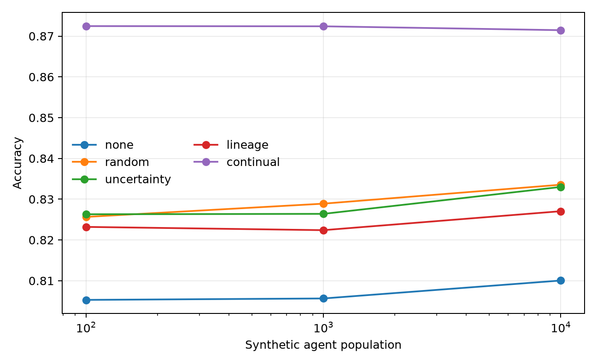
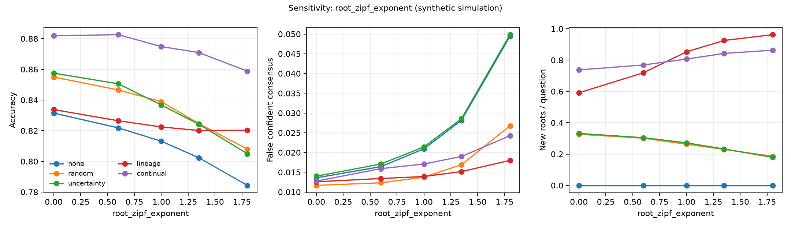
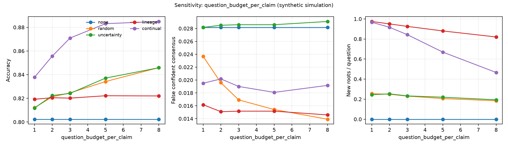
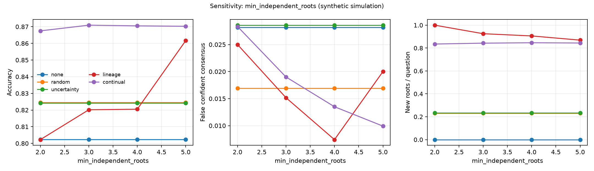
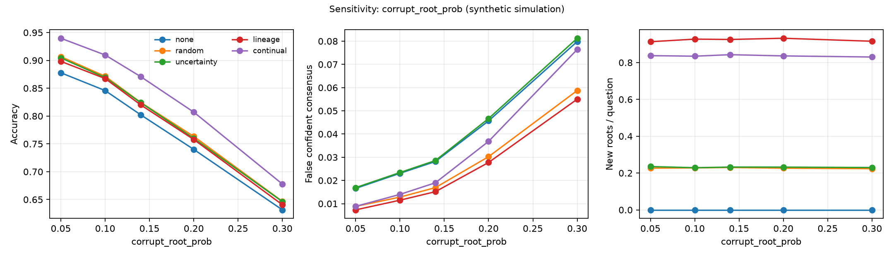
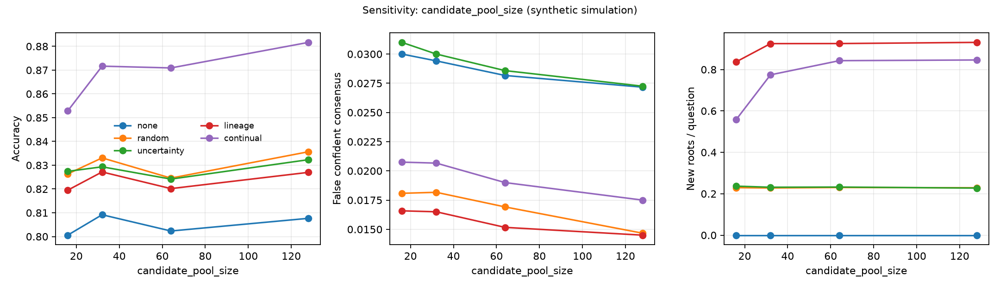

# Continual discovery: when should a collective ask, and whom?

**Evidence class: synthetic simulation / mechanism probe. Every number in this
document comes from a simulator. None of it is a deployment result, and none of
it belongs in the same table as the measured Track A and Track B numbers without
this label attached.**

September 6, 2026. Source: `experiments/continual_discovery/`. Two runs are
reported: a headline sweep (10 seeds x 2,000 claims at each of three population
labels) and a sensitivity sweep (23 cells, 8 seeds x 1,500 claims each, at a
population label of 1,000). Configs, seeds, raw per-run CSVs, and the figures
below are committed next to the code that produced them.

---

## 1. The question

Track A established, on a deterministic small-N simulator, that correlated
copies of a claim are not equivalent to independent support, and that
lineage-aware repair survives targeted failure better per byte transferred than
replication. That result is about *repair*: what to do once you know the
dependency structure.

This experiment asks the next question, about *acquisition*: when a collective's
evidence for a proposition descends from a small number of upstream roots, when
should it spend a question, and whom should it ask?

The failure mode being probed is a specific one. A collective can observe
twenty agents that agree, be confidently wrong, and have no way to notice —
because the twenty agents are descendants of two roots, one of which is corrupt.
Counting voices does not help. The experiment tests whether counting *lineages*
does.

## 2. What was simulated

Each synthetic proposition is generated as follows: a latent binary truth; a
handful of upstream evidence roots drawn with Zipf-distributed mass, so a few
roots dominate the population of descendants; each root either truth-aligned or
corrupted; candidate agents inheriting one root each; a small independent flip
probability per agent; and an initial coalition of six observed agents drawn from
a bounded candidate pool.

Five questioning policies compete:

| policy | trigger | selection |
|---|---|---|
| `none` | never asks | — |
| `random` | always spends the full budget | uniform over unseen agents |
| `uncertainty` | asks while answer confidence is low | uniform over unseen agents |
| `lineage` | asks while fewer than `min_independent_roots` roots are observed | prefers an agent from an unseen root |
| `continual` | combines uncertainty, lineage weakness, and observed conflict; stops early when all three are satisfied | prefers an agent from an unseen root |

All five share one root-balanced aggregator: descendants are grouped by root,
each root casts one vote, and confidence is the fraction of root votes behind the
prediction. This matters — it is what keeps the comparison about *questioning*
rather than about who has the better answer rule. A policy cannot win here by
inferring better, only by acquiring better evidence.

Metrics: root-balanced accuracy; **false confident consensus** (wrong while
final confidence is at or above 0.8 — the synthetic analogue of the dangerous
failure, certainty without truth); questions spent per claim; new independent
roots acquired per question; and resolved epistemic gap rate (of claims that
started wrong or under-confident, the fraction ending correct and confident).

## 3. Headline sweep

10 seeds x 2,000 claims at each population label.

| agents | policy | accuracy | false confident consensus | Q / claim | new roots / Q | resolved gaps |
|---:|---|---:|---:|---:|---:|---:|
| 100 | none | 0.805 ± 0.007 | 0.030 ± 0.004 | 0.00 | 0.000 | 0.000 |
| 100 | random | 0.826 ± 0.007 | 0.018 ± 0.003 | 3.00 | 0.227 | 0.097 |
| 100 | uncertainty | 0.826 ± 0.006 | 0.030 ± 0.004 | 1.17 | 0.232 | 0.006 |
| 100 | lineage | 0.823 ± 0.007 | 0.016 ± 0.003 | 0.24 | 0.928 | 0.000 |
| 100 | **continual** | **0.872 ± 0.007** | 0.021 ± 0.003 | 1.93 | 0.837 | 0.254 |
| 1,000 | none | 0.806 ± 0.009 | 0.028 ± 0.004 | 0.00 | 0.000 | 0.000 |
| 1,000 | random | 0.829 ± 0.010 | 0.017 ± 0.003 | 3.00 | 0.229 | 0.103 |
| 1,000 | uncertainty | 0.826 ± 0.007 | 0.029 ± 0.004 | 1.15 | 0.232 | 0.007 |
| 1,000 | lineage | 0.822 ± 0.010 | 0.015 ± 0.002 | 0.25 | 0.923 | 0.000 |
| 1,000 | **continual** | **0.872 ± 0.007** | 0.019 ± 0.003 | 1.94 | 0.839 | 0.260 |
| 10,000 | none | 0.810 ± 0.008 | 0.028 ± 0.004 | 0.00 | 0.000 | 0.000 |
| 10,000 | random | 0.834 ± 0.005 | 0.017 ± 0.002 | 3.00 | 0.226 | 0.101 |
| 10,000 | uncertainty | 0.833 ± 0.007 | 0.028 ± 0.004 | 1.13 | 0.236 | 0.007 |
| 10,000 | lineage | 0.827 ± 0.008 | 0.015 ± 0.004 | 0.24 | 0.926 | 0.000 |
| 10,000 | **continual** | **0.871 ± 0.004** | 0.019 ± 0.003 | 1.92 | 0.842 | 0.259 |



**The three population labels are flat, and that is not a scaling result.** The
per-claim candidate coalition is bounded at 64 agents regardless of population,
because the routing being modeled is sparse rather than all-to-all. The
population number is a label on the ID space these 64 are drawn from, not a
workload. Anyone reading these rows as "validated at 10,000 agents" is reading
them wrong; the correct reading is that the mechanism is insensitive to the size
of the population *outside* the routed coalition, which is what a sparse-routing
model predicts.

Two things stand out in the table itself. `continual` gains about four points of
accuracy over the best baseline while spending about a third fewer questions than
`random`. And `uncertainty` — the policy most systems actually implement — buys
accuracy but leaves false confident consensus exactly where `none` left it
(0.028 against 0.028 at 10,000). Confidence-triggered questioning cannot fix
confidently wrong, because it never fires there. That is the failure mode this
line of work exists to attack, and it is visible in the second column.

## 4. Sensitivity: the mechanism axis

The protocol requires that the effect not depend on one hand-picked
configuration, so each of five parameters was swept one at a time around the base
config, 8 seeds x 1,500 claims per cell. Every policy inside a cell sees the same
generated worlds, so all comparisons below are seed-paired: the quantity reported
is the mean per-seed difference with its standard error over the 8 seeds.

The most informative axis is `root_zipf_exponent`, which controls how
concentrated the lineage mass is. At 0.0 every root has equal weight and evidence
is effectively independent; at 1.8 a couple of roots dominate every claim.

`lineage` against `random` on accuracy, paired, as concentration rises:

| root_zipf_exponent | Δ accuracy (lineage − random) | SEM | seeds favoring lineage | verdict |
|---:|---:|---:|---:|---|
| 0.0 | −0.0212 | 0.0023 | 0 / 8 | loss |
| 0.6 | −0.0201 | 0.0018 | 0 / 8 | loss |
| 1.0 | −0.0165 | 0.0019 | 0 / 8 | loss |
| 1.35 (base) | −0.0044 | 0.0036 | 3 / 8 | tie |
| 1.8 | **+0.0122** | 0.0026 | 8 / 8 | win |

This is the cleanest confirmation in the run, and it is monotone. Lineage-aware
selection is worth nothing when evidence is already independent — at exponent
0.0 it barely fires at all (0.05 questions per claim, because six random
observers already cover three distinct roots) and it correctly does nothing. Its
value appears exactly in proportion to how correlated the evidence is, and it
overtakes random questioning in the regime the paper is actually about.



The same axis shows why the metric matters: at exponent 1.8, `none` and
`uncertainty` are confidently wrong on 4.9% and 5.0% of claims, `random` on 2.7%,
and `lineage` on 1.8% — at half a question per claim.

## 5. Sensitivity: question efficiency

Sweeping `question_budget_per_claim` separates the two things a policy can do
with a budget: spend it, or spend it well.

| budget | random accuracy (Q/claim) | continual accuracy (Q/claim) |
|---:|---|---|
| 1 | 0.812 (1.00) | 0.838 (0.73) |
| 2 | 0.821 (2.00) | 0.856 (1.37) |
| 3 (base) | 0.825 (3.00) | 0.871 (1.94) |
| 5 | 0.834 (5.00) | 0.883 (2.96) |
| 8 | 0.846 (8.00) | 0.885 (4.44) |

`continual` at a budget of 2 — 1.37 questions per claim in practice — is more
accurate than `random` at a budget of 8, which spends all 8.00: a paired
difference of **+0.0097 ± 0.0032, favoring `continual` on 7 of 8 seeds**. The
budget parameter does not touch world generation, so these two cells were run on
byte-identical worlds under the same seeds and the pairing is legitimate (the
`none` rows across budget cells are identical, which is the check).

That is a 5.8x reduction in questions asked, for slightly better accuracy. In a
real collective, where a question is a network round trip against another agent's
attention, this is the number that would matter.



## 6. Sensitivity: what the root target buys

`min_independent_roots` is the target the `lineage` policy asks toward. At the
base value of 3 it is nearly free to satisfy — the initial six observers usually
already cover three roots — so `lineage` spends 0.25 questions per claim and, as
section 4 shows, does not beat random questioning on accuracy.

Raise the target and the policy changes character:

| min_independent_roots | lineage accuracy | Q / claim | false confident consensus | resolved gaps |
|---:|---:|---:|---:|---:|
| 2 | 0.802 | 0.02 | 0.025 | 0.000 |
| 3 (base) | 0.820 | 0.25 | 0.015 | 0.000 |
| 4 | 0.821 | 0.91 | 0.007 | 0.000 |
| 5 | 0.862 | 1.85 | 0.020 | 0.320 |

At a target of 5, `lineage` beats `random` on accuracy by +0.0371 ± 0.0028 (8 of
8 seeds) and on resolved gaps by +0.2185 ± 0.0062, while still spending 1.85
questions against random's 3.00. So the honest reading of `lineage`'s weak
accuracy at the base configuration is **under-spending, not mis-selecting**: its
selection rule is good, its stopping rule is set too cheap. The target of 4 is
the cheapest configuration for suppressing confident error specifically — 0.007,
the lowest false-confident-consensus figure in any cell run at the base
corruption rate, at under one question per claim.



## 7. Sensitivity: corruption rate and pool size

Across `corrupt_root_prob` from 0.05 to 0.30, every policy degrades roughly
linearly and the ordering is stable: `continual` leads on accuracy in all five
cells, by 3.1 to 4.6 points over the strongest baseline in each cell — widest in
the middle of the range and narrowest at 0.30, where absolute accuracy has fallen
to 0.678 and no policy saves the claim. Across `candidate_pool_size` from 16 to
128, the `continual` advantage grows with the pool (0.853 against 0.826 at 16;
0.882 against 0.836 at 128), which is what a selection-quality effect should do:
a larger coalition offers more unseen roots to prefer, and lineage-blind policies
cannot exploit them.





## 8. Negative results

These are part of the result, not footnotes to it.

**`continual` is worse than `random` at avoiding confident error.** In 15 of 23
sensitivity cells, `random` has a lower false-confident-consensus rate, and the
gap widens with corruption: 0.076 against 0.059 at `corrupt_root_prob = 0.30`
(paired −0.0177 ± 0.0011, 0 of 8 seeds favoring `continual`). The cause is
structural. `continual` stops as soon as confidence is high, roots are
sufficient, and observed conflict is low — and a claim whose observed roots agree
because they share a corrupted ancestor satisfies all three. Spending the rest of
the budget blindly, as `random` does, sometimes stumbles into the disagreement
that the stopping rule declined to look for. A combined trigger that stops early
is buying accuracy and question cost at the price of calibration, and any
deployment that cares more about not being confidently wrong than about average
accuracy should prefer `lineage` at a high root target (section 6) over
`continual`.

**`lineage` alone does not improve accuracy.** Against `random`: 3 wins, 8 ties,
12 losses over 23 cells. Against `uncertainty`: 3 wins, 10 ties, 10 losses. The
wins are concentrated in the high-concentration and high-target cells discussed
above. Lineage-diversifying selection is a cheap calibration and evidence-quality
mechanism, not an accuracy mechanism, at the budgets swept here.

**No policy detects conflict reliably.** Of the claims where the candidate
coalition contains genuinely disagreeing roots, the best policy observes both
answers about 79% of the time (`random`, which spends the whole budget), against
75% for `continual` and 70% for asking nothing at all. Every policy leaves
one claim in five with an undetected latent disagreement inside reach.

**The sweep is descriptive, not confirmatory.** 736 seed-paired comparisons were
computed with no multiplicity correction, at 2 SEM. Individual cells should be
read as descriptive; the trends across an axis, especially the monotone one in
section 4, are what carry weight.

## 9. What this licenses, and what it does not

Safe to write:

> In a controlled synthetic simulation of correlated evidence lineages, a
> combined continual-questioning policy reached 87.1% root-balanced accuracy
> against 83.4% for the strongest baseline while spending roughly a third fewer
> questions, and a one-factor-at-a-time sensitivity sweep found the accuracy
> advantage in all 23 cells. In the same simulation, lineage-preferring selection
> acquired about 0.93 independent evidence roots per question against about 0.23
> for random selection, and its accuracy advantage over random questioning rose
> monotonically with lineage concentration. The combined policy was worse than
> random questioning on false confident consensus in 15 of 23 cells.

Not licensed by anything here:

> We validated the system at 10,000 agents.

> Our deployment demonstrates continual discovery at scale.

There is no deployment in this document. There are no agents, no messages, and no
network: there is a generative model of correlated evidence and five policies
reading from it. What the simulation supports is a mechanism claim — that
lineage-aware acquisition beats lineage-blind acquisition per question spent, in
proportion to how correlated the evidence actually is. Turning that into a
systems claim requires a systems experiment, which has not been run.

The same boundary applies in the other direction. The Track A survival numbers
(0.778 lineage-targeted, 2.11x survival per KB against full replication) are
measured on a deterministic, bitwise-reproducible simulator with real serialized
transfer volumes. They are a different evidence class from this document and
should not share a table with it without a column that says so.

## 10. Reproduction

```bash
cd experiments/continual_discovery
pip install -r requirements.txt
bash run_fast.sh          # headline sweep, ~15 s
bash run_sensitivity.sh   # 23-cell sensitivity sweep, ~2 min
```

The headline sweep reproduced the supplied run's metrics column-for-column on
Linux, Python 3.11.15, numpy 2.4.6 — only the `runtime_sec` column differs. Nine
tests pass, one of which asserts that a sensitivity cell evaluated at the base
parameter values reproduces the corresponding headline rows exactly, so the two
sweeps in this document cannot silently drift apart.

To regenerate the tables and figures from committed raw data without re-running
the simulation:

```bash
python3 src/sensitivity_sweep.py --config configs/fast.json --out results \
  --figures figures --from-raw results/sensitivity_raw.csv
```

Artifacts: `results/summary.md`, `results/paper_table.tex`,
`results/sensitivity_summary.md` (full per-axis tables and every loss),
`results/sensitivity_comparisons.csv` (all 736 paired comparisons),
`results/raw_runs.csv` and `results/sensitivity_raw.csv` (one row per run),
`results/run_config.json` and `results/sensitivity_config.json` (configs and
seeds), and `figures/`.
