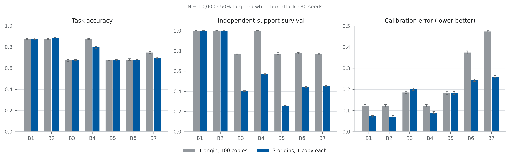
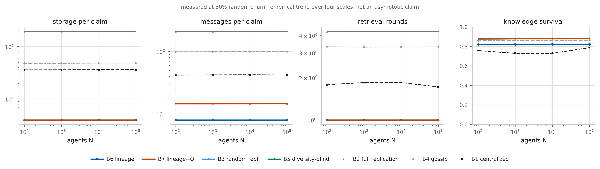
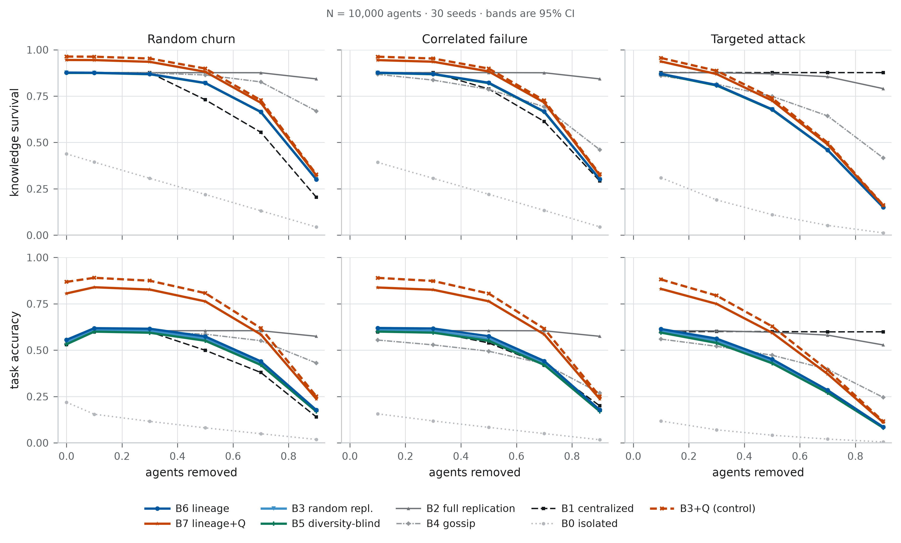
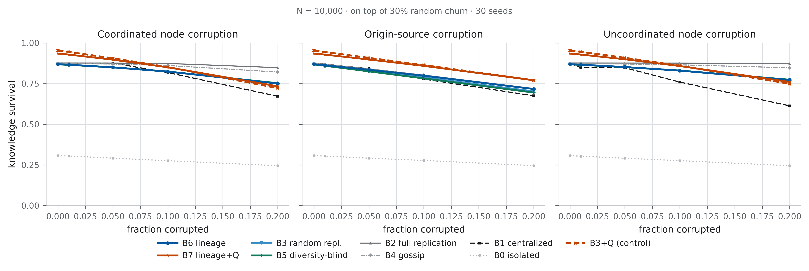
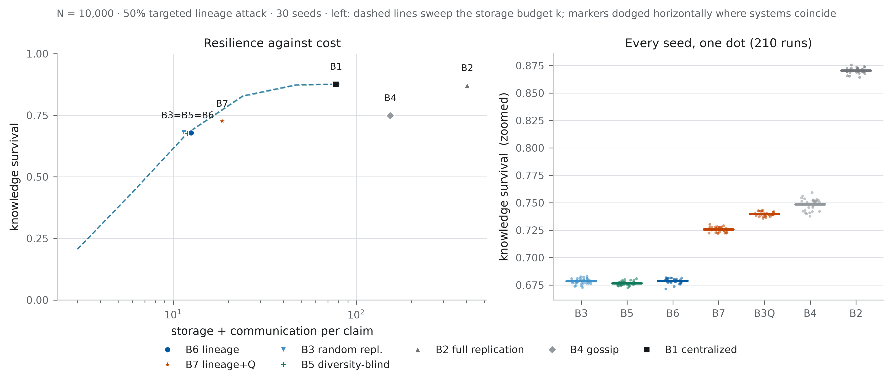

# Large-Scale Agentic Web Experiment

Decisive stress test for *3D Lineage-First Mycelial Fabric — Continual Discovery*.

This document is generated by `src/report.py` from `results/summary.json`. Every number is read out of the measured results; the comparative wording is derived from the sign of the measured difference.

- git commit: `88a82d7aaf8de43768221a7e48f7fa682f54dcb0`
- generated: `2026-09-06T15:38:09.867830+00:00`
- machine: Linux-6.18.44-fc-v24-x86_64-with-glibc2.39 / 4 CPU / python 3.11.15, numpy 2.4.6, scipy 1.17.1

## Scale

| | |
|---|---|
| **Agents** | 100, 1,000, 10,000, 100,000 |
| **Questions** | 127,374 labelled evaluation questions per seed at N = 10,000; 17,324,700 question instances answered per system across the main runs |
| **Trials (seeds)** | 30 at N ≤ 10,000; 10 at N = 100,000; 15 per ablation sweep |
| **Failures simulated** | 6 failure regimes over 31 regime×severity cells, 3 corruption models × 4 levels, 2 partition topologies × 2 phases = **47 conditions per seed** at N = 10,000 |
| **Systems** | 8 primary (B0–B7) plus 4 ablation cells (B3L, B6C, B2L, B3Q) |
| **Total experimental conditions** | 50,700 recorded (seed × condition × system) rows across 39 runs |
| **Runtime** | 97.2 CPU-minutes total, one machine, no GPU, **no LLM calls** |

> **Computational cost is reported separately and is entirely simulation.** There are no model calls in this experiment: semantic reasoning is abstracted to symbolic value matching (see *Limitations*).

## Primary result

Across **30 seeds at N = 10,000**, under a **white-box targeted lineage attack** that removes 50% of agents — the attacker knows each system's own placement and greedily destroys the hosts of the most important surviving independent evidence — the lineage-aware fabric (B6) recovered **0.679** of valid knowledge versus **0.678** for random replication (B3) and **0.677** for the diversity-blind replica-count policy (B5), all three at the identical storage budget of 4.0 published replicas per claim.

On raw knowledge survival the equal-budget policies are close: B6 − B3 Δ = +0.000 (95% CI [-0.001, 0.001], d_z = 0.10, paired t p = 0.59, Holm p = 0.59, n = 30). The separation appears in the quantities the architecture is actually about:

- **task accuracy**: B6 − B3 Δ = +0.010 (95% CI [0.009, 0.012], d_z = 2.29, paired t p = <1e-6, Holm p = <1e-6, n = 30)
- **independent-support survival (ISS)**: B6 − B3 Δ = +0.046 (95% CI [0.046, 0.047], d_z = 21.30, paired t p = <1e-6, Holm p = <1e-6, n = 30)
- **contradiction detection F1**: B6 − B3 Δ = +0.155 (95% CI [0.149, 0.161], d_z = 8.90, paired t p = <1e-6, Holm p = <1e-6, n = 30)
- **contradiction resolution** (accuracy on claims whose evidence genuinely disagrees): B6 − B3 Δ = +0.003 (95% CI [-0.001, 0.008], d_z = 0.26, paired t p = 0.16, Holm p = 0.33, n = 30)

Broad replication (B2) reached **0.870** survival under the same attack, but at 193.7 replicas per claim — **48× the storage** of the lineage fabric. The centralized store (B1) reached 0.876 at 36.3 replicas per claim, and is included as a performance upper baseline, not as a decentralised competitor.

### Table 1 — main results

Mean over seeds; 95% t-intervals in `tables/table1_main_results.csv`. KS = knowledge survival (recoverable **and correct**), ISS = independent-support survival, storage = published replicas per claim, messages = total messages per claim (publication + questioning + probing).

| condition | sys | KS | acc | ISS | contr. F1 | contr. resolved | ECE* | storage/claim | msgs/claim |
|---|---|---|---|---|---|---|---|---|---|
| 50% random churn | B0 | 0.219 | 0.081 | 0.142 | 0.000 | 0.127 | 0.007 | 0.000 | 0.000 |
| 50% random churn | B1 | 0.730 | 0.499 | 0.833 | 0.781 | 0.426 | 0.007 | 36.328 | 42.475 |
| 50% random churn | B2 | 0.876 | 0.605 | 1.000 | 0.900 | 0.513 | 0.006 | 193.749 | 209.462 |
| 50% random churn | B3 | 0.820 | 0.562 | 0.622 | 0.459 | 0.474 | 0.006 | 4.000 | 8.000 |
| 50% random churn | B4 | 0.864 | 0.586 | 0.960 | 0.896 | 0.512 | 0.007 | 48.437 | 99.588 |
| 50% random churn | B5 | 0.820 | 0.551 | 0.530 | 0.000 | 0.468 | 0.004 | 4.000 | 8.000 |
| 50% random churn | B6 | 0.821 | 0.574 | 0.686 | 0.638 | 0.477 | 0.006 | 4.000 | 8.000 |
| 50% random churn | B7 | 0.881 | 0.763 | 0.686 | 0.486 | 0.630 | 0.004 | 4.000 | 14.517 |
| 50% random churn | B3Q | 0.899 | 0.807 | 0.628 | 0.298 | 0.699 | 0.003 | 4.000 | 15.681 |
| 90% random churn | B0 | 0.044 | 0.018 | 0.028 | 0.000 | 0.026 | 0.019 | 0.000 | 0.000 |
| 90% random churn | B1 | 0.204 | 0.140 | 0.233 | 0.218 | 0.118 | 0.006 | 36.328 | 46.769 |
| 90% random churn | B2 | 0.843 | 0.575 | 0.895 | 0.868 | 0.509 | 0.007 | 193.749 | 251.032 |
| 90% random churn | B3 | 0.301 | 0.174 | 0.200 | 0.036 | 0.173 | 0.009 | 4.000 | 8.000 |
| 90% random churn | B4 | 0.669 | 0.431 | 0.528 | 0.639 | 0.460 | 0.007 | 48.437 | 118.795 |
| 90% random churn | B5 | 0.301 | 0.169 | 0.195 | 0.000 | 0.171 | 0.007 | 4.000 | 8.000 |
| 90% random churn | B6 | 0.300 | 0.177 | 0.203 | 0.058 | 0.172 | 0.008 | 4.000 | 8.000 |
| 90% random churn | B7 | 0.322 | 0.237 | 0.203 | 0.040 | 0.226 | 0.004 | 4.000 | 14.517 |
| 90% random churn | B3Q | 0.328 | 0.251 | 0.200 | 0.024 | 0.252 | 0.005 | 4.000 | 15.681 |
| 50% loss, whole organisations | B0 | 0.221 | 0.083 | 0.142 | 0.000 | 0.126 | 0.011 | 0.000 | 0.000 |
| 50% loss, whole organisations | B1 | 0.789 | 0.539 | 0.900 | 0.843 | 0.460 | 0.007 | 36.328 | 41.998 |
| 50% loss, whole organisations | B2 | 0.877 | 0.605 | 1.000 | 0.899 | 0.515 | 0.006 | 193.749 | 209.472 |
| 50% loss, whole organisations | B3 | 0.820 | 0.561 | 0.622 | 0.462 | 0.473 | 0.005 | 4.000 | 8.000 |
| 50% loss, whole organisations | B4 | 0.787 | 0.494 | 0.750 | 0.772 | 0.505 | 0.008 | 48.437 | 102.565 |
| 50% loss, whole organisations | B5 | 0.820 | 0.550 | 0.530 | 0.000 | 0.469 | 0.003 | 4.000 | 8.000 |
| 50% loss, whole organisations | B6 | 0.822 | 0.575 | 0.687 | 0.639 | 0.477 | 0.006 | 4.000 | 8.000 |
| 50% loss, whole organisations | B7 | 0.883 | 0.764 | 0.687 | 0.489 | 0.633 | 0.004 | 4.000 | 14.517 |
| 50% loss, whole organisations | B3Q | 0.898 | 0.806 | 0.628 | 0.298 | 0.701 | 0.004 | 4.000 | 15.681 |
| 70% loss, whole failure domains | B0 | 0.132 | 0.050 | 0.085 | 0.000 | 0.076 | 0.010 | 0.000 | 0.000 |
| 70% loss, whole failure domains | B1 | 0.672 | 0.460 | 0.767 | 0.719 | 0.392 | 0.007 | 36.328 | 42.955 |
| 70% loss, whole failure domains | B2 | 0.876 | 0.604 | 0.998 | 0.899 | 0.512 | 0.007 | 193.749 | 218.316 |
| 70% loss, whole failure domains | B3 | 0.665 | 0.431 | 0.471 | 0.238 | 0.385 | 0.005 | 4.000 | 8.000 |
| 70% loss, whole failure domains | B4 | 0.763 | 0.490 | 0.696 | 0.747 | 0.494 | 0.007 | 48.437 | 107.307 |
| 70% loss, whole failure domains | B5 | 0.665 | 0.421 | 0.430 | 0.000 | 0.381 | 0.005 | 4.000 | 8.000 |
| 70% loss, whole failure domains | B6 | 0.667 | 0.442 | 0.499 | 0.359 | 0.387 | 0.007 | 4.000 | 8.000 |
| 70% loss, whole failure domains | B7 | 0.716 | 0.586 | 0.499 | 0.262 | 0.506 | 0.004 | 4.000 | 14.517 |
| 70% loss, whole failure domains | B3Q | 0.727 | 0.617 | 0.473 | 0.151 | 0.564 | 0.004 | 4.000 | 15.681 |
| 50% targeted lineage attack | B0 | 0.111 | 0.041 | 0.067 | 0.000 | 0.069 | 0.014 | 0.000 | 0.000 |
| 50% targeted lineage attack | B1 | 0.876 | 0.600 | 1.000 | 0.937 | 0.511 | 0.007 | 36.328 | 41.286 |
| 50% targeted lineage attack | B2 | 0.870 | 0.597 | 0.993 | 0.895 | 0.513 | 0.006 | 193.749 | 210.089 |
| 50% targeted lineage attack | B3 | 0.678 | 0.441 | 0.504 | 0.351 | 0.390 | 0.006 | 4.000 | 8.000 |
| 50% targeted lineage attack | B4 | 0.749 | 0.472 | 0.691 | 0.747 | 0.492 | 0.007 | 48.437 | 105.090 |
| 50% targeted lineage attack | B5 | 0.677 | 0.429 | 0.437 | 0.000 | 0.385 | 0.005 | 4.000 | 8.000 |
| 50% targeted lineage attack | B6 | 0.679 | 0.451 | 0.550 | 0.506 | 0.394 | 0.008 | 4.000 | 8.000 |
| 50% targeted lineage attack | B7 | 0.726 | 0.594 | 0.550 | 0.398 | 0.511 | 0.004 | 4.000 | 14.517 |
| 50% targeted lineage attack | B3Q | 0.740 | 0.628 | 0.507 | 0.243 | 0.566 | 0.004 | 4.000 | 15.681 |
| 20% origin-source corruption | B0 | 0.246 | 0.090 | 0.198 | 0.000 | 0.197 | 0.012 | 0.000 | 0.000 |
| 20% origin-source corruption | B1 | 0.675 | 0.431 | 0.933 | 0.870 | 0.577 | 0.010 | 36.328 | 41.763 |
| 20% origin-source corruption | B2 | 0.719 | 0.464 | 1.000 | 0.894 | 0.608 | 0.010 | 193.749 | 205.168 |
| 20% origin-source corruption | B3 | 0.702 | 0.456 | 0.706 | 0.628 | 0.574 | 0.008 | 4.000 | 8.000 |
| 20% origin-source corruption | B4 | 0.719 | 0.461 | 0.994 | 0.901 | 0.611 | 0.009 | 48.437 | 96.845 |
| 20% origin-source corruption | B5 | 0.695 | 0.444 | 0.561 | 0.000 | 0.554 | 0.009 | 4.000 | 8.000 |
| 20% origin-source corruption | B6 | 0.717 | 0.475 | 0.810 | 0.827 | 0.611 | 0.009 | 4.000 | 8.000 |
| 20% origin-source corruption | B7 | 0.770 | 0.640 | 0.810 | 0.794 | 0.660 | 0.009 | 4.000 | 14.517 |
| 20% origin-source corruption | B3Q | 0.770 | 0.667 | 0.715 | 0.610 | 0.642 | 0.008 | 4.000 | 15.681 |
| 20% coordinated node corruption | B0 | 0.245 | 0.090 | 0.199 | 0.000 | 0.223 | 0.012 | 0.000 | 0.000 |
| 20% coordinated node corruption | B1 | 0.672 | 0.459 | 0.967 | 0.206 | 0.663 | 0.006 | 36.328 | 41.520 |
| 20% coordinated node corruption | B2 | 0.848 | 0.578 | 1.000 | 0.722 | 0.834 | 0.007 | 193.749 | 205.169 |
| 20% coordinated node corruption | B3 | 0.751 | 0.498 | 0.706 | 0.540 | 0.739 | 0.009 | 4.000 | 8.000 |
| 20% coordinated node corruption | B4 | 0.821 | 0.539 | 0.994 | 0.764 | 0.825 | 0.009 | 48.437 | 96.841 |
| 20% coordinated node corruption | B5 | 0.752 | 0.492 | 0.561 | 0.504 | 0.741 | 0.009 | 4.000 | 8.000 |
| 20% coordinated node corruption | B6 | 0.750 | 0.507 | 0.810 | 0.557 | 0.738 | 0.010 | 4.000 | 8.000 |
| 20% coordinated node corruption | B7 | 0.733 | 0.589 | 0.810 | 0.576 | 0.706 | 0.009 | 4.000 | 14.517 |
| 20% coordinated node corruption | B3Q | 0.722 | 0.600 | 0.714 | 0.555 | 0.689 | 0.011 | 4.000 | 15.681 |
| 4-way partition, after reconnect | B0 | 0.392 | 0.191 | 0.283 | 0.000 | 0.240 | 0.008 | 0.000 | 0.000 |
| 4-way partition, after reconnect | B1 | 0.672 | 0.363 | 1.000 | 0.421 | 0.297 | 0.006 | 36.328 | 41.286 |
| 4-way partition, after reconnect | B2 | 0.659 | 0.357 | 1.000 | 0.797 | 0.259 | 0.008 | 193.749 | 201.749 |
| 4-way partition, after reconnect | B3 | 0.677 | 0.375 | 0.773 | 0.701 | 0.305 | 0.008 | 4.000 | 8.000 |
| 4-way partition, after reconnect | B4 | 0.759 | 0.431 | 1.000 | 0.850 | 0.422 | 0.008 | 48.437 | 94.467 |
| 4-way partition, after reconnect | B5 | 0.676 | 0.368 | 0.566 | 0.561 | 0.304 | 0.006 | 4.000 | 8.000 |
| 4-way partition, after reconnect | B6 | 0.674 | 0.382 | 0.930 | 0.761 | 0.299 | 0.012 | 4.000 | 8.000 |
| 4-way partition, after reconnect | B7 | 0.829 | 0.695 | 0.930 | 0.622 | 0.548 | 0.007 | 4.000 | 15.393 |
| 4-way partition, after reconnect | B3Q | 0.882 | 0.792 | 0.786 | 0.463 | 0.666 | 0.005 | 4.000 | 16.881 |

*ECE\* is calibration error after held-out histogram recalibration; raw ECE and confidence AUROC are in `tables/appendix_full_grid.csv`.*

## Continual questioning result

**What B3+Q controls for.** B3+Q applies the identical questioning machinery to random placement with replica-count aggregation. It is not a *lineage-free* system: re-verifying a stored replica requires knowing which origin produced it, so provenance metadata is still present. What B3+Q removes is lineage-aware *placement* (choosing which evidence to publish so that distinct origins are covered) and lineage-aware *aggregation* (counting distinct origins rather than replicas). The comparison therefore answers: does continual discovery need those two mechanisms, or only the provenance pointer it uses to ask?

G_Q is measured **at identical storage**: the questioning system's base placement budget is reduced by exactly the number of replicas its questions add, so the only extra cost is messages. Paired by seed, n = 30.

| condition | metric | B6 | B7 | G_Q | d_z | Holm p | G_Q on B3 base |
|---|---|---|---|---|---|---|---|
| 50% loss, whole organisations | accuracy_macro | 0.575 | 0.764 | 0.189 | 37.157 | 0.000 | 0.245 |
| 50% loss, whole organisations | acc_revision_sensitive | 0.142 | 0.593 | 0.451 | 44.437 | 0.000 | 0.593 |
| 50% loss, whole organisations | knowledge_survival | 0.822 | 0.883 | 0.061 | 18.591 | 0.000 | 0.078 |
| 50% loss, whole organisations | contradiction_f1 | 0.639 | 0.489 | -0.150 | -11.949 | 0.000 | -0.163 |
| 50% loss, whole organisations | contradiction_resolved_acc | 0.477 | 0.633 | 0.155 | 12.246 | 0.000 | 0.229 |
| 50% targeted lineage attack | accuracy_macro | 0.451 | 0.594 | 0.143 | 32.914 | 0.000 | 0.187 |
| 50% targeted lineage attack | acc_revision_sensitive | 0.120 | 0.469 | 0.349 | 48.481 | 0.000 | 0.467 |
| 50% targeted lineage attack | knowledge_survival | 0.679 | 0.726 | 0.047 | 16.405 | 0.000 | 0.061 |
| 50% targeted lineage attack | contradiction_f1 | 0.506 | 0.398 | -0.108 | -5.507 | 0.000 | -0.109 |
| 50% targeted lineage attack | contradiction_resolved_acc | 0.394 | 0.511 | 0.118 | 9.541 | 0.000 | 0.175 |
| 50% random churn | accuracy_macro | 0.574 | 0.763 | 0.189 | 44.472 | 0.000 | 0.246 |
| 50% random churn | acc_revision_sensitive | 0.142 | 0.590 | 0.447 | 54.517 | 0.000 | 0.593 |
| 50% random churn | knowledge_survival | 0.821 | 0.881 | 0.060 | 23.198 | 0.000 | 0.078 |
| 50% random churn | contradiction_f1 | 0.638 | 0.486 | -0.152 | -9.171 | 0.000 | -0.161 |
| 50% random churn | contradiction_resolved_acc | 0.477 | 0.630 | 0.153 | 12.793 | 0.000 | 0.225 |
| 20% origin-source corruption | accuracy_macro | 0.475 | 0.640 | 0.165 | 29.336 | 0.000 | 0.210 |
| 20% origin-source corruption | acc_revision_sensitive | 0.117 | 0.511 | 0.395 | 29.488 | 0.000 | 0.519 |
| 20% origin-source corruption | knowledge_survival | 0.717 | 0.770 | 0.054 | 15.508 | 0.000 | 0.068 |
| 20% origin-source corruption | contradiction_f1 | 0.827 | 0.794 | -0.033 | -8.154 | 0.000 | -0.018 |
| 20% origin-source corruption | contradiction_resolved_acc | 0.611 | 0.660 | 0.049 | 6.494 | 0.000 | 0.069 |
| 20% coordinated node corruption | accuracy_macro | 0.507 | 0.589 | 0.082 | 10.830 | 0.000 | 0.102 |
| 20% coordinated node corruption | acc_revision_sensitive | 0.117 | 0.438 | 0.321 | 29.604 | 0.000 | 0.426 |
| 20% coordinated node corruption | knowledge_survival | 0.750 | 0.733 | -0.017 | -3.192 | 0.000 | -0.029 |
| 20% coordinated node corruption | contradiction_f1 | 0.557 | 0.576 | 0.018 | 3.156 | 0.000 | 0.015 |
| 20% coordinated node corruption | contradiction_resolved_acc | 0.738 | 0.706 | -0.031 | -6.556 | 0.000 | -0.050 |

Note the two contradiction metrics move in opposite directions for the questioning system, and that is the mechanism working as designed: re-verification *removes* the disagreement from the fabric, so there is less disagreement left to detect (F1 falls) while more contradictory claims end up answered correctly (resolution rises).

The cost of that gain: 14.52 messages per claim versus 8.00 for B6 without questioning — a 1.81× increase in communication for zero increase in storage.

### Question budget

| sys | questions/claim | accuracy | stale-fact acc | contr. F1 | msgs/claim |
|---|---|---|---|---|---|
| B6 | 0.050 | 0.576 | 0.142 | 0.640 | 8.000 |
| B6 | 0.100 | 0.576 | 0.142 | 0.640 | 8.000 |
| B6 | 0.200 | 0.576 | 0.142 | 0.640 | 8.000 |
| B6 | 0.400 | 0.576 | 0.142 | 0.640 | 8.000 |
| B6 | 0.600 | 0.576 | 0.142 | 0.640 | 8.000 |
| B6 | 1.000 | 0.576 | 0.142 | 0.640 | 8.000 |
| B6 | 2.000 | 0.576 | 0.142 | 0.640 | 8.000 |
| B7 | 0.050 | 0.601 | 0.208 | 0.635 | 8.531 |
| B7 | 0.100 | 0.622 | 0.259 | 0.631 | 9.064 |
| B7 | 0.200 | 0.659 | 0.350 | 0.618 | 10.127 |
| B7 | 0.400 | 0.713 | 0.480 | 0.572 | 12.255 |
| B7 | 0.600 | 0.765 | 0.593 | 0.492 | 14.516 |
| B7 | 1.000 | 0.850 | 0.780 | 0.276 | 19.356 |
| B7 | 2.000 | 0.897 | 0.882 | 0.141 | 26.399 |

### Question-targeting strategy

| targeting | accuracy | stale-fact acc | KS | ISS | contr. F1 |
|---|---|---|---|---|---|
| hybrid | 0.765 | 0.593 | 0.884 | 0.688 | 0.492 |
| random | 0.720 | 0.475 | 0.872 | 0.688 | 0.429 |
| strategic | 0.719 | 0.486 | 0.869 | 0.688 | 0.517 |
| temporal | 0.773 | 0.608 | 0.889 | 0.688 | 0.421 |

### Which question type does the work

| question type | accuracy | stale-fact acc | KS | ISS | contr. F1 | msgs/claim |
|---|---|---|---|---|---|---|
| RESOLVE only | 0.818 | 0.713 | 0.902 | 0.688 | 0.406 | 17.120 |
| ADD_SUPPORT only | 0.602 | 0.200 | 0.833 | 0.688 | 0.598 | 12.090 |
| REVERIFY only | 0.817 | 0.714 | 0.901 | 0.687 | 0.405 | 14.718 |

## Correlated replication result

The world contains two designated claim classes that isolate the core distinction. A *correlated* claim has **one** origin with **100** derived copies (`e0 → e1..e100`); an *independent* claim has **three** origins with one copy each. Both are measured under the same 50% white-box targeted attack.

| sys | acc (1 origin ×100) | acc (3 origins ×1) | acc gap | ISS corr. | ISS indep. | ECE corr. | ECE indep. |
|---|---|---|---|---|---|---|---|
| B1 | 0.874 | 0.878 | 0.005 | 1.000 | 1.000 | 0.122 | 0.072 |
| B2 | 0.874 | 0.881 | 0.008 | 1.000 | 1.000 | 0.122 | 0.070 |
| B3 | 0.673 | 0.676 | 0.003 | 0.770 | 0.401 | 0.186 | 0.200 |
| B4 | 0.874 | 0.795 | -0.079 | 1.000 | 0.572 | 0.122 | 0.090 |
| B5 | 0.679 | 0.675 | -0.004 | 0.775 | 0.257 | 0.184 | 0.183 |
| B6 | 0.679 | 0.674 | -0.006 | 0.777 | 0.445 | 0.375 | 0.243 |
| B7 | 0.748 | 0.696 | -0.051 | 0.770 | 0.451 | 0.474 | 0.261 |

Reading the table: three independent origins are worth less than one hundred correlated copies for every system (accuracy gap -0.006 for B6, -0.004 for B5, +0.008 for B2). The replica-count policy B5, which keeps the *best-corroborated* evidence, is the one that most systematically confuses the two: its independent-support survival on correlated claims is 0.775 against 0.777 for the lineage fabric.



## Scaling result

Measured at 50% random churn across every scale that was run. **These are empirical scaling trends from a handful of measured points, not asymptotic complexity claims.**

| sys | quantity | points | log-log slope | R² | trend | measured (N:value) |
|---|---|---|---|---|---|---|
| B1 | storage_per_claim | 4 | 0.001 | 0.909 | approximately constant | 100:36.02;1000:36.1;10000:36.33;100000:36.35 |
| B1 | messages_per_claim | 4 | 0.001 | 0.081 | approximately constant | 100:41.92;1000:42.23;10000:42.48;100000:42.02 |
| B1 | mean_probe_rounds | 4 | -0.005 | 0.166 | approximately constant | 100:1.785;1000:1.849;10000:1.849;100000:1.722 |
| B1 | eval_seconds | 4 | 0.643 | 0.868 | sub-linear (near sqrt) | 100:0.004047;1000:0.003814;10000:0.02589;100000:0.2963 |
| B1 | knowledge_survival | 4 | 0.005 | 0.175 | varies with N | 100:0.7579;1000:0.7301;10000:0.7301;100000:0.7885 |
| B2 | storage_per_claim | 4 | 0.001 | 0.909 | approximately constant | 100:192.1;1000:192.5;10000:193.7;100000:193.9 |
| B2 | messages_per_claim | 4 | 0.001 | 0.915 | approximately constant | 100:207.8;1000:208.3;10000:209.5;100000:209.6 |
| B2 | mean_probe_rounds | 4 | 0.000 | 0.508 | approximately constant | 100:4.263;1000:4.274;10000:4.271;100000:4.273 |
| B2 | eval_seconds | 4 | 0.810 | 0.867 | sub-linear (near sqrt) | 100:0.01244;1000:0.01256;10000:0.1174;100000:2.963 |
| B2 | knowledge_survival | 4 | 0.000 | 0.627 | flat in N | 100:0.8738;1000:0.8764;10000:0.8763;100000:0.8765 |
| B3 | storage_per_claim | 4 | 0.000 | -- | approximately constant | 100:4;1000:4;10000:4;100000:4 |
| B3 | messages_per_claim | 4 | 0.000 | -- | approximately constant | 100:8;1000:8;10000:8;100000:8 |
| B3 | mean_probe_rounds | 4 | 0.000 | -- | approximately constant | 100:1;1000:1;10000:1;100000:1 |
| B3 | eval_seconds | 4 | 0.615 | 0.874 | sub-linear (near sqrt) | 100:0.004087;1000:0.004059;10000:0.02454;100000:0.2516 |
| B3 | knowledge_survival | 4 | 0.000 | 0.924 | flat in N | 100:0.8192;1000:0.8202;10000:0.8205;100000:0.821 |
| B4 | storage_per_claim | 4 | 0.001 | 0.909 | approximately constant | 100:48.02;1000:48.13;10000:48.44;100000:48.46 |
| B4 | messages_per_claim | 4 | 0.001 | 0.896 | approximately constant | 100:98.88;1000:99.01;10000:99.59;100000:99.64 |
| B4 | mean_probe_rounds | 4 | -0.000 | 0.068 | approximately constant | 100:3.322;1000:3.307;10000:3.313;100000:3.316 |
| B4 | eval_seconds | 4 | 0.699 | 0.874 | sub-linear (near sqrt) | 100:0.006262;1000:0.006175;10000:0.04822;100000:0.6756 |
| B4 | knowledge_survival | 4 | 0.001 | 0.608 | flat in N | 100:0.8587;1000:0.8641;10000:0.864;100000:0.8642 |
| B6 | storage_per_claim | 4 | 0.000 | -- | approximately constant | 100:4;1000:4;10000:4;100000:4 |
| B6 | messages_per_claim | 4 | 0.000 | -- | approximately constant | 100:8;1000:8;10000:8;100000:8 |
| B6 | mean_probe_rounds | 4 | 0.000 | -- | approximately constant | 100:1;1000:1;10000:1;100000:1 |
| B6 | eval_seconds | 4 | 0.629 | 0.871 | sub-linear (near sqrt) | 100:0.003912;1000:0.003848;10000:0.0239;100000:0.2666 |
| B6 | knowledge_survival | 4 | -0.000 | 0.082 | flat in N | 100:0.8218;1000:0.8204;10000:0.8209;100000:0.8212 |
| B7 | storage_per_claim | 4 | 0.000 | -- | approximately constant | 100:4;1000:4;10000:4;100000:4 |
| B7 | messages_per_claim | 4 | 0.000 | 0.975 | approximately constant | 100:14.51;1000:14.51;10000:14.52;100000:14.52 |
| B7 | mean_probe_rounds | 4 | 0.000 | -- | approximately constant | 100:1;1000:1;10000:1;100000:1 |
| B7 | eval_seconds | 4 | 0.626 | 0.875 | sub-linear (near sqrt) | 100:0.003885;1000:0.003773;10000:0.02487;100000:0.2525 |
| B7 | knowledge_survival | 4 | -0.000 | 0.195 | flat in N | 100:0.8826;1000:0.8808;10000:0.8813;100000:0.8816 |



For the lineage fabric, per-claim storage is fixed by the budget k and therefore does not grow with N (4.00 at N = 100 → 4.00 at N = 100,000); retrieval cost is 1.00 → 1.00 rounds, and knowledge survival is 0.822 → 0.821. The behaviour therefore persists at N ≥ 10⁴; the total knowledge base grows with N (2 claims per agent), so per-claim costs that stay flat mean total system cost grows linearly in N rather than super-linearly.

## Failure-domain result

Correlated failure removes whole failure domains, organisations or regions, trimmed to exactly the same node-level severity as the random regime, so the comparison isolates *structure* of the failure rather than its size.

| condition | system | KS | accuracy | ISS |
|---|---|---|---|---|
| 50% random churn | B1 | 0.730 | 0.499 | 0.833 |
| 50% random churn | B2 | 0.876 | 0.605 | 1.000 |
| 50% random churn | B3 | 0.820 | 0.562 | 0.622 |
| 50% random churn | B4 | 0.864 | 0.586 | 0.960 |
| 50% random churn | B5 | 0.820 | 0.551 | 0.530 |
| 50% random churn | B6 | 0.821 | 0.574 | 0.686 |
| 50% random churn | B7 | 0.881 | 0.763 | 0.686 |
| 50% loss, whole organisations | B1 | 0.789 | 0.539 | 0.900 |
| 50% loss, whole organisations | B2 | 0.877 | 0.605 | 1.000 |
| 50% loss, whole organisations | B3 | 0.820 | 0.561 | 0.622 |
| 50% loss, whole organisations | B4 | 0.787 | 0.494 | 0.750 |
| 50% loss, whole organisations | B5 | 0.820 | 0.550 | 0.530 |
| 50% loss, whole organisations | B6 | 0.822 | 0.575 | 0.687 |
| 50% loss, whole organisations | B7 | 0.883 | 0.764 | 0.687 |
| 70% loss, whole failure domains | B1 | 0.672 | 0.460 | 0.767 |
| 70% loss, whole failure domains | B2 | 0.876 | 0.604 | 0.998 |
| 70% loss, whole failure domains | B3 | 0.665 | 0.431 | 0.471 |
| 70% loss, whole failure domains | B4 | 0.763 | 0.490 | 0.696 |
| 70% loss, whole failure domains | B5 | 0.665 | 0.421 | 0.430 |
| 70% loss, whole failure domains | B6 | 0.667 | 0.442 | 0.499 |
| 70% loss, whole failure domains | B7 | 0.716 | 0.586 | 0.499 |
| 50% targeted lineage attack | B1 | 0.876 | 0.600 | 1.000 |
| 50% targeted lineage attack | B2 | 0.870 | 0.597 | 0.993 |
| 50% targeted lineage attack | B3 | 0.678 | 0.441 | 0.504 |
| 50% targeted lineage attack | B4 | 0.749 | 0.472 | 0.691 |
| 50% targeted lineage attack | B5 | 0.677 | 0.429 | 0.437 |
| 50% targeted lineage attack | B6 | 0.679 | 0.451 | 0.550 |
| 50% targeted lineage attack | B7 | 0.726 | 0.594 | 0.550 |
| 90% random churn | B1 | 0.204 | 0.140 | 0.233 |
| 90% random churn | B2 | 0.843 | 0.575 | 0.895 |
| 90% random churn | B3 | 0.301 | 0.174 | 0.200 |
| 90% random churn | B4 | 0.669 | 0.431 | 0.528 |
| 90% random churn | B5 | 0.301 | 0.169 | 0.195 |
| 90% random churn | B6 | 0.300 | 0.177 | 0.203 |
| 90% random churn | B7 | 0.322 | 0.237 | 0.203 |



## Partition and reconciliation result

The network is split into 2 or 4 components; facts are updated independently inside the component that holds their origin; then the network reconnects. `acc_updated` is the reconciliation rate — of the claims updated during the split, the fraction that carry the post-update value afterwards. `conflict_visible` is the fraction of those claims where the system can actually *see* the disagreement in the evidence it retrieves.

| sys | KS | accuracy | reconciliation rate | conflict visible | contr. F1 |
|---|---|---|---|---|---|
| B0 | 0.392 | 0.191 | 0.284 | 0.000 | 0.000 |
| B1 | 0.672 | 0.363 | 0.196 | 0.021 | 0.421 |
| B2 | 0.659 | 0.357 | 0.153 | 0.804 | 0.797 |
| B3 | 0.677 | 0.375 | 0.211 | 0.626 | 0.701 |
| B4 | 0.759 | 0.431 | 0.485 | 0.761 | 0.850 |
| B5 | 0.676 | 0.368 | 0.214 | 0.618 | 0.561 |
| B6 | 0.674 | 0.382 | 0.203 | 0.631 | 0.761 |
| B7 | 0.829 | 0.695 | 0.554 | 0.368 | 0.622 |
| B3Q | 0.882 | 0.792 | 0.688 | 0.262 | 0.463 |

- After reconnection, B6 − B3 accuracy Δ = +0.007 (95% CI [0.005, 0.008], d_z = 1.72, paired t p = <1e-6, Holm p = <1e-6, n = 30)
- After reconnection, B7 − B6 accuracy Δ = +0.314 (95% CI [0.311, 0.316], d_z = 49.75, paired t p = <1e-6, Holm p = <1e-6, n = 30)
- After reconnection, B7 − B3Q accuracy Δ = -0.096 (95% CI [-0.098, -0.095], d_z = -19.26, paired t p = <1e-6, Holm p = <1e-6, n = 30)

## Corruption result

Three corruption models are injected on top of 30% random churn: **coordinated node corruption** (all corrupt agents assert the *same* false value — the worst case for majority voting), **uncoordinated node corruption**, and **origin-source corruption**, in which a corrupted origin's false value is inherited by every one of its derived copies. The last model is the one that separates replica count from independent support.

| condition | system | KS | accuracy | ISS | contradiction_F1 |
|---|---|---|---|---|---|
| 20% coordinated node corruption | B1 | 0.672 | 0.459 | 0.967 | 0.206 |
| 20% coordinated node corruption | B2 | 0.848 | 0.578 | 1.000 | 0.722 |
| 20% coordinated node corruption | B3 | 0.751 | 0.498 | 0.706 | 0.540 |
| 20% coordinated node corruption | B4 | 0.821 | 0.539 | 0.994 | 0.764 |
| 20% coordinated node corruption | B5 | 0.752 | 0.492 | 0.561 | 0.504 |
| 20% coordinated node corruption | B6 | 0.750 | 0.507 | 0.810 | 0.557 |
| 20% coordinated node corruption | B7 | 0.733 | 0.589 | 0.810 | 0.576 |
| 20% origin-source corruption | B1 | 0.675 | 0.431 | 0.933 | 0.870 |
| 20% origin-source corruption | B2 | 0.719 | 0.464 | 1.000 | 0.894 |
| 20% origin-source corruption | B3 | 0.702 | 0.456 | 0.706 | 0.628 |
| 20% origin-source corruption | B4 | 0.719 | 0.461 | 0.994 | 0.901 |
| 20% origin-source corruption | B5 | 0.695 | 0.444 | 0.561 | 0.000 |
| 20% origin-source corruption | B6 | 0.717 | 0.475 | 0.810 | 0.827 |
| 20% origin-source corruption | B7 | 0.770 | 0.640 | 0.810 | 0.794 |

- Under 20% origin-source corruption, B6 − B3 accuracy Δ = +0.019 (95% CI [0.018, 0.020], d_z = 5.14, paired t p = <1e-6, Holm p = <1e-6, n = 30); contradiction F1 Δ = +0.199 (95% CI [0.197, 0.201], d_z = 37.05, paired t p = <1e-6, Holm p = <1e-6, n = 30)
- Under 20% origin-source corruption, B6 − B5 accuracy Δ = +0.031 (95% CI [0.029, 0.032], d_z = 7.14, paired t p = <1e-6, Holm p = <1e-6, n = 30); contradiction F1 Δ = +0.827 (95% CI [0.826, 0.828], d_z = 266.03, paired t p = <1e-6, Holm p = <1e-6, n = 30)
- Under 20% origin-source corruption, B6 − B2 accuracy Δ = +0.011 (95% CI [0.010, 0.013], d_z = 2.87, paired t p = <1e-6, Holm p = <1e-6, n = 30); contradiction F1 Δ = -0.067 (95% CI [-0.068, -0.066], d_z = -17.50, paired t p = <1e-6, Holm p = <1e-6, n = 30)



## Cost result

Storage is counted as published replicas per claim; communication counts every message: publication, questioning, and every probe attempt including attempts on dead hosts.

| sys | KS | storage/claim | msgs/claim | redundancy eff. | comm. eff. |
|---|---|---|---|---|---|
| B0 | 0.1106 | 0.0000 | 0.0000 | -- | -- |
| B1 | 0.8761 | 36.3279 | 41.2864 | 0.0241 | 0.0212 |
| B2 | 0.8704 | 193.7486 | 210.0891 | 0.0045 | 0.0041 |
| B3 | 0.6784 | 4.0000 | 8.0000 | 0.1696 | 0.0848 |
| B4 | 0.7486 | 48.4371 | 105.0899 | 0.0155 | 0.0071 |
| B5 | 0.6766 | 4.0000 | 8.0000 | 0.1692 | 0.0846 |
| B6 | 0.6787 | 4.0000 | 8.0000 | 0.1697 | 0.0848 |
| B7 | 0.7257 | 4.0000 | 14.5165 | 0.1814 | 0.0500 |

Sweeping the storage budget k ∈ {1, 2, 4, 8, 16, 32} traces each equal-budget policy's own resilience/cost curve, so the frontier claim does not depend on one arbitrary budget:

| sys | k | storage/claim | msgs/claim | KS | accuracy | ISS |
|---|---|---|---|---|---|---|
| B3 | 1 | 1.000 | 2.000 | 0.205 | 0.115 | 0.133 |
| B3 | 2 | 2.000 | 4.000 | 0.435 | 0.261 | 0.297 |
| B3 | 4 | 4.000 | 8.000 | 0.679 | 0.442 | 0.504 |
| B3 | 8 | 8.000 | 16.000 | 0.829 | 0.567 | 0.689 |
| B3 | 16 | 16.000 | 30.936 | 0.875 | 0.606 | 0.813 |
| B3 | 32 | 32.000 | 49.350 | 0.877 | 0.606 | 0.892 |
| B5 | 1 | 1.000 | 2.000 | 0.207 | 0.113 | 0.133 |
| B5 | 2 | 2.000 | 4.000 | 0.438 | 0.256 | 0.283 |
| B5 | 4 | 4.000 | 8.000 | 0.677 | 0.430 | 0.437 |
| B5 | 8 | 8.000 | 16.000 | 0.826 | 0.557 | 0.533 |
| B5 | 16 | 16.000 | 30.976 | 0.872 | 0.598 | 0.563 |
| B5 | 32 | 32.000 | 49.691 | 0.876 | 0.602 | 0.566 |
| B6 | 1 | 1.000 | 2.000 | 0.205 | 0.119 | 0.133 |
| B6 | 2 | 2.000 | 4.000 | 0.438 | 0.270 | 0.315 |
| B6 | 4 | 4.000 | 8.000 | 0.679 | 0.452 | 0.550 |
| B6 | 8 | 8.000 | 16.000 | 0.829 | 0.578 | 0.773 |
| B6 | 16 | 16.000 | 30.961 | 0.873 | 0.616 | 0.918 |
| B6 | 32 | 32.000 | 49.618 | 0.876 | 0.618 | 0.982 |



## Negative results

Every condition in which the proposed architecture is **significantly worse** than a baseline on a primary metric (paired t-test, p < 0.05, uncorrected — deliberately the permissive threshold, so that nothing is hidden by a correction) is enumerated in `tables/table8_negative_results.csv`. There are 1295 such (condition, metric, comparison) entries.

| system | loses to | metric | n_conditions | worst condition | worst gap |
|---|---|---|---|---|---|
| B6 | B2 | iss | 161 | targeted_whitebox sev=0.9 none@0.0 N=10000 | -0.712 |
| B6 | B4 | iss | 161 | random sev=0.7 none@0.0 N=100000 | -0.353 |
| B7 | B2 | iss | 161 | targeted_whitebox sev=0.9 none@0.0 N=10000 | -0.712 |
| B7 | B3Q | accuracy_macro | 152 | partition sev=0.0 none@0.0 N=1000 | -0.100 |
| B6 | B2 | knowledge_survival | 135 | targeted_whitebox sev=0.9 none@0.0 N=10000 | -0.640 |
| B7 | B3Q | knowledge_survival | 126 | partition sev=0.0 none@0.0 N=10000 | -0.053 |
| B6 | B4 | knowledge_survival | 109 | random sev=0.9 none@0.0 N=10000 | -0.369 |
| B6 | B2 | accuracy_macro | 89 | targeted_whitebox sev=0.9 none@0.0 N=10000 | -0.442 |
| B6 | B4 | accuracy_macro | 65 | random sev=0.9 none@0.0 N=10000 | -0.254 |
| B7 | B2 | knowledge_survival | 65 | targeted_whitebox sev=0.9 none@0.0 N=1000 | -0.631 |
| B7 | B2 | accuracy_macro | 36 | targeted_whitebox sev=0.9 none@0.0 N=1000 | -0.419 |
| B6 | B3 | knowledge_survival | 12 | targeted_whitebox sev=0.9 none@0.0 N=100 | -0.012 |
| B6 | B5 | knowledge_survival | 10 | targeted_whitebox sev=0.9 none@0.0 N=100 | -0.012 |
| B7 | B6 | knowledge_survival | 7 | random sev=0.3 node_coordinated@0.2 N=10000 | -0.017 |
| B7 | B6 | iss | 2 | random sev=0.5 none@0.0 N=100 | -0.004 |
| B6 | B3 | iss | 2 | targeted_whitebox sev=0.9 none@0.0 N=100 | -0.006 |
| B7 | B3Q | iss | 2 | targeted_world sev=0.9 none@0.0 N=100 | -0.009 |

### Regimes where lineage awareness does not help

- **Single-origin claims.** ~35% of claims in the world have exactly one lineage root. No placement policy can create independent support that does not exist; per-subset accuracy for these claims is in `acc_single_root` in `tables/appendix_full_grid.csv`.
- **Raw availability at equal budget.** Under random churn, knowledge survival is set by how many replicas survive, not by whose evidence they are: the equal-budget policies B3, B5 and B6 are close, and the lineage advantage is confined to correctness, independent-support survival, contradiction detection and calibration.
- **Extreme churn.** As severity approaches 90%, every equal-budget policy converges toward the same floor; only systems that pay orders of magnitude more storage (B2, B4) stay high.
- **Questioning is not lineage-specific.** The G_Q table shows the same questioning machinery applied to a count-based system (B3+Q). Where the two gains are comparable, continual discovery is an orthogonal contribution rather than a consequence of lineage.
- **Questioning can amplify corruption.** Re-verification contacts the origin; if the origin is corrupt, it installs the false value. See the corruption rows in the G_Q table for the measured sign of the effect.
- **The aggregation rule is nearly inert.** The placement × aggregation factorial (`tables/table7_placement_x_aggregation.csv`) isolates what the lineage weighting itself buys once placement is held fixed.

### Deliberately hostile worlds

Six variants of the world generator were run specifically to find where the architecture stops helping. Each keeps everything else fixed and changes one property of the world or of the questioning policy.

| world variant | B6 acc | B6 − B3 | p (B6−B3) | B7 − B6 (G_Q) | p (G_Q) | B3Q − B3 |
|---|---|---|---|---|---|---|
| every claim has exactly one origin (no independent evidence exists) | 0.546 | 0.002 | 0.0016 | 0.214 | <1e-6 | 0.288 |
| near-perfectly correlated evidence (heavier family tail, 25% of claims are 1-origin/100-copy) | 0.571 | 0.014 | <1e-6 | 0.190 | <1e-6 | 0.252 |
| 75% of facts are revised | 0.415 | 0.014 | <1e-6 | 0.267 | <1e-6 | 0.346 |
| 5% of facts are revised | 0.650 | 0.013 | <1e-6 | 0.149 | <1e-6 | 0.194 |
| 8 randomly-targeted questions per claim (flooding) | 0.576 | 0.013 | <1e-6 | 0.320 | <1e-6 | 0.331 |
| 50% of origin sources corrupted | 0.576 | 0.013 | <1e-6 | 0.189 | <1e-6 | 0.244 |

Full per-variant results: `tables/table9_negative_regimes.csv`; paired tests: `tables/table9b_negative_regime_tests.csv`.

**Placement × aggregation, standard world** (50% white-box attack)

Note that for the lineage placement the two aggregation rules nearly coincide *by construction*: round-robin over origins publishes at most one replica per origin, so counting replicas and counting distinct origins give the same tally. The informative cells are the broad-replication ones (B2 vs B2L), where retrieved replicas greatly outnumber distinct origins.

| cell | placement | aggregation | KS | accuracy | ISS | contr. F1 | storage |
|---|---|---|---|---|---|---|---|
| B2 | broad | count | 0.871 | 0.597 | 0.993 | 0.896 | 194.036 |
| B2L | broad | lineage | 0.870 | 0.598 | 0.993 | 0.896 | 194.036 |
| B3 | random | count | 0.679 | 0.442 | 0.504 | 0.351 | 4.000 |
| B3L | random | lineage | 0.679 | 0.442 | 0.504 | 0.347 | 4.000 |
| B5 | support-count | count | 0.677 | 0.430 | 0.437 | 0.000 | 4.000 |
| B6 | lineage | lineage | 0.679 | 0.452 | 0.550 | 0.509 | 4.000 |
| B6C | lineage | count | 0.679 | 0.451 | 0.549 | 0.509 | 4.000 |

**Placement × aggregation, correlation-dominated world** (50% white-box attack)

Same cells with a much heavier family tail (family_alpha 0.4) and 25% of claims in the 1-origin/100-copy class — the regime in which replica count and independent support diverge most.

| cell | placement | aggregation | KS | accuracy | ISS | contr. F1 | storage |
|---|---|---|---|---|---|---|---|
| B2 | broad | count | 0.868 | 0.583 | 0.989 | 0.833 | 875.100 |
| B2L | broad | lineage | 0.867 | 0.581 | 0.990 | 0.835 | 875.100 |
| B3 | random | count | 0.679 | 0.437 | 0.559 | 0.323 | 4.000 |
| B3L | random | lineage | 0.679 | 0.438 | 0.558 | 0.316 | 4.000 |
| B5 | support-count | count | 0.677 | 0.431 | 0.515 | 0.000 | 4.000 |
| B6 | lineage | lineage | 0.679 | 0.446 | 0.602 | 0.507 | 4.000 |
| B6C | lineage | count | 0.678 | 0.446 | 0.601 | 0.509 | 4.000 |

## Success criteria

The experiment was specified with three criteria. They are evaluated here against the measured numbers, independently of whether the proposed architecture comes out ahead.

### 1. SCALE — does the behaviour persist at N ≥ 10⁴? **MET**

| N | B6−B3 accuracy | Holm p | B6−B3 ISS | B7−B6 accuracy (G_Q) | seeds |
|---|---|---|---|---|---|
| 100 | 0.008 | 0.00082 | 0.052 | 0.196 | 30 |
| 1,000 | 0.010 | 0.0023 | 0.047 | 0.185 | 30 |
| 10,000 | 0.010 | <1e-6 | 0.046 | 0.189 | 30 |
| 100,000 | 0.009 | <1e-6 | 0.046 | 0.187 | 10 |

### 2. RESILIENCE — KS(lineage) > KS(replication) at comparable budget under correlated or targeted failure? **PARTIALLY MET**

| condition | comparison | ΔKS | d_z | Holm p | significant |
|---|---|---|---|---|---|
| 50% loss, whole organisations | B6 − B3 | 0.002 | 0.908 | 8.1e-05 | yes |
| 50% loss, whole organisations | B6 − B5 | 0.002 | 0.755 | 0.00056 | yes |
| 70% loss, whole failure domains | B6 − B3 | 0.001 | 0.333 | 0.16 | no |
| 70% loss, whole failure domains | B6 − B5 | 0.002 | 0.446 | 0.062 | no |
| 50% targeted lineage attack | B6 − B3 | 0.000 | 0.100 | 0.59 | no |
| 50% targeted lineage attack | B6 − B5 | 0.002 | 0.774 | 0.00041 | yes |

3 of 6 equal-budget survival comparisons are positive and significant. Where they are not, the correct reading is that at matched storage the three policies keep roughly the same *amount* of knowledge alive; what differs is whether what survives is independent, and whether the answer built from it is correct.

### 3. DISCOVERY — does continual questioning produce a statistically meaningful improvement? **MET**

| condition | metric | G_Q | d_z | Holm p | significant |
|---|---|---|---|---|---|
| 50% loss, whole organisations | stale-fact accuracy | 0.451 | 44.437 | <1e-6 | yes |
| 50% loss, whole organisations | contradiction resolution | 0.155 | 12.246 | <1e-6 | yes |
| 50% loss, whole organisations | downstream accuracy | 0.189 | 37.157 | <1e-6 | yes |
| 50% targeted lineage attack | stale-fact accuracy | 0.349 | 48.481 | <1e-6 | yes |
| 50% targeted lineage attack | contradiction resolution | 0.118 | 9.541 | <1e-6 | yes |
| 50% targeted lineage attack | downstream accuracy | 0.143 | 32.914 | <1e-6 | yes |
| 20% origin-source corruption | stale-fact accuracy | 0.395 | 29.488 | <1e-6 | yes |
| 20% origin-source corruption | contradiction resolution | 0.049 | 6.494 | <1e-6 | yes |
| 20% origin-source corruption | downstream accuracy | 0.165 | 29.336 | <1e-6 | yes |
| 4-way partition, after reconnect | stale-fact accuracy | 0.536 | 73.862 | <1e-6 | yes |
| 4-way partition, after reconnect | contradiction resolution | 0.249 | 16.428 | <1e-6 | yes |
| 4-way partition, after reconnect | downstream accuracy | 0.314 | 49.747 | <1e-6 | yes |

**Important qualification.** The identical questioning machinery applied to a count-based system gains +0.245 accuracy, which is larger than the +0.189 it gains on top of lineage. Criterion 3 is therefore met for continual discovery as a mechanism, but the data do **not** support the stronger claim that questioning depends on, or is amplified by, lineage awareness.

## Statistical tests

1953 paired comparisons are recorded in `tables/table2_statistical_tests.csv`. Every comparison is paired by seed — the same world, workload and failure draw is given to both systems — and reports the mean difference, a bootstrap 95% CI of that difference (10,000 resamples), Cohen's d_z, a paired t-test, a Wilcoxon signed-rank test, and a Holm–Bonferroni corrected p-value computed within each metric's comparison family.

| condition | comparison | metric | mean_a | mean_b | diff | ci | d_z | p_t | p_wilcoxon | p_holm | sig |
|---|---|---|---|---|---|---|---|---|---|---|---|
| 50% targeted lineage attack | B6 − B3 | knowledge_survival | 0.679 | 0.678 | 0.000 | [-0.001, 0.001] | 0.100 | 0.59 | 0.65 | 0.59 | no |
| 50% targeted lineage attack | B6 − B3 | accuracy_macro | 0.451 | 0.441 | 0.010 | [0.009, 0.012] | 2.288 | <1e-6 | <1e-6 | <1e-6 | yes |
| 50% targeted lineage attack | B6 − B3 | iss | 0.550 | 0.504 | 0.046 | [0.046, 0.047] | 21.303 | <1e-6 | <1e-6 | <1e-6 | yes |
| 50% targeted lineage attack | B6 − B5 | knowledge_survival | 0.679 | 0.677 | 0.002 | [0.001, 0.003] | 0.774 | 0.00021 | 0.00086 | 0.00041 | yes |
| 50% targeted lineage attack | B6 − B5 | accuracy_macro | 0.451 | 0.429 | 0.022 | [0.021, 0.023] | 6.223 | <1e-6 | <1e-6 | <1e-6 | yes |
| 50% targeted lineage attack | B6 − B5 | iss | 0.550 | 0.437 | 0.113 | [0.112, 0.114] | 47.212 | <1e-6 | <1e-6 | <1e-6 | yes |
| 50% targeted lineage attack | B6 − B2 | knowledge_survival | 0.679 | 0.870 | -0.192 | [-0.192, -0.191] | -96.579 | <1e-6 | 1.7e-06 | <1e-6 | yes |
| 50% targeted lineage attack | B6 − B2 | accuracy_macro | 0.451 | 0.597 | -0.146 | [-0.146, -0.145] | -54.501 | <1e-6 | <1e-6 | <1e-6 | yes |
| 50% targeted lineage attack | B6 − B2 | iss | 0.550 | 0.993 | -0.443 | [-0.444, -0.442] | -194.644 | <1e-6 | <1e-6 | <1e-6 | yes |
| 50% targeted lineage attack | B7 − B6 | knowledge_survival | 0.726 | 0.679 | 0.047 | [0.046, 0.048] | 16.405 | <1e-6 | 1.7e-06 | <1e-6 | yes |
| 50% targeted lineage attack | B7 − B6 | accuracy_macro | 0.594 | 0.451 | 0.143 | [0.141, 0.144] | 32.914 | <1e-6 | <1e-6 | <1e-6 | yes |
| 50% targeted lineage attack | B7 − B6 | iss | 0.550 | 0.550 | -0.000 | [-0.001, 0.000] | -0.136 | 0.46 | 0.33 | 0.46 | no |
| 50% targeted lineage attack | B7 − B3Q | knowledge_survival | 0.726 | 0.740 | -0.014 | [-0.015, -0.013] | -4.766 | <1e-6 | 1.7e-06 | <1e-6 | yes |
| 50% targeted lineage attack | B7 − B3Q | accuracy_macro | 0.594 | 0.628 | -0.034 | [-0.036, -0.032] | -5.931 | <1e-6 | <1e-6 | <1e-6 | yes |
| 50% targeted lineage attack | B7 − B3Q | iss | 0.550 | 0.507 | 0.043 | [0.042, 0.043] | 19.802 | <1e-6 | <1e-6 | <1e-6 | yes |
| 50% loss, whole organisations | B6 − B3 | knowledge_survival | 0.822 | 0.820 | 0.002 | [0.001, 0.003] | 0.908 | 2.7e-05 | 0.00015 | 8.1e-05 | yes |
| 50% loss, whole organisations | B6 − B3 | accuracy_macro | 0.575 | 0.561 | 0.014 | [0.013, 0.016] | 3.906 | <1e-6 | <1e-6 | <1e-6 | yes |
| 50% loss, whole organisations | B6 − B3 | iss | 0.687 | 0.622 | 0.065 | [0.064, 0.066] | 24.259 | <1e-6 | <1e-6 | <1e-6 | yes |
| 50% loss, whole organisations | B6 − B5 | knowledge_survival | 0.822 | 0.820 | 0.002 | [0.001, 0.003] | 0.755 | 0.00028 | 0.00072 | 0.00056 | yes |
| 50% loss, whole organisations | B6 − B5 | accuracy_macro | 0.575 | 0.550 | 0.025 | [0.023, 0.026] | 5.937 | <1e-6 | <1e-6 | <1e-6 | yes |
| 50% loss, whole organisations | B6 − B5 | iss | 0.687 | 0.530 | 0.157 | [0.156, 0.158] | 60.695 | <1e-6 | <1e-6 | <1e-6 | yes |
| 50% loss, whole organisations | B6 − B2 | knowledge_survival | 0.822 | 0.877 | -0.054 | [-0.055, -0.053] | -22.602 | <1e-6 | 1.7e-06 | <1e-6 | yes |
| 50% loss, whole organisations | B6 − B2 | accuracy_macro | 0.575 | 0.605 | -0.030 | [-0.031, -0.029] | -8.872 | <1e-6 | <1e-6 | <1e-6 | yes |
| 50% loss, whole organisations | B6 − B2 | iss | 0.687 | 1.000 | -0.313 | [-0.314, -0.312] | -116.311 | <1e-6 | <1e-6 | <1e-6 | yes |
| 50% loss, whole organisations | B7 − B6 | knowledge_survival | 0.883 | 0.822 | 0.061 | [0.060, 0.062] | 18.591 | <1e-6 | 1.7e-06 | <1e-6 | yes |
| 50% loss, whole organisations | B7 − B6 | accuracy_macro | 0.764 | 0.575 | 0.189 | [0.187, 0.190] | 37.157 | <1e-6 | <1e-6 | <1e-6 | yes |
| 50% loss, whole organisations | B7 − B6 | iss | 0.687 | 0.687 | 0.001 | [-0.000, 0.002] | 0.202 | 0.28 | 0.33 | 0.28 | no |
| 50% loss, whole organisations | B7 − B3Q | knowledge_survival | 0.883 | 0.898 | -0.015 | [-0.016, -0.015] | -6.462 | <1e-6 | 1.7e-06 | <1e-6 | yes |
| 50% loss, whole organisations | B7 − B3Q | accuracy_macro | 0.764 | 0.806 | -0.042 | [-0.043, -0.040] | -9.171 | <1e-6 | <1e-6 | <1e-6 | yes |
| 50% loss, whole organisations | B7 − B3Q | iss | 0.687 | 0.628 | 0.059 | [0.058, 0.060] | 25.209 | <1e-6 | <1e-6 | <1e-6 | yes |
| 70% loss, whole failure domains | B6 − B3 | knowledge_survival | 0.667 | 0.665 | 0.001 | [-0.000, 0.003] | 0.333 | 0.078 | 0.1 | 0.16 | no |
| 70% loss, whole failure domains | B6 − B3 | accuracy_macro | 0.442 | 0.431 | 0.012 | [0.010, 0.013] | 2.503 | <1e-6 | <1e-6 | <1e-6 | yes |
| 70% loss, whole failure domains | B6 − B3 | iss | 0.499 | 0.471 | 0.028 | [0.027, 0.029] | 8.576 | <1e-6 | <1e-6 | <1e-6 | yes |
| 70% loss, whole failure domains | B6 − B5 | knowledge_survival | 0.667 | 0.665 | 0.002 | [0.000, 0.003] | 0.446 | 0.021 | 0.025 | 0.062 | no |
| 70% loss, whole failure domains | B6 − B5 | accuracy_macro | 0.442 | 0.421 | 0.021 | [0.020, 0.023] | 4.622 | <1e-6 | <1e-6 | <1e-6 | yes |
| 70% loss, whole failure domains | B6 − B5 | iss | 0.499 | 0.430 | 0.069 | [0.068, 0.070] | 21.502 | <1e-6 | <1e-6 | <1e-6 | yes |
| 70% loss, whole failure domains | B6 − B2 | knowledge_survival | 0.667 | 0.876 | -0.209 | [-0.210, -0.208] | -69.205 | <1e-6 | <1e-6 | <1e-6 | yes |
| 70% loss, whole failure domains | B6 − B2 | accuracy_macro | 0.442 | 0.604 | -0.162 | [-0.163, -0.161] | -44.999 | <1e-6 | <1e-6 | <1e-6 | yes |
| 70% loss, whole failure domains | B6 − B2 | iss | 0.499 | 0.998 | -0.499 | [-0.501, -0.498] | -132.303 | <1e-6 | <1e-6 | <1e-6 | yes |
| 70% loss, whole failure domains | B7 − B6 | knowledge_survival | 0.716 | 0.667 | 0.049 | [0.048, 0.051] | 12.339 | <1e-6 | 1.7e-06 | <1e-6 | yes |
| 70% loss, whole failure domains | B7 − B6 | accuracy_macro | 0.586 | 0.442 | 0.144 | [0.142, 0.146] | 29.140 | <1e-6 | <1e-6 | <1e-6 | yes |
| 70% loss, whole failure domains | B7 − B6 | iss | 0.499 | 0.499 | 0.000 | [-0.001, 0.002] | 0.131 | 0.48 | 0.52 | 0.48 | no |
| 70% loss, whole failure domains | B7 − B3Q | knowledge_survival | 0.716 | 0.727 | -0.011 | [-0.012, -0.010] | -2.657 | <1e-6 | 1.7e-06 | <1e-6 | yes |
| 70% loss, whole failure domains | B7 − B3Q | accuracy_macro | 0.586 | 0.617 | -0.031 | [-0.033, -0.029] | -5.217 | <1e-6 | <1e-6 | <1e-6 | yes |
| 70% loss, whole failure domains | B7 − B3Q | iss | 0.499 | 0.473 | 0.026 | [0.025, 0.027] | 8.160 | <1e-6 | <1e-6 | <1e-6 | yes |
| 20% origin-source corruption | B6 − B3 | knowledge_survival | 0.717 | 0.702 | 0.014 | [0.013, 0.015] | 5.128 | <1e-6 | <1e-6 | <1e-6 | yes |
| 20% origin-source corruption | B6 − B3 | accuracy_macro | 0.475 | 0.456 | 0.019 | [0.018, 0.020] | 5.142 | <1e-6 | <1e-6 | <1e-6 | yes |
| 20% origin-source corruption | B6 − B3 | iss | 0.810 | 0.706 | 0.104 | [0.103, 0.105] | 53.870 | <1e-6 | <1e-6 | <1e-6 | yes |
| 20% origin-source corruption | B6 − B5 | knowledge_survival | 0.717 | 0.695 | 0.022 | [0.021, 0.023] | 6.418 | <1e-6 | <1e-6 | <1e-6 | yes |
| 20% origin-source corruption | B6 − B5 | accuracy_macro | 0.475 | 0.444 | 0.031 | [0.029, 0.032] | 7.136 | <1e-6 | <1e-6 | <1e-6 | yes |
| 20% origin-source corruption | B6 − B5 | iss | 0.810 | 0.561 | 0.249 | [0.248, 0.250] | 104.339 | <1e-6 | <1e-6 | <1e-6 | yes |
| 20% origin-source corruption | B6 − B2 | knowledge_survival | 0.717 | 0.719 | -0.003 | [-0.004, -0.002] | -0.962 | 1.2e-05 | 6.9e-05 | 4.8e-05 | yes |
| 20% origin-source corruption | B6 − B2 | accuracy_macro | 0.475 | 0.464 | 0.011 | [0.010, 0.013] | 2.872 | <1e-6 | <1e-6 | <1e-6 | yes |
| 20% origin-source corruption | B6 − B2 | iss | 0.810 | 1.000 | -0.190 | [-0.191, -0.189] | -91.736 | <1e-6 | <1e-6 | <1e-6 | yes |
| 20% origin-source corruption | B7 − B6 | knowledge_survival | 0.770 | 0.717 | 0.054 | [0.053, 0.055] | 15.508 | <1e-6 | 1.7e-06 | <1e-6 | yes |
| 20% origin-source corruption | B7 − B6 | accuracy_macro | 0.640 | 0.475 | 0.165 | [0.163, 0.167] | 29.336 | <1e-6 | <1e-6 | <1e-6 | yes |
| 20% origin-source corruption | B7 − B6 | iss | 0.810 | 0.810 | -0.000 | [-0.001, 0.000] | -0.227 | 0.22 | 0.19 | 0.22 | no |
| 20% origin-source corruption | B7 − B3Q | knowledge_survival | 0.770 | 0.770 | -0.000 | [-0.001, 0.001] | -0.029 | 0.87 | 0.99 | 0.87 | no |
| 20% origin-source corruption | B7 − B3Q | accuracy_macro | 0.640 | 0.667 | -0.027 | [-0.028, -0.025] | -6.903 | <1e-6 | <1e-6 | <1e-6 | yes |
| 20% origin-source corruption | B7 − B3Q | iss | 0.810 | 0.715 | 0.095 | [0.095, 0.096] | 61.064 | <1e-6 | <1e-6 | <1e-6 | yes |
| 50% random churn | B6 − B3 | knowledge_survival | 0.821 | 0.820 | 0.000 | [-0.001, 0.001] | 0.160 | 0.39 | 0.37 | 0.4 | no |
| 50% random churn | B6 − B3 | accuracy_macro | 0.574 | 0.562 | 0.012 | [0.010, 0.014] | 2.780 | <1e-6 | <1e-6 | <1e-6 | yes |
| 50% random churn | B6 − B3 | iss | 0.686 | 0.622 | 0.064 | [0.063, 0.065] | 23.867 | <1e-6 | <1e-6 | <1e-6 | yes |
| 50% random churn | B6 − B5 | knowledge_survival | 0.821 | 0.820 | 0.001 | [-0.000, 0.002] | 0.282 | 0.13 | 0.17 | 0.4 | no |
| 50% random churn | B6 − B5 | accuracy_macro | 0.574 | 0.551 | 0.023 | [0.022, 0.024] | 6.243 | <1e-6 | <1e-6 | <1e-6 | yes |
| 50% random churn | B6 − B5 | iss | 0.686 | 0.530 | 0.156 | [0.155, 0.157] | 57.753 | <1e-6 | <1e-6 | <1e-6 | yes |
| 50% random churn | B6 − B2 | knowledge_survival | 0.821 | 0.876 | -0.055 | [-0.056, -0.055] | -24.182 | <1e-6 | 1.7e-06 | <1e-6 | yes |
| 50% random churn | B6 − B2 | accuracy_macro | 0.574 | 0.605 | -0.031 | [-0.032, -0.030] | -8.500 | <1e-6 | <1e-6 | <1e-6 | yes |
| 50% random churn | B6 − B2 | iss | 0.686 | 1.000 | -0.314 | [-0.315, -0.313] | -104.606 | <1e-6 | <1e-6 | <1e-6 | yes |
| 50% random churn | B7 − B6 | knowledge_survival | 0.881 | 0.821 | 0.060 | [0.059, 0.061] | 23.198 | <1e-6 | 1.7e-06 | <1e-6 | yes |
| 50% random churn | B7 − B6 | accuracy_macro | 0.763 | 0.574 | 0.189 | [0.188, 0.191] | 44.472 | <1e-6 | <1e-6 | <1e-6 | yes |
| 50% random churn | B7 − B6 | iss | 0.686 | 0.686 | 0.000 | [-0.001, 0.001] | 0.031 | 0.87 | 0.56 | 0.87 | no |
| 50% random churn | B7 − B3Q | knowledge_survival | 0.881 | 0.899 | -0.017 | [-0.018, -0.016] | -7.040 | <1e-6 | 1.7e-06 | <1e-6 | yes |
| 50% random churn | B7 − B3Q | accuracy_macro | 0.763 | 0.807 | -0.044 | [-0.046, -0.043] | -9.081 | <1e-6 | <1e-6 | <1e-6 | yes |
| 50% random churn | B7 − B3Q | iss | 0.686 | 0.628 | 0.058 | [0.057, 0.059] | 23.178 | <1e-6 | <1e-6 | <1e-6 | yes |
| 90% random churn | B6 − B3 | knowledge_survival | 0.300 | 0.301 | -0.001 | [-0.003, 0.000] | -0.253 | 0.18 | 0.24 | 0.53 | no |
| 90% random churn | B6 − B3 | accuracy_macro | 0.177 | 0.174 | 0.003 | [0.002, 0.004] | 0.767 | 0.00023 | 0.00034 | 0.00046 | yes |
| 90% random churn | B6 − B3 | iss | 0.203 | 0.200 | 0.003 | [0.001, 0.004] | 0.769 | 0.00023 | 0.00021 | 0.0009 | yes |
| 90% random churn | B6 − B5 | knowledge_survival | 0.300 | 0.301 | -0.001 | [-0.003, 0.001] | -0.233 | 0.21 | 0.3 | 0.53 | no |
| 90% random churn | B6 − B5 | accuracy_macro | 0.177 | 0.169 | 0.008 | [0.007, 0.009] | 2.114 | <1e-6 | <1e-6 | <1e-6 | yes |
| 90% random churn | B6 − B5 | iss | 0.203 | 0.195 | 0.008 | [0.007, 0.010] | 2.643 | <1e-6 | <1e-6 | <1e-6 | yes |
| 90% random churn | B6 − B2 | knowledge_survival | 0.300 | 0.843 | -0.543 | [-0.544, -0.541] | -121.786 | <1e-6 | <1e-6 | <1e-6 | yes |
| 90% random churn | B6 − B2 | accuracy_macro | 0.177 | 0.575 | -0.398 | [-0.399, -0.397] | -94.364 | <1e-6 | <1e-6 | <1e-6 | yes |
| 90% random churn | B6 − B2 | iss | 0.203 | 0.895 | -0.692 | [-0.693, -0.691] | -254.301 | <1e-6 | <1e-6 | <1e-6 | yes |
| 90% random churn | B7 − B6 | knowledge_survival | 0.322 | 0.300 | 0.022 | [0.021, 0.023] | 5.200 | <1e-6 | 1.7e-06 | <1e-6 | yes |
| 90% random churn | B7 − B6 | accuracy_macro | 0.237 | 0.177 | 0.060 | [0.058, 0.062] | 13.066 | <1e-6 | <1e-6 | <1e-6 | yes |
| 90% random churn | B7 − B6 | iss | 0.203 | 0.203 | 0.000 | [-0.001, 0.001] | 0.067 | 0.71 | 0.76 | 1 | no |
| 90% random churn | B7 − B3Q | knowledge_survival | 0.322 | 0.328 | -0.006 | [-0.007, -0.004] | -1.387 | <1e-6 | 5.2e-06 | <1e-6 | yes |
| 90% random churn | B7 − B3Q | accuracy_macro | 0.237 | 0.251 | -0.014 | [-0.016, -0.012] | -2.433 | <1e-6 | <1e-6 | <1e-6 | yes |
| 90% random churn | B7 − B3Q | iss | 0.203 | 0.200 | 0.003 | [0.002, 0.005] | 1.069 | 2.4e-06 | 5.1e-06 | 1.2e-05 | yes |
| 4-way partition, after reconnect | B6 − B3 | knowledge_survival | 0.674 | 0.677 | -0.002 | [-0.003, -0.002] | -1.149 | <1e-6 | 2.6e-05 | 2.1e-06 | yes |
| 4-way partition, after reconnect | B6 − B3 | accuracy_macro | 0.382 | 0.375 | 0.007 | [0.005, 0.008] | 1.715 | <1e-6 | <1e-6 | <1e-6 | yes |
| 4-way partition, after reconnect | B6 − B3 | iss | 0.930 | 0.773 | 0.156 | [0.156, 0.157] | 90.835 | <1e-6 | <1e-6 | <1e-6 | yes |
| 4-way partition, after reconnect | B6 − B5 | knowledge_survival | 0.674 | 0.676 | -0.002 | [-0.003, -0.001] | -0.747 | 0.00031 | 0.0012 | 0.00063 | yes |
| 4-way partition, after reconnect | B6 − B5 | accuracy_macro | 0.382 | 0.368 | 0.013 | [0.012, 0.015] | 3.043 | <1e-6 | <1e-6 | <1e-6 | yes |
| 4-way partition, after reconnect | B6 − B5 | iss | 0.930 | 0.566 | 0.364 | [0.363, 0.365] | 162.473 | <1e-6 | <1e-6 | <1e-6 | yes |
| 4-way partition, after reconnect | B6 − B2 | knowledge_survival | 0.674 | 0.659 | 0.015 | [0.013, 0.017] | 2.748 | <1e-6 | 1.9e-06 | <1e-6 | yes |
| 4-way partition, after reconnect | B6 − B2 | accuracy_macro | 0.382 | 0.357 | 0.025 | [0.023, 0.026] | 5.809 | <1e-6 | <1e-6 | <1e-6 | yes |
| 4-way partition, after reconnect | B6 − B2 | iss | 0.930 | 1.000 | -0.070 | [-0.071, -0.070] | -62.026 | <1e-6 | <1e-6 | <1e-6 | yes |
| 4-way partition, after reconnect | B7 − B6 | knowledge_survival | 0.829 | 0.674 | 0.154 | [0.151, 0.157] | 20.884 | <1e-6 | 1.7e-06 | <1e-6 | yes |
| 4-way partition, after reconnect | B7 − B6 | accuracy_macro | 0.695 | 0.382 | 0.314 | [0.311, 0.316] | 49.747 | <1e-6 | <1e-6 | <1e-6 | yes |
| 4-way partition, after reconnect | B7 − B6 | iss | 0.930 | 0.930 | 0.000 | [0.000, 0.000] | 0.000 | 1 | 1 | 1 | no |
| 4-way partition, after reconnect | B7 − B3Q | knowledge_survival | 0.829 | 0.882 | -0.053 | [-0.054, -0.052] | -15.043 | <1e-6 | 1.7e-06 | <1e-6 | yes |
| 4-way partition, after reconnect | B7 − B3Q | accuracy_macro | 0.695 | 0.792 | -0.096 | [-0.098, -0.095] | -19.265 | <1e-6 | <1e-6 | <1e-6 | yes |
| 4-way partition, after reconnect | B7 − B3Q | iss | 0.930 | 0.786 | 0.144 | [0.144, 0.145] | 92.506 | <1e-6 | <1e-6 | <1e-6 | yes |

## Limitations

1. **No LLM calls anywhere.** Semantic reasoning is abstracted: a claim's value is a symbol and an answer is correct iff it equals the claim's current true value. Nothing here measures whether an agent can formulate a good question in natural language, extract evidence from text, or recognise that two differently-worded claims are the same claim. Every result is a claim about the *distribution layer*, not about end-to-end agents. This was both a scope decision (the hypothesis is about evidence topology under failure) and an environment constraint (no model credentials were available on the machine that ran this).
2. **Simulation artefacts.** Placement, failure and retrieval are modelled, not deployed. The retrieval model assumes all live agents are mutually reachable outside the partition regime, which is a *conservative* assumption for the hypothesis: it maximises the value of having a replica anywhere at all, which favours the broad-replication baselines.
3. **Re-verification is modelled as a privileged operation, and that inflates G_Q.** A REVERIFY question contacts the claim's origin, and the origin re-observes the world, so unless that origin is corrupt the refreshed value is correct by construction. Most of the measured questioning gain is therefore a measurement of *what re-verification is worth if you can do it*, at a stated message price — not evidence that formulating good questions is itself easy or cheap. The informative parts of the questioning ablation are the ones that are not tautological: that ADD_SUPPORT (publishing an additional independent origin — the genuinely lineage-flavoured question) contributes far less than re-verification, that returns saturate and then waste messages, that fragility-based targeting is not the best targeting policy, and that the same gain appears without lineage.
4. **Contradiction ground truth is world-level**: a claim counts as contradictory if the evidence that exists anywhere in the world disagrees, including evidence no system stores. This is system-independent by design, but it caps the achievable recall of every small-budget policy and flatters broad replication, which probes far more of that evidence.
5. **Recovery time is a logical-round proxy**, not wall-clock latency.
6. **The white-box attacker is greedy and batched** (8 recomputation rounds), so it is a lower bound on an optimal adversary.
7. **The scaling trends come from the measured scales only.** They are reported as empirical trends with log-log slopes and R², never as asymptotic complexity.
8. **One world generator.** All results are conditional on the generative model of the world (heavy-tailed family sizes, ~35% single-origin claims, 25% revised facts, locality-correlated homes). The parameters are declared in `configs/` and can be swept.

## Reproduction instructions

```bash
cd experiments/large_scale_agentic_web
pip install -r requirements.txt
./run_all.sh            # N = 1e2, 1e3, 1e4 + every ablation + analysis
FULL=1 ./run_all.sh     # additionally N = 1e5
QUICK=1 ./run_all.sh    # smoke run to verify the pipeline
```

Each invocation writes a new timestamped directory under `results/` containing the raw `rows.csv` and a `manifest.json` recording the git commit, the complete configuration, the seed list, the timestamp, the machine and every dependency version. Raw outputs are never overwritten. `results/index.jsonl` is an append-only index used by the analysis step; `results/summary.json` contains every number quoted above.

Seeds: `seeds.json` (fixed list). Superseded pilot runs are archived under `results/_pilot_pre_tiebreak_fix/` with a note explaining why they are not used.

