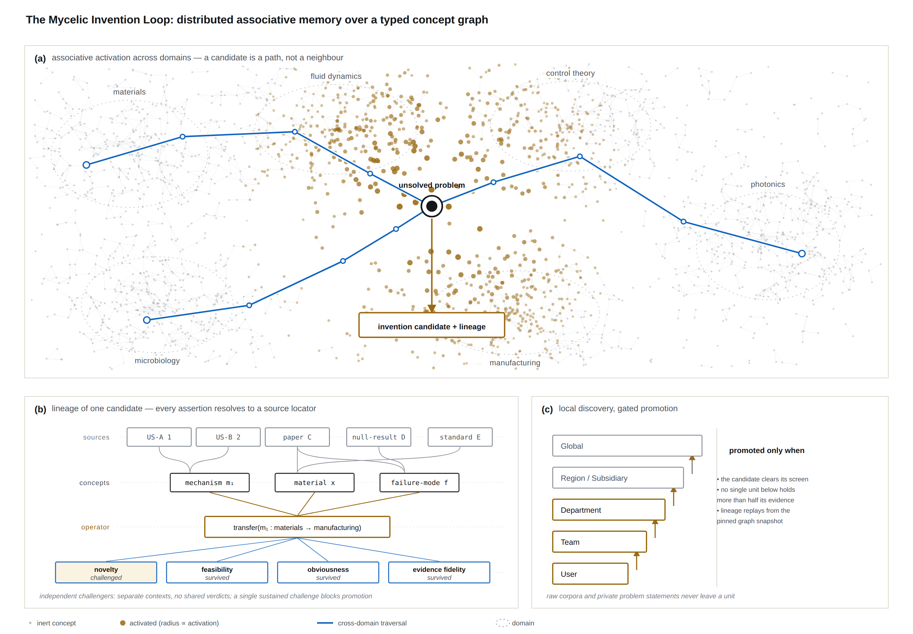

# The Mycelic Invention Loop: Distributed Associative Memory for Literal Invention Discovery

**Status: architecture specification. No experimental results are reported in
this document. Nothing described here has been run.** Every quantity that
matters is given as a definition of how it would be measured, not as a
measurement. Section 10 states what would falsify the design.

---

## Abstract

Retrieval systems answer questions that have answers. The object we want is
different: a *proposal* that is not present in any source document, assembled
from parts that are, together with the evidence and reasoning that produced it
and a test that could show it wrong. We call this **invention discovery**, and it
differs from retrieval-augmented generation not in degree but in the acceptance
test applied to the output — a retrieved answer is checked against its source,
whereas a proposed invention must be checked against the *absence* of a source.

We specify the Mycelic Invention Loop: a swarm of specialised agents over a typed
concept graph built by continuously ingesting patents, papers, technical
documentation, standards, and — critically — negative knowledge, meaning failed
approaches, retracted results, and problems recorded as open. Concepts are
activated by spreading activation rather than nearest-neighbour lookup, which
allows the system to reach multi-hop chains `A → B → C` where `A` and `C` are
nowhere near each other in any embedding, and where the intermediate `B` sits in
a third field entirely. This is the structural property we are after: the
combinations worth finding are the ones no single domain's literature contains.

A candidate is generated by explicit operators over the activated subgraph —
analogical transfer, substitution under constraint, constraint relaxation, and
composition — and is required to state the falsifiable prediction it makes. A
candidate that cannot be wrong is rejected before verification. Surviving
candidates pass a two-stage gate: a prior-art check that decomposes the proposal
into elements and searches for anticipation and for obviousness separately, and
an adversarial panel of independent challengers with disjoint attack surfaces
(novelty, feasibility, obviousness, and whether the cited evidence actually says
what the candidate claims). Every artifact carries a lineage graph in which every
assertion resolves to a source locator, and the derivation replays
deterministically from a pinned graph snapshot.

The loop is embedded in the Mycelic hierarchy — User → Team → Department →
Region/Subsidiary → Global — so that discovery happens locally and only bounded,
policy-checked, lineage-carrying artifacts propagate upward. Raw corpora and
private problem statements never leave a unit. Promotion reuses the existing
Mycelic gate: a finding rises only when it clears its screen and no single unit
below holds more than half of its supporting evidence. This yields a property
worth naming precisely, because it is the organisational analogue of the
multi-hop structure above: an invention that no single team could have produced,
because the connecting concepts were held in different units. We specify how that
property is *verified* rather than asserted.

We make no claim that this system invents things. We claim an architecture, a
provenance formalism, and an evaluation protocol — including a retrospective
rediscovery benchmark and its severe limitations — under which such a claim could
be tested and could fail.

---

## 1. Introduction

### 1.1 The output object

A retrieval system and an invention system can be handed the same corpus and the
same question and still be doing different work, because the thing they return is
different and the way you check it is different.

A retrieval answer is *grounded*: it is correct when it faithfully reflects a
source. The failure mode is hallucination, and the defence is attribution — show
the passage. Every serious RAG system is organised around making that check
cheap.

A proposed invention is *not* grounded in that sense, and cannot be. If a source
already discloses it, the proposal has failed. The check runs the other way: we
must establish that no single source discloses the combination (anticipation),
and that a skilled practitioner would not have been led to it (obviousness), and
simultaneously that every *constituent part* is grounded — the mechanism, the
material, the constraint, the failure mode are each attributable, even though
their conjunction is not. So the artifact has to carry two kinds of evidence at
once: positive evidence for its parts, and negative evidence for the whole. The
second kind is the one that systems built for retrieval do not produce, because
absence of evidence is only meaningful if you record the search that failed to
find it.

This document is organised around producing that artifact.

### 1.2 Why nearest-neighbour retrieval is the wrong primitive

If the useful combination were between concepts that are similar, embedding
search would find it and there would be no problem to solve. The combinations
that are worth anything are the ones that are *not* similar: a mechanism from
fluid dynamics that resolves a failure mode in cell culture; a manufacturing
constraint that makes an abandoned photonics method viable.

Under cosine similarity, the two ends of such a connection are far apart by
construction — that distance is what made the connection unexploited. A
similarity index is therefore structurally blind to exactly the cases we want. It
is not that it ranks them poorly; it is that the query that would surface them
has to be issued from a concept that the user has not thought of, which is the
whole difficulty.

Spreading activation has a different reachability profile. Activation propagates
along typed edges, so `A` can reach `C` through an intermediate `B` that shares an
edge with each, without `A` and `C` ever being compared. The path *is* the
finding, and it is legible: it names the intermediate concept that licences the
connection. We take this from the classical account of associative memory in
semantic networks, and from the observation — long predating this system — that
scientific literatures can contain complementary halves of a finding that no one
has put together because no reader reads both.

This is also why the architecture is a swarm rather than a single agent. The
frontier of a spreading activation is wide and mostly worthless; the work of
deciding which parts of it to expand is embarrassingly parallel, benefits from
agents holding different priors, and — as Section 5 argues — needs explicit
pressure against every agent converging on the same obvious region.

### 1.3 Contributions

1. **A formal separation between retrieval and invention discovery** in terms of
   the output object and its acceptance test (Section 2), including definitions of
   novelty and non-obviousness as defeasible predicates over an evidence set
   rather than as properties of a proposal.
2. **An associative substrate** — a typed concept graph with a spreading
   activation algorithm, its termination and inhibition rules, and an explicit
   account of what it reaches that nearest-neighbour search does not (Section 3).
3. **Negative knowledge as a first-class citizen**: failed approaches, retracted
   results and open problems are ingested, typed, and made addressable, on the
   argument that they are the highest-value and most systematically discarded
   signal in the corpus (Section 4).
4. **Explicit generation operators** with stated preconditions, replacing
   "the model proposes an idea" with named transformations over the activated
   subgraph, and a requirement that every candidate state a falsifiable
   prediction (Section 6).
5. **A two-stage verification gate** separating prior-art search from adversarial
   challenge, with independent challengers on disjoint attack surfaces, an
   aggregation rule, and a calibration procedure for detecting a panel that has
   started rubber-stamping (Section 7).
6. **A lineage formalism** with stated invariants and a replay condition, and a
   withdrawal cascade that connects to Mycelic's existing cumulative
   re-verification, so that a retracted source propagates to everything derived
   from it (Section 8).
7. **Hierarchical integration and an evaluation protocol** (Section 9), including
   a retrospective rediscovery benchmark, the baselines it must beat, and a frank
   account of the leakage problem that makes such benchmarks easy to fool
   yourself with.

### 1.4 What this is not

It is not a patent attorney: the prior-art analysis in Section 7 is modelled on
the structure of anticipation and obviousness analysis, and is explicitly not
legal advice or a patentability opinion. It is not a physical validator: no
component of this system can tell you that a proposed mechanism works, only that
it is not disclosed and not obviously refuted. It is not a demonstration: no
results are reported, and Section 10 lists the ways the architecture could fail
to work at all.

---

<!-- SECTIONS 2-9 ARE ASSEMBLED FROM THE DRAFTING PASS AND INSERTED HERE -->

---

## Figure 1



**Figure 1. The Mycelic Invention Loop.**
**(a)** Associative activation across domains. The field shows 2,284 concept
nodes in six domain territories, joined by 3,690 substrate edges; node radius and
opacity encode activation, so the front is visible as a gradient rather than a
boundary. Three highlighted traversals reach the unsolved problem from
materials, photonics and microbiology respectively, each passing through an
intermediate domain — the structural point of the figure is that the endpoints of
each traversal are far apart, and that a similarity index would not have
connected them. The problem sits between territories: no single domain contains
it.
**(b)** The lineage of one candidate. Every assertion resolves downward to a
source locator; the operator that produced the candidate is named, not implied;
the four challengers hold disjoint attack surfaces and are evaluated in separate
contexts without sight of each other's verdicts. One sustained challenge blocks
promotion, which is why a single challenged verdict is shown.
**(c)** Local discovery with gated promotion. Candidates are raised through the
Mycelic hierarchy only when they clear their screen, no single unit below holds
more than half the supporting evidence, the lineage replays from the pinned graph
snapshot, and no challenge is sustained. Raw corpora and private problem
statements never leave a unit.

The figure is generated deterministically by `figures/gen_architecture_figure.py`
from a fixed seed; it is regenerated from source rather than edited by hand, and
the node and edge counts in this caption are printed by that script rather than
asserted here.

---

## References

**These are unverified.** This document was prepared on a machine with no network
access, so no reference below has been checked against the record. Each entry
names an idea and the author it is attributed to from memory; before this
document is submitted anywhere, every one must be located, verified, and given a
correct citation, or removed. Entries are deliberately not formatted as a
confident bibliography.

*To be completed and verified — see `unverified_refs` collected during drafting.*

---

## Appendix A. Reproducibility of this document

The figure is produced by a seeded generator committed alongside this file.
Regenerating it requires no network access and no manual editing:

```
cd mycelic-invention/figures
python3 gen_architecture_figure.py     # writes architecture.svg, prints node/edge counts
```

The counts quoted in the Figure 1 caption are the values that script prints. If
the seed or the layout changes, the caption must be regenerated with it.
